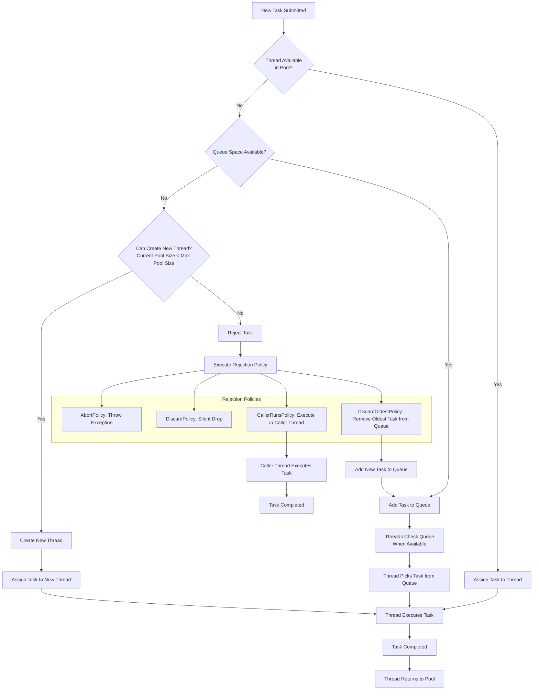
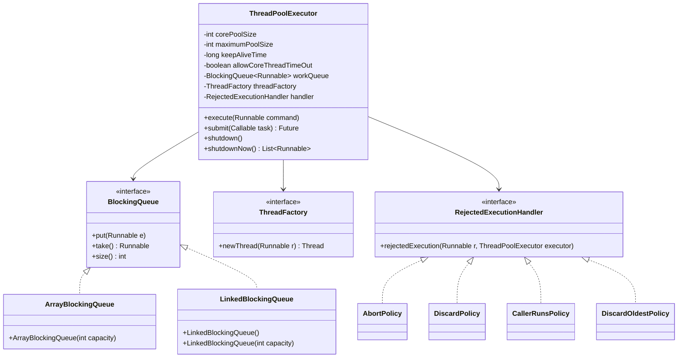
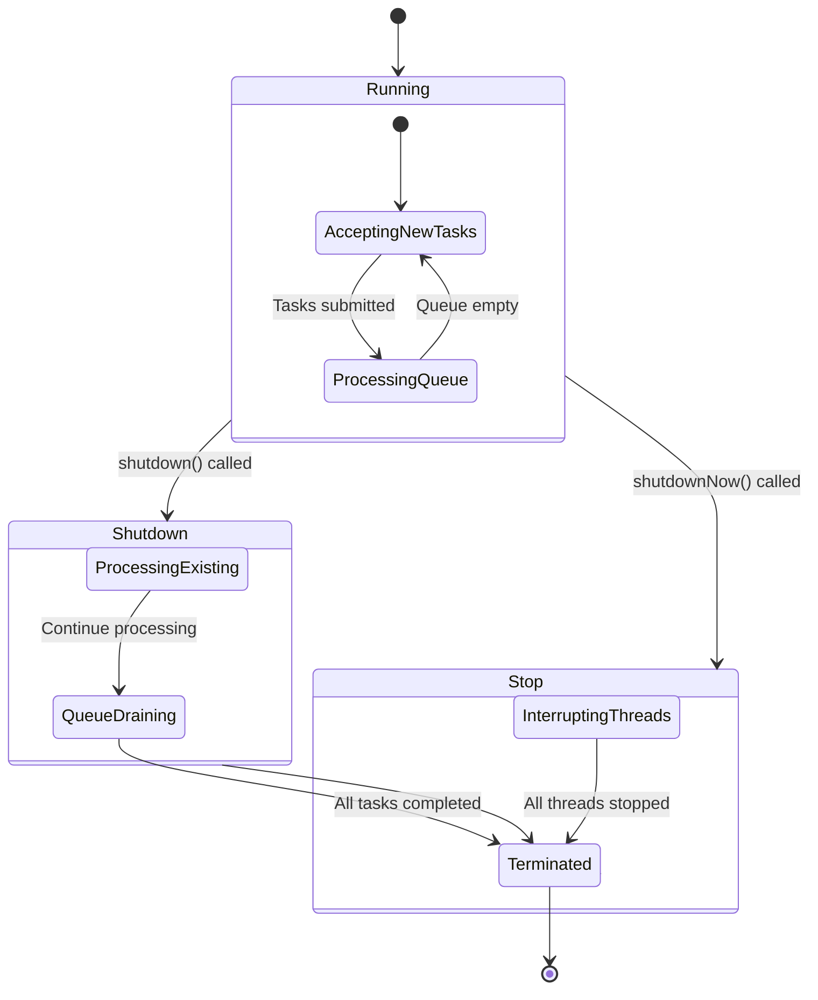
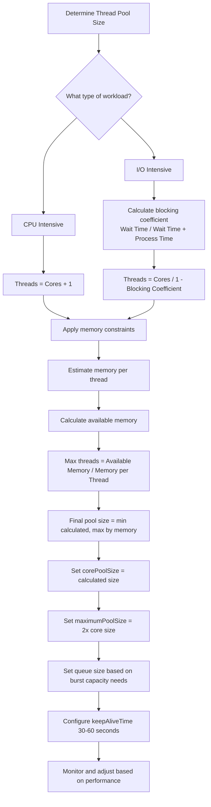

# Java Thread Pools with detailed code examples

## Table of Contents
1. [What is a Thread Pool?](#what-is-a-thread-pool)
2. [Thread Pool Advantages](#thread-pool-advantages)
3. [Java Executor Framework](#java-executor-framework)
4. [ThreadPoolExecutor Parameters](#threadpoolexecutor-parameters)
5. [Thread Pool Lifecycle](#thread-pool-lifecycle)
6. [Complete Code Example](#complete-code-example)
7. [Determining Optimal Pool Size](#determining-optimal-pool-size)
8. [Best Practices](#best-practices)

## What is a Thread Pool?

A thread pool is a collection of pre-initialized worker threads that are ready to perform tasks. Instead of creating a new thread for each task, threads are reused from the pool, which improves performance and resource management.

```java
// Traditional approach - creating new threads for each task
new Thread(() -> {
    // Task logic
}).start();

// Thread pool approach - reusing threads
ExecutorService executor = Executors.newFixedThreadPool(5);
executor.submit(() -> {
    // Task logic
});
```

## Thread Pool Advantages

1. **Reduced Thread Creation Overhead**: Thread creation is expensive (memory allocation, stack setup, etc.)
2. **Thread Lifecycle Management**: The framework handles thread states (running, waiting, terminated)
3. **Improved Performance**: Controlled thread count reduces context switching
4. **Resource Management**: Prevents system overload by limiting concurrent threads

## Java Executor Framework

The Java Concurrency API provides a robust framework for thread management:

```java
// Top-level interface
public interface Executor {
    void execute(Runnable command);
}

// Extended interface with more features
public interface ExecutorService extends Executor {
    void shutdown();
    List<Runnable> shutdownNow();
    boolean isShutdown();
    boolean isTerminated();
    // ... more methods
}

// Main implementation class
public class ThreadPoolExecutor extends AbstractExecutorService {
    // Core implementation
}
```

## ThreadPoolExecutor Parameters

Let's examine the ThreadPoolExecutor constructor:

```java
public ThreadPoolExecutor(int corePoolSize,
                         int maximumPoolSize,
                         long keepAliveTime,
                         TimeUnit unit,
                         BlockingQueue<Runnable> workQueue,
                         ThreadFactory threadFactory,
                         RejectedExecutionHandler handler)
```

### 1. Core Pool Size
The minimum number of threads to keep in the pool, even if idle.

```java
// Creates pool with 2 core threads
ThreadPoolExecutor executor = new ThreadPoolExecutor(
    2, // corePoolSize
    10, // maximumPoolSize
    60, // keepAliveTime
    TimeUnit.SECONDS,
    new ArrayBlockingQueue<>(5)
);
```

### 2. Maximum Pool Size
The maximum number of threads to allow in the pool.

### 3. Keep Alive Time
How long excess threads (beyond core pool size) wait for new tasks before terminating.

### 4. Work Queue
Holds tasks before they are executed. Common types:
- `ArrayBlockingQueue`: Bounded queue
- `LinkedBlockingQueue`: Unbounded queue
- `SynchronousQueue`: Direct handoff

### 5. Thread Factory
Creates new threads with custom names, priorities, etc.

```java
class CustomThreadFactory implements ThreadFactory {
    private final String namePrefix;
    private final AtomicInteger threadNumber = new AtomicInteger(1);
    
    CustomThreadFactory(String poolName) {
        namePrefix = poolName + "-thread-";
    }
    
    public Thread newThread(Runnable r) {
        Thread thread = new Thread(r, namePrefix + threadNumber.getAndIncrement());
        thread.setPriority(Thread.NORM_PRIORITY);
        thread.setDaemon(false);
        return thread;
    }
}
```

### 6. Rejected Execution Handler
Handles tasks that cannot be executed. Built-in policies:
- `AbortPolicy`: Throws RejectedExecutionException (default)
- `CallerRunsPolicy`: Executes task in caller's thread
- `DiscardPolicy`: Silently discards task
- `DiscardOldestPolicy`: Discards oldest queued task

```java
class LoggingRejectHandler implements RejectedExecutionHandler {
    public void rejectedExecution(Runnable r, ThreadPoolExecutor executor) {
        System.out.println("Task rejected: " + r.toString());
        System.out.println("Executor state: " + executor.toString());
        // Additional logging or metrics collection
    }
}
```

## Thread Pool Lifecycle

1. **Running**: Accepts new tasks and processes queued tasks
2. **Shutdown**: Doesn't accept new tasks but processes existing ones
3. **Stop**: Doesn't accept new tasks and interrupts running tasks
4. **Terminated**: All tasks completed, threads terminated

```java
ExecutorService executor = Executors.newFixedThreadPool(2);

// Graceful shutdown
executor.shutdown(); // No new tasks accepted
try {
    if (!executor.awaitTermination(60, TimeUnit.SECONDS)) {
        executor.shutdownNow(); // Forceful shutdown
    }
} catch (InterruptedException e) {
    executor.shutdownNow();
    Thread.currentThread().interrupt();
}
```

## Complete Code Example

Here's a comprehensive example demonstrating thread pool configuration:

```java
import java.util.concurrent.*;
import java.util.concurrent.atomic.AtomicInteger;

public class ThreadPoolDemo {
    
    public static void main(String[] args) {
        // Configuration
        int corePoolSize = 2;
        int maxPoolSize = 4;
        int queueCapacity = 2;
        long keepAliveTime = 10;
        
        // Create thread pool with custom parameters
        ThreadPoolExecutor executor = new ThreadPoolExecutor(
            corePoolSize,
            maxPoolSize,
            keepAliveTime,
            TimeUnit.SECONDS,
            new ArrayBlockingQueue<>(queueCapacity),
            new CustomThreadFactory("my-pool"),
            new LoggingRejectHandler()
        );
        
        // Allow core threads to timeout (optional)
        executor.allowCoreThreadTimeOut(true);
        
        try {
            // Submit tasks
            for (int i = 1; i <= 6; i++) {
                final int taskId = i;
                executor.submit(() -> processTask(taskId));
                System.out.println("Submitted task " + taskId);
                Thread.sleep(100); // Slow down submission
            }
        } catch (InterruptedException e) {
            Thread.currentThread().interrupt();
        } finally {
            // Graceful shutdown
            executor.shutdown();
            try {
                if (!executor.awaitTermination(30, TimeUnit.SECONDS)) {
                    executor.shutdownNow();
                }
            } catch (InterruptedException e) {
                executor.shutdownNow();
                Thread.currentThread().interrupt();
            }
        }
    }
    
    private static void processTask(int taskId) {
        System.out.println(Thread.currentThread().getName() + 
                          " processing task " + taskId);
        try {
            // Simulate work
            Thread.sleep(2000);
        } catch (InterruptedException e) {
            Thread.currentThread().interrupt();
        }
        System.out.println(Thread.currentThread().getName() + 
                          " completed task " + taskId);
    }
}

class CustomThreadFactory implements ThreadFactory {
    private final String namePrefix;
    private final AtomicInteger threadNumber = new AtomicInteger(1);
    
    CustomThreadFactory(String poolName) {
        namePrefix = poolName + "-thread-";
    }
    
    public Thread newThread(Runnable r) {
        Thread thread = new Thread(r, namePrefix + threadNumber.getAndIncrement());
        thread.setPriority(Thread.NORM_PRIORITY);
        thread.setDaemon(false);
        return thread;
    }
}

class LoggingRejectHandler implements RejectedExecutionHandler {
    public void rejectedExecution(Runnable r, ThreadPoolExecutor executor) {
        System.out.println("Task rejected: " + r.toString());
        System.out.println("Executor state: " + 
                          "Active: " + executor.getActiveCount() +
                          ", Pool: " + executor.getPoolSize() +
                          ", Queue: " + executor.getQueue().size());
    }
}
```

## Determining Optimal Pool Size

The optimal thread pool size depends on multiple factors:

### 1. CPU Cores
```java
int availableProcessors = Runtime.getRuntime().availableProcessors();
```

### 2. Task Nature (CPU vs I/O Intensive)

**CPU-intensive tasks** (calculations, processing):
```java
// Optimal: Number of cores + 1 (to handle context switching)
int optimalPoolSize = Runtime.getRuntime().availableProcessors() + 1;
```

**I/O-intensive tasks** (database calls, network requests):
```java
// Optimal: Higher number since threads spend time waiting
int optimalPoolSize = (int) (Runtime.getRuntime().availableProcessors() * 
                           (1 + (waitTime / processingTime)));
```

### 3. Memory Constraints
```java
// Estimate memory per thread (stack + heap usage)
long threadMemoryUsage = 2 * 1024 * 1024; // 2MB estimate

// Available memory for threads
long availableMemory = Runtime.getRuntime().maxMemory() * 70 / 100; // 70% of max memory

// Maximum threads based on memory
int maxThreadsByMemory = (int) (availableMemory / threadMemoryUsage);
```

### 4. Comprehensive Calculation Example

```java
public class ThreadPoolCalculator {
    
    public static PoolConfig calculateOptimalConfig(WorkloadProfile profile) {
        int cpuCores = Runtime.getRuntime().availableProcessors();
        
        // Calculate based on workload type
        int optimalThreads;
        if (profile.isCpuIntensive()) {
            optimalThreads = cpuCores + 1;
        } else {
            // I/O intensive formula
            double blockingCoefficient = profile.getWaitTime() / 
                                       (profile.getWaitTime() + profile.getProcessTime());
            optimalThreads = (int) (cpuCores / (1 - blockingCoefficient));
        }
        
        // Apply memory constraints
        long maxMemory = Runtime.getRuntime().maxMemory();
        long memoryPerThread = estimateMemoryPerThread(profile);
        int maxThreadsByMemory = (int) ((maxMemory * 0.7) / memoryPerThread);
        
        optimalThreads = Math.min(optimalThreads, maxThreadsByMemory);
        
        // Calculate queue size based on expected burst load
        int queueSize = calculateQueueSize(profile.getExpectedRequestRate(), 
                                         profile.getProcessingTime());
        
        return new PoolConfig(optimalThreads, optimalThreads * 2, queueSize);
    }
    
    private static long estimateMemoryPerThread(WorkloadProfile profile) {
        // Base thread memory (stack + metadata)
        long baseMemory = 2 * 1024 * 1024; // 2MB
        
        // Task-specific memory
        long taskMemory = profile.getMemoryPerRequest();
        
        return baseMemory + taskMemory;
    }
    
    private static int calculateQueueSize(double requestRate, double processingTime) {
        // Queue should handle 2 seconds of peak load
        return (int) (requestRate * processingTime * 2);
    }
}

class WorkloadProfile {
    private boolean cpuIntensive;
    private double waitTime;
    private double processTime;
    private long memoryPerRequest;
    private double expectedRequestRate;
    
    // Getters and setters
}

class PoolConfig {
    private final int corePoolSize;
    private final int maxPoolSize;
    private final int queueSize;
    
    // Constructor, getters
}
```

## Best Practices

1. **Use Appropriate Queue Types**:
   ```java
   // Bounded queue for backpressure
   new ArrayBlockingQueue<>(1000)
   
   // Unbounded queue (use with caution)
   new LinkedBlockingQueue<>()
   ```

2. **Proper Shutdown**:
   ```java
   executor.shutdown(); // Graceful
   if (!executor.awaitTermination(60, TimeUnit.SECONDS)) {
       executor.shutdownNow(); // Forceful
   }
   ```

3. **Monitoring**:
   ```java
   // Monitor thread pool metrics
   System.out.println("Active threads: " + executor.getActiveCount());
   System.out.println("Pool size: " + executor.getPoolSize());
   System.out.println("Queue size: " + executor.getQueue().size());
   ```

4. **Use ThreadPoolExecutor for Fine-grained Control**:
   ```java
   // Instead of Executors.newFixedThreadPool()
   new ThreadPoolExecutor(
       coreSize, maxSize, keepAlive, unit, 
       workQueue, threadFactory, handler
   )
   ```

5. **Consider Work Stealing Pools for Heterogeneous Workloads**:
   ```java
   ExecutorService executor = Executors.newWorkStealingPool();
   ```

This comprehensive guide covers thread pools from basic concepts to advanced configuration. The key is to understand your workload characteristics and monitor performance to fine-tune your thread pool configuration.

<br/>
<br/>

# How to Determine Optimal Thread Pool Size

## Key Factors to Consider

### 1. CPU Cores
```java
int availableCores = Runtime.getRuntime().availableProcessors();
// This gives you the number of available processor cores
```

### 2. Task Nature (CPU-bound vs I/O-bound)

**CPU-intensive tasks** (calculations, data processing):
- Optimal: Number of cores + 1 (to handle context switching)
- Formula: `N_threads = N_cores + 1`

**I/O-intensive tasks** (database calls, network requests):
- Optimal: Higher number since threads spend time waiting
- Formula: `N_threads = N_cores * (1 + (wait_time / processing_time))`

### 3. Memory Constraints
```java
// Estimate memory per thread
long threadMemoryUsage = 2 * 1024 * 1024; // 2MB estimate (stack + heap)

// Calculate maximum threads based on available memory
long maxMemory = Runtime.getRuntime().maxMemory();
long availableMemory = maxMemory * 70 / 100; // Use 70% of max memory
int maxThreadsByMemory = (int) (availableMemory / threadMemoryUsage);
```

### 4. Response Time Requirements
- Higher concurrency needs = larger pool size
- Low latency requirements = carefully tuned pool size

### 5. Task Characteristics
- Short-lived tasks = larger pool acceptable
- Long-running tasks = smaller pool recommended

## Practical Calculation Approach

```java
public class ThreadPoolCalculator {
    
    public static PoolConfig calculateOptimalConfig(WorkloadProfile profile) {
        int cpuCores = Runtime.getRuntime().availableProcessors();
        
        // Calculate based on workload type
        int optimalThreads;
        if (profile.isCpuIntensive()) {
            optimalThreads = cpuCores + 1;
        } else {
            // I/O intensive formula
            double blockingCoefficient = profile.getWaitTime() / 
                                       (profile.getWaitTime() + profile.getProcessTime());
            optimalThreads = (int) (cpuCores / (1 - blockingCoefficient));
        }
        
        // Apply memory constraints
        long maxMemory = Runtime.getRuntime().maxMemory();
        long memoryPerThread = estimateMemoryPerThread(profile);
        int maxThreadsByMemory = (int) ((maxMemory * 0.7) / memoryPerThread);
        
        optimalThreads = Math.min(optimalThreads, maxThreadsByMemory);
        
        return new PoolConfig(optimalThreads, optimalThreads * 2);
    }
    
    private static long estimateMemoryPerThread(WorkloadProfile profile) {
        // Base thread memory (stack + metadata)
        long baseMemory = 2 * 1024 * 1024; // 2MB
        
        // Task-specific memory
        long taskMemory = profile.getMemoryPerRequest();
        
        return baseMemory + taskMemory;
    }
}

class WorkloadProfile {
    private boolean cpuIntensive;
    private double waitTime;     // Average wait time in ms
    private double processTime;  // Average processing time in ms
    private long memoryPerRequest; // Memory needed per request
    
    // Getters and setters
}

class PoolConfig {
    private final int corePoolSize;
    private final int maxPoolSize;
    
    public PoolConfig(int corePoolSize, int maxPoolSize) {
        this.corePoolSize = corePoolSize;
        this.maxPoolSize = maxPoolSize;
    }
    
    // Getters
}
```

## Real-World Examples

### Example 1: Web Server (I/O Intensive)
```java
// 8-core server, database calls (50ms wait, 10ms processing)
int cores = 8;
double waitTime = 50;
double processTime = 10;
double blockingCoefficient = waitTime / (waitTime + processTime);

int optimalThreads = (int) (cores / (1 - blockingCoefficient));
// Result: 8 / (1 - 0.833) ≈ 48 threads

// Apply memory constraints (2GB JVM, 5MB per request)
long availableMemory = 2 * 1024 * 1024 * 1024L * 70 / 100; // 1.4GB
long memoryPerThread = 5 * 1024 * 1024; // 5MB
int maxByMemory = (int) (availableMemory / memoryPerThread); // 286 threads

// Final pool size: min(48, 286) = 48 threads
ThreadPoolExecutor executor = new ThreadPoolExecutor(
    48, 96, 60, TimeUnit.SECONDS, 
    new ArrayBlockingQueue<>(100)
);
```

### Example 2: Image Processing (CPU Intensive)
```java
// 4-core server, CPU-intensive image processing
int cores = 4;
int optimalThreads = cores + 1; // 5 threads

// Memory constraints (4GB JVM, 50MB per image)
long availableMemory = 4 * 1024 * 1024 * 1024L * 70 / 100; // 2.8GB
long memoryPerThread = 50 * 1024 * 1024; // 50MB
int maxByMemory = (int) (availableMemory / memoryPerThread); // 57 threads

// Final pool size: min(5, 57) = 5 threads
ThreadPoolExecutor executor = new ThreadPoolExecutor(
    5, 10, 60, TimeUnit.SECONDS, 
    new ArrayBlockingQueue<>(20)
);
```

## Monitoring and Adjustment

```java
// Monitor thread pool metrics regularly
public void monitorThreadPool(ThreadPoolExecutor executor) {
    System.out.println("Active threads: " + executor.getActiveCount());
    System.out.println("Pool size: " + executor.getPoolSize());
    System.out.println("Queue size: " + executor.getQueue().size());
    System.out.println("Completed tasks: " + executor.getCompletedTaskCount());
    
    // Adjust pool size dynamically if needed
    if (executor.getQueue().size() > 100 && 
        executor.getPoolSize() < executor.getMaximumPoolSize()) {
        executor.setCorePoolSize(executor.getCorePoolSize() + 5);
    }
}
```

## Best Practices

1. **Start with formula-based estimation**
2. **Use bounded queues** to prevent out-of-memory errors
3. **Monitor and adjust** based on real performance metrics
4. **Set appropriate keep-alive times** (30-60 seconds for most applications)
5. **Implement proper rejection policies**
6. **Consider using different pools** for different types of work

## Common Pitfalls to Avoid

1. **Unbounded queues** can lead to memory exhaustion
2. **Too many threads** cause excessive context switching
3. **Too few threads** lead to underutilized resources
4. **Ignoring memory constraints** can crash your application
5. **Not monitoring** pool performance over time

By following this systematic approach, you can determine optimal thread pool sizes that balance performance, resource utilization, and stability for your specific application needs.

<br/>
<br/>

# Mermaid Diagram: ThreadPoolExecutor Internal Workflow



## ThreadPoolExecutor Component Relationships



## Thread Pool Lifecycle States



## Thread Pool Configuration Decision Flow



This diagram visualization shows:

1. **Internal Workflow**: How tasks flow through the ThreadPoolExecutor system
2. **Component Relationships**: How the different parts of ThreadPoolExecutor interact
3. **Lifecycle States**: The different states a thread pool can be in
4. **Configuration Decision Flow**: How to determine optimal pool size based on workload characteristics

The diagrams follow the detailed explanation from the notes, showing the decision process for task handling, the relationship between core components, and the methodology for determining optimal thread pool sizing based on CPU cores, task type, and memory constraints.


<br/>
<br/>

# ThreadPoolExecutor Parameters - Detailed Explanation

## Complete Parameter Overview

The `ThreadPoolExecutor` constructor has 7 core parameters that control its behavior:

```java
public ThreadPoolExecutor(int corePoolSize,
                         int maximumPoolSize,
                         long keepAliveTime,
                         TimeUnit unit,
                         BlockingQueue<Runnable> workQueue,
                         ThreadFactory threadFactory,
                         RejectedExecutionHandler handler)
```

## 1. corePoolSize

**Definition**: The minimum number of threads to keep in the pool, even if they are idle.

**Behavior**:
- Threads are created up to this number immediately when the pool is created
- These threads will stay alive even when idle (unless `allowCoreThreadTimeOut` is set to true)
- When tasks arrive, core threads are used first

**Example**:
```java
// Creates a pool that maintains at least 2 threads
ThreadPoolExecutor executor = new ThreadPoolExecutor(
    2,  // corePoolSize - minimum 2 threads always in pool
    10, // maximumPoolSize
    60, // keepAliveTime
    TimeUnit.SECONDS,
    new ArrayBlockingQueue<>(5)
);
```

**When to set high**: For constant workload, to avoid thread creation overhead
**When to set low**: For bursty workload with long idle periods, to save resources

## 2. maximumPoolSize

**Definition**: The maximum number of threads to allow in the pool.

**Behavior**:
- The pool can grow beyond corePoolSize up to this limit when needed
- Additional threads are created when queue is full and more tasks arrive
- These extra threads are terminated if they remain idle longer than keepAliveTime

**Example**:
```java
// Pool can grow up to 10 threads under load
ThreadPoolExecutor executor = new ThreadPoolExecutor(
    2,  // corePoolSize
    10, // maximumPoolSize - maximum 10 threads total
    60, TimeUnit.SECONDS,
    new ArrayBlockingQueue<>(5)
);
```

**Relationship with corePoolSize**:
```java
// Common patterns:
// 1. Fixed size pool (core == max)
new ThreadPoolExecutor(5, 5, 0, TimeUnit.SECONDS, queue);

// 2. Scalable pool (core < max)  
new ThreadPoolExecutor(2, 10, 60, TimeUnit.SECONDS, queue);

// 3. Cached pool (core = 0, max = Integer.MAX_VALUE)
new ThreadPoolExecutor(0, Integer.MAX_VALUE, 60, TimeUnit.SECONDS, 
                      new SynchronousQueue<>());
```

## 3. keepAliveTime & TimeUnit

**Definition**: The maximum time that excess idle threads (beyond corePoolSize) will wait for new tasks before terminating.

**Behavior**:
- Applies only to threads beyond corePoolSize
- If `allowCoreThreadTimeOut(true)` is called, also applies to core threads
- TimeUnit specifies the time unit (SECONDS, MINUTES, MILLISECONDS, etc.)

**Example**:
```java
ThreadPoolExecutor executor = new ThreadPoolExecutor(
    2, 10, 
    30,                 // keepAliveTime - 30 units
    TimeUnit.SECONDS,   // TimeUnit - seconds
    new ArrayBlockingQueue<>(5)
);

// Allow core threads to timeout too
executor.allowCoreThreadTimeOut(true);
```

**Common Values**:
- 30-60 seconds for most applications
- Longer for pools with expensive thread creation
- 0 for fixed-size pools (no timeout needed)

## 4. workQueue

**Definition**: The queue to use for holding tasks before they are executed.

### Queue Types and Their Behaviors:

**1. Bounded Queue (ArrayBlockingQueue)**:
```java
// Fixed capacity queue - most common choice
new ArrayBlockingQueue<>(100); // Capacity of 100 tasks

// Behavior:
// - Tasks queued when all core threads busy
// - New threads created only when queue is full
// - Provides backpressure when system overloaded
```

**2. Unbounded Queue (LinkedBlockingQueue)**:
```java
// Unlimited capacity queue - use with caution
new LinkedBlockingQueue<>(); // No capacity limit

// Behavior:
// - Tasks always queued when all core threads busy  
// - maximumPoolSize is ignored (never reached)
// - Risk of OutOfMemoryError under heavy load
```

**3. SynchronousQueue**:
```java
// Direct handoff - no queuing
new SynchronousQueue<>();

// Behavior:
// - Tasks directly handed to waiting threads
// - No task queuing (queue size always 0)
// - New thread created if no threads available
// - Used for "cached thread pool" pattern
```

**4. PriorityQueue (PriorityBlockingQueue)**:
```java
// Tasks executed by priority
new PriorityBlockingQueue<>(100, comparator);

// Behavior:
// - Tasks ordered by priority, not submission order
// - Requires Comparator or Comparable tasks
```

## 5. threadFactory

**Definition**: The factory to use when the executor creates a new thread.

**Purpose**: Customize thread properties (name, priority, daemon status, etc.)

**Default Behavior**: Uses `Executors.defaultThreadFactory()`

**Custom Implementation Example**:
```java
class CustomThreadFactory implements ThreadFactory {
    private final String namePrefix;
    private final AtomicInteger threadNumber = new AtomicInteger(1);
    
    public CustomThreadFactory(String poolName) {
        namePrefix = poolName + "-thread-";
    }
    
    public Thread newThread(Runnable r) {
        Thread thread = new Thread(r, namePrefix + threadNumber.getAndIncrement());
        thread.setPriority(Thread.NORM_PRIORITY);
        thread.setDaemon(false); // User threads, not daemon
        return thread;
    }
}

// Usage:
ThreadPoolExecutor executor = new ThreadPoolExecutor(
    2, 10, 60, TimeUnit.SECONDS,
    new ArrayBlockingQueue<>(10),
    new CustomThreadFactory("my-app"), // Custom factory
    new ThreadPoolExecutor.AbortPolicy()
);
```

**Common Customizations**:
- Thread naming pattern for debugging
- Thread priority settings
- Daemon vs non-daemon threads
- Thread group assignments
- Uncaught exception handlers

## 6. handler

**Definition**: The handler to use when execution is blocked because the thread bounds and queue capacities are reached.

### Built-in Rejection Policies:

**1. AbortPolicy (Default)**:
```java
new ThreadPoolExecutor.AbortPolicy();

// Behavior: Throws RejectedExecutionException
// Use when: You want to be notified of overload conditions
```

**2. CallerRunsPolicy**:
```java
new ThreadPoolExecutor.CallerRunsPolicy();

// Behavior: Executes task in caller's thread
// Use when: You want gentle backpressure without exceptions
```

**3. DiscardPolicy**:
```java
new ThreadPoolExecutor.DiscardPolicy();

// Behavior: Silently discards the task
// Use when: You can afford to lose some tasks during overload
```

**4. DiscardOldestPolicy**:
```java
new ThreadPoolExecutor.DiscardOldestPolicy();

// Behavior: Discards oldest queued task, then retries execution
// Use when: New tasks are more important than old ones
```

**Custom Rejection Handler Example**:
```java
class LoggingRejectHandler implements RejectedExecutionHandler {
    public void rejectedExecution(Runnable r, ThreadPoolExecutor executor) {
        // Log the rejection with details
        System.err.println("Task rejected: " + r.toString());
        System.err.println("Executor state: " +
                          "Active: " + executor.getActiveCount() +
                          ", Pool: " + executor.getPoolSize() +
                          ", Queue: " + executor.getQueue().size());
        
        // Optionally send metrics/alert
        metricsCounter.increment("rejected.tasks");
        
        // Fallback: execute in current thread
        if (!executor.isShutdown()) {
            r.run();
        }
    }
}

// Usage:
ThreadPoolExecutor executor = new ThreadPoolExecutor(
    2, 10, 60, TimeUnit.SECONDS,
    new ArrayBlockingQueue<>(10),
    Executors.defaultThreadFactory(),
    new LoggingRejectHandler() // Custom handler
);
```

## Complete Configuration Example

```java
public ThreadPoolExecutor createOptimalThreadPool() {
    int corePoolSize = Runtime.getRuntime().availableProcessors();
    int maxPoolSize = corePoolSize * 2;
    int queueSize = 100;
    
    return new ThreadPoolExecutor(
        corePoolSize,      // Core threads = number of CPU cores
        maxPoolSize,       // Max threads = 2x cores for I/O wait
        60,                // Keep alive 60 seconds
        TimeUnit.SECONDS,
        new ArrayBlockingQueue<>(queueSize), // Bounded queue
        new CustomThreadFactory("app-worker"), // Named threads
        new ThreadPoolExecutor.CallerRunsPolicy() // Gentle backpressure
    );
}
```

## Parameter Interaction Summary

The parameters work together in this decision flow:

1. **corePoolSize** threads are created immediately and kept alive
2. New tasks go to **core threads** if available
3. If no core threads available, tasks go to **workQueue**
4. If queue is full, create new threads up to **maximumPoolSize**
5. Excess threads terminate after **keepAliveTime** if idle
6. If max threads reached and queue full, use **rejection handler**
7. All threads created using **threadFactory**

Understanding these parameters and their interactions is crucial for creating efficient, stable thread pools that match your application's workload characteristics.