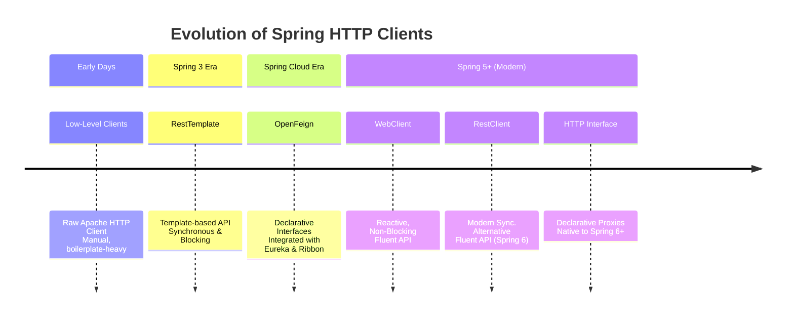

# **Inter-Service Communication in Spring Boot**

#### **I. Foundational Concepts**
1.  **What is Inter-Service Communication?**
    *   Definition and necessity in a microservices architecture.
    *   Comparison with Monolithic architecture communication (in-process vs. over-the-network).
    *   Key goals: Unified user experience, service collaboration, data ownership, independent scalability.

2.  **Communication Patterns**
    *   **Synchronous Communication (Request-Response):** How it works, pros (simplicity), cons (tight coupling, cascading failures).
    *   **Asynchronous Communication (Message-Based):** How it works (message brokers), pros (decoupling, resilience), cons (complexity, eventual consistency).

#### **II. Synchronous Communication Clients (Detailed Implementation)**
**A. RestTemplate (Legacy)**
*   **Concept:** Synchronous, blocking client with a template-style API.
*   **Implementation Approaches:**
    1.  **Inline Instantiation:** Simple but inefficient.
    2.  **Bean Configuration:** Centralized `@Bean` creation in a `@Configuration` class for efficiency and shared configuration.
    3.  **Service Client Abstraction:** Creating a dedicated service class to encapsulate all API logic for maximum maintainability.
*   **Status:** Legacy. Not recommended for new projects.

**B. Spring Cloud OpenFeign (Declarative - Maintenance Mode)**
*   **Concept:** Declarative REST client. Define an interface, Spring provides the implementation.
*   **Key Annotations:** `@EnableFeignClients`, `@FeignClient(name="service", url="...")`.
*   **Setup:** Requires `spring-cloud-starter-openfeign` dependency and Spring Cloud BOM.
*   **Advantage:** Extremely low boilerplate code.
*   **Status:** Maintenance Mode. Feature complete. Migration to HTTP Interface recommended.

**C. RestClient (Modern Synchronous)**
*   **Concept:** Modern, synchronous client with a fluent API. The intended successor to `RestTemplate`.
*   **Key Feature:** Fluent API for building requests (e.g., `.get().uri(...).retrieve().body(...)`).
*   **Implementation Approaches:** Same three patterns as `RestTemplate` (Inline, Bean Config, Service Client).
*   **Advantage:** Modern API, no extra dependencies needed.

**D. WebClient (Modern Asynchronous/Reactive)**
*   **Concept:** Non-blocking, reactive client for asynchronous communication. Part of Spring WebFlux.
*   **Key Feature:** Returns reactive types `Mono` (0-1 result) and `Flux` (0-N results).
*   **Setup:** Requires `spring-boot-starter-webflux` dependency.
*   **Implementation Approaches:** Same three patterns, returning `Mono<T>`/`Flux<T>`.
*   **Advantage:** High scalability for I/O-bound operations and high-concurrency scenarios.

**E. HTTP Interface (Modern Declarative)**
*   **Concept:** Declarative mechanism to define HTTP services as Java interfaces (Spring 6+).
*   **Key Annotations:** `@HttpExchange` (base URL), `@GetExchange`, `@PostExchange`, etc.
*   **How it Works:** `HttpServiceProxyFactory` creates a dynamic proxy for the interface.
*   **Flexibility:** Can be backed by **`RestClient`** (synchronous) or **`WebClient`** (asynchronous).
*   **Advantage:** Ultimate decoupling. Cleanest code. The strategic, future-proof choice for declarative clients.

#### **III. Practical Project Setup**
1.  **Provider Service:**
    *   Purpose: The "server" microservice.
    *   Implementation: Simple REST Controller (`@RestController`) with a `GET /instance-info` endpoint.
    *   Configuration: `server.port=8810` in `application.properties`.

2.  **Consumer Service:**
    *   Purpose: The "client" microservice that calls the Provider.
    *   Configuration: `server.port=8800` in `application.properties`.
    *   Implemented all five clients (`RestTemplate`, OpenFeign, `RestClient`, `WebClient`, HTTP Interface) in separate packages.

#### **IV. Comparative Analysis & Decision Guide**
1.  **Decision Parameters:**
    *   Project Context (Legacy vs. New)
    *   Communication Paradigm (Synchronous vs. Asynchronous)
    *   Programming Style (Imperative vs. Declarative)
    *   Performance & Scalability Needs
    *   Spring's Official Recommendations

2.  **Official Spring Recommendations:**
    *   **`RestTemplate`:** Deprecated in favor of `RestClient`.
    *   **OpenFeign:** In maintenance mode. Migrate to HTTP Interface.
    *   **Strategic Choice:** **HTTP Interface** backed by either `RestClient` (sync) or `WebClient` (async).

3.  **Final Recommendation:**
    *   **For new projects:** Use **HTTP Interface**.
    *   **Choose `RestClient`** as the backend for standard synchronous calls.
    *   **Choose `WebClient`** as the backend for reactive/high-throughput needs.
    *   This approach provides the cleanest code and the most flexibility for the future.

---
This index encapsulates the journey from understanding the basic concepts to implementing various clients and finally making an informed architectural decision based on best practices and official guidance.
# **Inter-Service Communication in Microservices Architecture**

#### **1. What is Inter-Service Communication?**

Inter-service communication is the mechanism by which independent, decentralized services in a microservices architecture talk to each other, exchange data, and collaborate to fulfill complex business tasks that no single service can accomplish alone.

**Analogy:** Think of a symphony orchestra. Each musician (microservice) is an expert in their own instrument (function). To create a harmonious piece of music (a complete user request), they must listen to and coordinate with each other under the guidance of a conductor (the communication protocol).

#### **2. Why is it So Crucial? The Monolith vs. Microservices Divide**

*   **In a Monolithic Architecture:**
    *   All components (e.g., user auth, product catalog, order processing) live in a single, unified codebase and runtime process.
    *   Communication is simple: **method calls** or **function invocations** within the same memory space. It's fast, straightforward, and doesn't require a network.

*   **In a Microservices Architecture:**
    *   Each service is a self-contained unit with its own **private database** and **runtime process**. It might even be on a different server or in a different data center.
    *   They are isolated by design to promote independence, scalability, and fault tolerance.
    *   **They cannot call each other's methods directly.** To collaborate, they must pass messages over a network. This need to talk over a network is what makes designing inter-service communication a fundamental and critical challenge.

#### **3. Key Goals and Importance**

1.  **Unified User Experience:** For an end-user (via a browser or mobile app), the application must feel like a single, cohesive unit. The complexity of the distributed back-end must be completely hidden. Inter-service communication is the glue that makes this illusion possible.

2.  **Service Collaboration:** Real-world business operations require multiple services to work together.
    *   **Example (E-commerce):** To "Place an Order," the `Order Service` might need to:
        *   Call the `User Service` to validate the customer.
        *   Call the `Product Service` to check inventory and price.
        *   Call the `Payment Service` to process the transaction.
        *   Call the `Notification Service` to send a confirmation email.

3.  **Data Ownership and Decoupling:** Each service is the sole owner of its data. If the `Order Service` needs user data, it cannot directly access the `User Service`'s database. It must **ask** the `User Service` for it via an API. This maintains clear boundaries and encapsulation.

4.  **Independent Scalability & Resilience:** Because services are loosely coupled through communication protocols, you can scale a single service (e.g., the `Product Service` during a sale) without scaling others. If one service fails, others can often continue operating or retry the request, preventing a total system crash.

---

### **How to Implement It: The Two Primary Patterns**

There are two fundamental paradigms for communication, each with its own trade-offs.

#### **Pattern 1: Synchronous Communication (Request-Response)**

*   **How it Works:** A client service sends a request to a server service and **blocks** (waits) for a response before it can continue its work. This is typically implemented using HTTP-based protocols like **REST** (most common), gRPC, or GraphQL.

*   **Pros:**
    *   **Simple & Familiar:** Easy to understand, implement, and debug. Well-known tools and patterns (HTTP status codes, etc.).
    *   **Direct:** The caller gets an immediate success or failure response.

*   **Cons:**
    *   **Temporal Coupling:** The client and server **must both be available** at the exact same time for the request to succeed. If the server is down or slow, the client will fail or be blocked.
    *   **Cascading Failures:** A slow or failing service can cause timeouts and back up requests, potentially bringing down the entire chain of services.
    *   **Single Point of Failure:** The server endpoint is a direct dependency.

*   **When to Use:** Ideal for real-time queries where an immediate response is needed (e.g., "Get user profile," "Validate product stock").

#### **Pattern 2: Asynchronous Communication (Message-Based)**

*   **How it Works:** A service (producer) publishes a message to a **message broker** (e.g., RabbitMQ, Apache Kafka, AWS SQS) and immediately continues its work without waiting. One or more other services (consumers) process that message from the broker **when they are ready**.

*   **Pros:**
    *   **Decoupling:** The producer and consumer are completely decoupled. They don't need to be online at the same time. This is the biggest advantage.
    *   **Resilience:** The message broker acts as a buffer. If a consumer service fails, messages will pile up in the queue and be processed when the service recovers.
    *   **Scalability:** You can easily add multiple consumers to process messages in parallel from a queue.

*   **Cons:**
    *   **Complexity:** Introduces a new, critical infrastructure component (the message broker) that must be managed and made highly available.
    *   **Eventual Consistency:** Data is not updated immediately across the system. The system operates under an "eventually consistent" model.
    *   **Harder to Debug:** Tracing a business operation through a flow of asynchronous messages can be more challenging than following a synchronous call stack.

*   **When to Use:** Ideal for background tasks, event notifications, and decoupling long-running processes (e.g., "Process order," "Send email," "Update recommendations").

---

### **Summary: Choosing the Right Pattern**

| Aspect | Synchronous (HTTP/REST) | Asynchronous (Message Queues) |
| :--- | :--- | :--- |
| **Coupling** | Temporally Coupled | Decoupled |
| **Availability** | Services must be available simultaneously | Services can be unavailable independently |
| **Response** | Immediate response | eventual consistency |
| **Complexity** | Simpler to implement | More complex to manage & debug |
| **Use Case** | Real-time queries, need immediate answer | Background tasks, event-driven workflows |

### **Conclusion**

Inter-service communication is the nervous system of a microservices architecture. There is no one-size-fits-all solution. Most real-world systems are a **hybrid**, using synchronous communication for immediate front-end requests and asynchronous messaging for back-end processing and event propagation. The key to success is understanding the trade-offs of each pattern and applying them judiciously to build a system that is **resilient, scalable, and maintainable.**

<br/>
<br/>

# **Synchronous Inter-Service Communication in Spring Microservices**

#### **Introduction & Evolution**

Synchronous communication in microservices is a request-response pattern where a client service sends a request to a server service and **waits (blocks)** for a response before proceeding. This is essential for operations where an immediate answer is required.

The methods for achieving this in the Spring ecosystem have evolved significantly, moving from manual, low-level code to modern, declarative, and efficient clients. Understanding this evolution is key to making the right architectural choices.

---

### **The Evolutionary Timeline of Spring HTTP Clients**



#### **1. The Early Days: Manual HTTP Clients & `RestTemplate`**

**a) Low-Level HTTP Clients (e.g., Apache HTTP Client)**
*   **How it worked:** Developers manually handled every aspect of the HTTP request: creating the connection, writing the request, parsing the response, and managing errors and retries.
*   **Drawbacks:** Extremely verbose, error-prone, and difficult to maintain. Lacked support for modern microservice patterns like service discovery.

**b) Spring's `RestTemplate` (Spring 3)**
*   **Purpose:** Introduced as a higher-level abstraction to simplify synchronous HTTP communication.
*   **How it works:** It provides template methods like `.getForObject()`, `.postForEntity()`, etc., which abstract away the boilerplate of the underlying HTTP client.
*   **Pros:**
    *   Vastly simpler than manual clients.
    *   Integrated well with Jackson for JSON parsing.
*   **Cons:**
    *   **Imperative & Blocking:** A thread is held while waiting for a response, which can lead to resource exhaustion under high load.
    *   **Tight Coupling:** The URL of the target service is often hard-coded.
    *   **Manual Integration:** Requires explicit configuration for timeouts, load balancing (e.g., with Netflix Ribbon), and error handling.

**Code Example: `RestTemplate`**
```java
// 1. Create (or inject) a RestTemplate
RestTemplate restTemplate = new RestTemplate();

// 2. Make a synchronous GET call
// The thread blocks here until the response is received
String response = restTemplate.getForObject(
    "http://localhost:8081/api/products/123", // Hard-coded URL 😟
    String.class
);

// 3. Use the response
System.out.println("Response: " + response);
```

---

#### **2. The Spring Cloud Era: Client-Side Load Balancing & Declarative Clients**

This phase addressed key microservice challenges: **Service Discovery** (finding service instances) and **Client-Side Load Balancing** (distributing requests among instances).

**a) Service Discovery & `RestTemplate` Integration**
*   **Tools:** **Netflix Eureka** (Service Discovery server) and **Netflix Ribbon** (Client-Side Load Balancer).
*   **How it worked:** Services register with Eureka. The `RestTemplate` is configured to use Ribbon, which fetches service instances from Eureka and distributes requests (e.g., Round-Robin).
*   **Benefit:** Eliminated hard-coded URLs. You could now call a service by its logical name (e.g., `product-service`).

**b) Declarative Clients with Spring Cloud OpenFeign**
*   **Concept:** A **declarative** HTTP client. You define a Java interface and annotate it with Spring MVC annotations. Spring Cloud OpenFeign generates the implementation at runtime.
*   **How it works:** You write an interface. Spring provides the implementation.
*   **Pros:**
    *   **Dramatically less Boilerplate:** No implementation code needed.
    *   **Deep Integration:** Works seamlessly with Eureka and Ribbon out-of-the-box.
    *   **Clean Code:** Remote calls look like local method calls.

**Code Example: Spring Cloud OpenFeign**
```java
// 1. Define an interface annotated with @FeignClient
@FeignClient(name = "product-service") // Logical name in Eureka
public interface ProductServiceClient {

    @GetMapping("/api/products/{id}")
    String getProduct(@PathVariable String id);
}

// 2. Inject and use it in your Service/Controller
@Service
public class OrderService {

    @Autowired
    private ProductServiceClient productClient; // Injected Feign client

    public void processOrder() {
        // Looks like a local method call!
        String productInfo = productClient.getProduct("123");
        System.out.println("Product Info: " + productInfo);
    }
}
```
*   **Current Status:** As of Spring Cloud 2022.0.0, OpenFeign is in **maintenance mode** (feature complete). Spring recommends migrating to its own native solutions.

---

#### **3. The Modern Era: Spring's Native HTTP Clients**

Spring now provides a suite of modern clients built directly into the framework.

**a. `WebClient` (Spring 5)**
*   **Paradigm:** A **reactive, non-blocking** client for building asynchronous communication. It is part of the Spring WebFlux module.
*   **Key Features:**
    *   **Non-Blocking:** Does not hold a thread while waiting for a response, leading to better scalability and resource utilization.
    *   **Fluent API:** Provides a clean, functional style for building requests.
    *   **Reactive:** Returns `Mono` or `Flux` publishers.
*   **Use Case:** Ideal for high-throughput applications and reactive programming stacks.

**Code Example: `WebClient` (Async)**
```java
// 1. Create a WebClient instance
WebClient webClient = WebClient.create();

// 2. Make a non-blocking GET call
Mono<String> productMono = webClient.get()
        .uri("http://product-service/api/products/123")
        .retrieve()
        .bodyToMono(String.class);

// 3. Subscribe to the Mono to process the response when it arrives
productMono.subscribe(product -> System.out.println("Product: " + product));
// The main thread is free to do other work here
```

**b. `RestClient` (Spring 6)**
*   **Paradigm:** A modern **synchronous** client with a fluent API. It is designed as the direct successor to the blocking `RestTemplate`.
*   **Key Features:**
    *   **Synchronous & Blocking:** Simple to understand for traditional imperative code.
    *   **Fluent API:** Same modern API style as `WebClient`.
    *   **Modern Alternative:** Spring's recommended choice for synchronous calls.
*   **Use Case:** The best choice for most new synchronous communication needs.

**Code Example: `RestClient` (Sync)**
```java
// 1. Create a RestClient instance
RestClient restClient = RestClient.create();

// 2. Make a synchronous GET call using the fluent API
// The thread blocks here, just like with RestTemplate
String product = restClient.get()
        .uri("http://product-service/api/products/123")
        .retrieve()
        .body(String.class);

// 3. Use the response
System.out.println("Product: " + product);
```

**c. HTTP Interfaces (Spring 6)**
*   **Concept:** A **declarative** client mechanism **native to Spring Framework** (no longer requires Spring Cloud). It is the official successor to OpenFeign.
*   **How it works:** Similar to OpenFeign—you define an interface with annotations. Spring creates a dynamic proxy that delegates to a concrete client like `RestClient` or `WebClient`.
*   **Benefit:** Combines the cleanliness of declarative interfaces with the power of Spring's modern HTTP clients.

**Code Example: HTTP Interface**
```java
// 1. Define an interface annotated with @HttpExchange
@HttpExchange(url = "/api/products", accept = "application/json")
public interface ProductServiceClient {

    @GetExchange("/{id}")
    String getProduct(@PathVariable String id);
}

// 2. Create a Bean that uses RestClient to implement the interface
@Configuration
public class ClientConfig {
    @Bean
    ProductServiceClient productClient() {
        return HttpServiceProxyFactory.builder(
                RestClientAdapter.create(RestClient.create())
        ).build().createClient(ProductServiceClient.class);
    }
}

// 3. Inject and use it (just like Feign!)
@Service
public class OrderService {
    @Autowired
    private ProductServiceClient productClient;

    public void processOrder() {
        String productInfo = productClient.getProduct("123");
    }
}
```

---

### **Summary & Recommendations**

| Client | Type | Paradigm | Spring Version | Recommendation |
| :--- | :--- | :--- | :--- | :--- |
| **Low-Level Clients** | Manual | Synchronous | - | **Avoid.** Too verbose and primitive. |
| **`RestTemplate`** | Template | Synchronous / Blocking | 3.x | **Legacy.** Avoid in new projects. Still widely used. |
| **OpenFeign** | Declarative | Synchronous / Blocking | Cloud | **Maintenance Mode.** Prefer HTTP Interfaces. |
| **`WebClient`** | Fluent | **Asynchronous / Non-Blocking** | 5+ | **Use** for reactive, high-throughput systems. |
| **`RestClient`** | Fluent | Synchronous / Blocking | 6+ | **Use** for imperative, synchronous calls. |
| **HTTP Interface** | Declarative | Sync or Async (delegates) | 6+ | **Use** for a clean, declarative style. The future. |

**Final Advice:**
*   For **new Spring 6+ projects**, use **`RestClient`** for imperative synchronous logic and **HTTP Interfaces** for a declarative style.
*   Use **`WebClient`** if you are building a fully **reactive** application.
*   **`RestTemplate`** and **OpenFeign** are still functional but are considered legacy for new development.
<br/>
<br/>

# **Building a Microservices Demo: Consumer & Provider**

#### **1. Project Overview & Goal**

We are building two simple Spring Boot microservices to demonstrate synchronous inter-service communication.

*   **Provider Service:** Acts as the "server." It exposes a REST API endpoint that returns information about itself (port, instance ID).
*   **Consumer Service:** Acts as the "client." It will call the Provider's API, consume the response, and potentially use it.

**Goal:** To understand the fundamental setup and mechanics of one service calling another over HTTP.

---

#### **2. Project Setup & Configuration**

**a) Spring Initializr Configuration**
Both projects were created using `start.spring.io` with the following common configuration:
*   **Project:** Maven
*   **Language:** Java
*   **Spring Boot:** The latest stable version (e.g., 3.2.4)
*   **Packaging:** Jar
*   **Java:** The latest LTS version (e.g., 17 or 21)

**b) Dependencies**
Both services require:
*   **Spring Web:** To create REST controllers and handle HTTP requests.
*   **Lombok:** To reduce boilerplate code (e.g., getters, setters, constructors).

**c) Project Metadata**
To keep the projects organized, they share the same group ID but have unique artifact IDs.

| Service | Group | Artifact | Implied Package Name |
| :--- | :--- | :--- | :--- |
| **Provider** | `com.demo` | `provider` | `com.demo.provider` |
| **Consumer** | `com.demo` | `consumer` | `com.demo.consumer` |

**d) IDE Setup (IntelliJ IDEA)**
1.  Unzip both projects into a parent directory (e.g., `interservice-demo`).
2.  **Open the parent directory** in IntelliJ. The IDE will automatically detect the Maven projects (`pom.xml` files) and load them as modules.
3.  IntelliJ will resolve Maven dependencies, downloading all required libraries.

This structure provides a unified view of both services, making development and navigation easier.

---

#### **3. Provider Service Implementation**

The Provider service is designed to respond to HTTP requests with information about the instance that handled the request.

**a) Application Properties**
*   **File:** `src/main/resources/application.properties`
*   **Purpose:** Configures the server port to avoid port conflicts when running both services locally.
```properties
server.port=8810
```

**b) The REST Controller**
*   **File:** `src/main/java/com/demo/provider/InstanceController.java`
*   **Annotations:**
    *   `@RestController`: Marks this class as a controller where every method returns a domain object instead of a view.
    *   `@GetMapping`: Maps HTTP `GET` requests to the `getInstanceInfo()` method.

**c) Code Logic:**
1.  **`@Value("${server.port}")`:** Injects the server port from the `application.properties` file into the `port` field.
2.  **Instance ID:** A `UUID` is generated at startup to uniquely identify this application instance. This is useful for demonstrating load balancing later.
3.  **`getInstanceInfo()` Method:**
    *   **Prints** a log message to the console indicating a request was received.
    *   **Returns** a string response containing the port and instance ID.

**Full Controller Code:**
```java
package com.demo.provider;

import org.springframework.beans.factory.annotation.Value;
import org.springframework.web.bind.annotation.GetMapping;
import org.springframework.web.bind.annotation.RestController;
import java.util.UUID;

@RestController
public class InstanceController {

    @Value("${server.port}")
    private String port;

    // Generate a unique ID for this application instance
    private final String instanceId = UUID.randomUUID().toString();

    @GetMapping("/instance-info")
    public String getInstanceInfo() {
        // Log to the console (optional but useful for demonstration)
        System.out.println("Request received at instance running on port: " + port);
        
        // Return the response body
        return "Instance served by port: " + port + " | Instance ID: " + instanceId;
    }
}
```

**d) Testing the Provider**
1.  Run the `ProviderApplication`.
2.  Open a browser or use a tool like `curl`.
3.  Navigate to: **`http://localhost:8810/instance-info`**
4.  **Expected Output in Browser:**
    `Instance served by port: 8810 | Instance ID: f81d4fae-7dec-11d0-a765-00a0c91e6bf6`
5.  **Expected Output in Console:**
    `Request received at instance running on port: 8810`

---

#### **4. Consumer Service Configuration**

The Consumer service needs to be configured to run on a different port.

**a) Application Properties**
*   **File:** `src/main/resources/application.properties`
```properties
server.port=8800
```

---

### **Summary of Current Progress**

| Service | Port | API Endpoint | Purpose |
| :--- | :--- | :--- | :--- |
| **Provider** | `8810` | `GET /instance-info` | Returns its instance details. |
| **Consumer** | `8800` | *None yet* | Will call the Provider's API. |

**What We've Achieved:**
*   ✅ Created two independent Spring Boot projects.
*   ✅ Configured them to run on different ports.
*   ✅ Implemented a working REST API in the Provider service.
*   ✅ Verified the Provider works correctly.

**Next Step:** Implement the communication logic in the **Consumer** service to call the Provider's API using a HTTP client (e.g., `RestTemplate`, `WebClient`, or `RestClient`). This will complete the inter-service communication loop.

<br/>
<br/>

# **Inter-Service Communication with `RestTemplate`**

#### **1. Introduction to `RestTemplate`**

`RestTemplate` is a central Spring class within the `spring-web` module that simplifies synchronous HTTP communication between microservices. It provides a high-level, template-based API to perform HTTP requests (GET, POST, PUT, DELETE, etc.) and seamlessly handles response data binding.

*   **Purpose:** To act as a client for one service to call the REST API endpoints of another service.
*   **Nature:** **Synchronous and Blocking.** The calling thread will wait until a response is received (or an error occurs) before proceeding.
*   **Status:** While still widely used, it is considered a **legacy** component. For new projects, Spring recommends using the modern `RestClient` or `WebClient`.

---

#### **2. Project Setup: Consumer & Provider**

We have two microservices:
*   **Provider Service (Port 8810):** Exposes a simple API endpoint (`GET /instance-info`) that returns its port and a unique instance ID.
*   **Consumer Service (Port 8800):** Will call the Provider's API using `RestTemplate` and return the result.

**Provider's `InstanceController`:**
```java
@RestController
public class InstanceController {
    @Value("${server.port}")
    private String port;
    private final String instanceId = UUID.randomUUID().toString();

    @GetMapping("/instance-info")
    public String getInstanceInfo() {
        System.out.println("Request received at instance running on port: " + port);
        return "Instance served by port: " + port + " | Instance ID: " + instanceId;
    }
}
```

---

#### **3. Implementing `RestTemplate` in the Consumer**

There are two primary ways to use `RestTemplate`: a simple, inline approach and a more scalable, production-ready approach.

##### **Approach 1: The Simple (But Not Ideal) Inline Method**

This method involves creating a new `RestTemplate` object directly inside the controller method.

**Consumer's `RestTemplateController`:**
```java
@RestController
@RequestMapping("/api/rest-template")
public class RestTemplateController {

    @GetMapping("/instance")
    public String getInstance() {
        // 1. Create a new RestTemplate instance (Inefficient)
        RestTemplate restTemplate = new RestTemplate();

        // 2. Define the Provider's URL (Hard-coded - not ideal)
        String providerUrl = "http://localhost:8810/instance-info";

        // 3. Make the GET request and map the response to a String
        String response = restTemplate.getForObject(providerUrl, String.class);

        // 4. Return the Provider's response to the client
        return response;
    }
}
```
*   **Drawbacks:**
    *   **Inefficient:** A new `RestTemplate` instance is created for every request, wasting resources.
    *   **Hard-coded URL:** The provider's address is embedded in the code, making it difficult to change and not dynamic for service discovery.
    *   **No Centralized Configuration:** Timeouts, error handlers, and interceptors would need to be configured repeatedly.

##### **Approach 2: The Production-Ready Method (Recommended)**

This method leverages Spring's dependency injection and centralizes configuration for efficiency and maintainability. It involves three components:

**1. Configuration Class (`RestTemplateConfig`):**
Creates a single, shared `RestTemplate` bean for the entire application. This is where all global settings (timeouts, interceptors, message converters) would be configured.

```java
@Configuration
public class RestTemplateConfig {

    @Bean
    public RestTemplate restTemplate(RestTemplateBuilder builder) {
        // Use the builder for easy and customizable configuration
        return builder
                // .setConnectTimeout(Duration.ofSeconds(5)) // Example config
                // .setReadTimeout(Duration.ofSeconds(5))    // Example config
                .build();
    }
}
```

**2. Service Client Class (`RestTemplateClient`):**
This class encapsulates all communication logic with the Provider service. It uses the injected `RestTemplate` bean.

```java
@Service
@RequiredArgsConstructor // Lombok annotation to create a constructor for final fields
public class RestTemplateClient {

    private final RestTemplate restTemplate;
    private static final String PROVIDER_BASE_URL = "http://localhost:8810";

    public String getInstanceInfo() {
        // Construct the full URL and make the call
        String fullUrl = PROVIDER_BASE_URL + "/instance-info";
        return restTemplate.getForObject(fullUrl, String.class);
    }

    // Future methods for other endpoints can be added here
    // public String getInstanceName() { ... }
    // public String getInstanceConfig() { ... }
}
```
*   **Benefits:**
    *   **Separation of Concerns:** The controller doesn't need to know how to call the provider, just which service method to call.
    *   **Reusability:** The `getInstanceInfo()` method can be called from anywhere in the application.
    *   **Maintainability:** If the Provider's API changes, you only need to update this client class.
    *   **Testability:** Easy to mock for unit tests.

**3. Controller Class (`RestTemplateController` - Refactored):**
The controller is now clean and focused only on handling HTTP requests and delegating business logic.

```java
@RestController
@RequestMapping("/api/rest-template")
@RequiredArgsConstructor // Injects the RestTemplateClient via constructor
public class RestTemplateController {

    private final RestTemplateClient restTemplateClient;

    @GetMapping("/instance")
    public String getInstance() {
        // Simply delegate the call to the dedicated client service
        return restTemplateClient.getInstanceInfo();
    }
}
```

---

#### **4. Testing the Communication Flow**

1.  **Start both services:** Ensure the Provider (8810) and Consumer (8800) are running.
2.  **Call the Consumer endpoint:** Open a browser or use `curl` to call `http://localhost:8800/api/rest-template/instance`.
3.  **Observe the result:** The browser displays the response from the Provider: `"Instance served by port: 8810 | Instance ID: [UUID]"`.
4.  **Check the logs:** The Provider's console shows the log message: `"Request received at instance running on port: 8810"`.

This confirms a successful synchronous inter-service call from the Consumer to the Provider.

---

### **Summary: Key Takeaways**

| Aspect | Approach 1 (Inline) | Approach 2 (Production-Ready) |
| :--- | :--- | :--- |
| **Efficiency** | ❌ Creates new instance per request | ✅ Single, shared bean (Singleton) |
| **Code Organization** | ❌ Logic mixed in controller | ✅ Clean separation of concerns |
| **Maintainability** | ❌ Hard to change config/URLs | ✅ Changes centralized in config/client |
| **Scalability** | ❌ Poor | ✅ Excellent |
| **Testing** | ❌ Harder to test | ✅ Easy to mock and test |
| **Recommended Use** | Quick prototypes, learning | All production applications |

**Conclusion:** Always use the **Production-Ready Method** (Configuration Bean + Service Client). It transforms `RestTemplate` from a simple utility into a powerful, maintainable, and scalable component for microservice communication, adhering to Spring's best practices. While `RestTemplate` is legacy, understanding it is crucial for maintaining existing systems.

<br/>
<br/>

# **Inter-Service Communication with Spring Cloud OpenFeign**

#### **1. Introduction to OpenFeign**

OpenFeign is a **declarative REST client** developed by Netflix and later integrated into the Spring Cloud project. It simplifies HTTP API calls between microservices by allowing you to define a Java interface annotated with Spring MVC annotations. At runtime, Spring dynamically generates the implementation, handling all the low-level HTTP communication.

*   **Core Concept:** **"Define an interface, and Spring does the rest."** You describe the API you want to call, and OpenFeign provides the implementation.
*   **Key Benefit:** Drastically **reduces boilerplate code** compared to imperative clients like `RestTemplate`. The code is cleaner, more intuitive, and less error-prone.
*   **Status:** As announced in Spring Cloud 2022.0.0, OpenFeign is now in **maintenance mode** (feature complete). For new projects, Spring recommends migrating to its native HTTP interfaces. However, it remains crucial knowledge due to its widespread use in existing production systems.

---

#### **2. Project Setup: Adding OpenFeign to the Consumer**

We have two services:
*   **Provider (Port 8810):** Exposes a simple `GET /instance-info` endpoint.
*   **Consumer (Port 8800):** Will call the Provider's API using OpenFeign.

To use OpenFeign, we must add the **Spring Cloud OpenFeign** dependency to the `pom.xml` of the **consumer** service. This is a Spring Cloud component, so it requires the Spring Cloud BOM (Bill of Materials) for dependency management.

**Updated Consumer `pom.xml`:**
```xml
<!-- 1. Add Spring Cloud Version Property -->
<properties>
    <java.version>17</java.version>
    <spring-cloud.version>2023.0.0</spring-cloud.version> <!-- Use latest version -->
</properties>

<!-- 2. Add Spring Cloud Dependency Management -->
<dependencyManagement>
    <dependencies>
        <dependency>
            <groupId>org.springframework.cloud</groupId>
            <artifactId>spring-cloud-dependencies</artifactId>
            <version>${spring-cloud.version}</version>
            <type>pom</type>
            <scope>import</scope>
        </dependency>
    </dependencies>
</dependencyManagement>

<!-- 3. Add OpenFeign Dependency -->
<dependencies>
    <dependency>
        <groupId>org.springframework.cloud</groupId>
        <artifactId>spring-cloud-starter-openfeign</artifactId>
    </dependency>
    <!-- Other dependencies (Spring Web, Lombok) -->
</dependencies>
```

**Crucial Step: Enable Feign Clients**
You must explicitly enable Feign in your main application class with the `@EnableFeignClients` annotation. This tells Spring to scan for interfaces marked as Feign clients.

**Consumer's Main Application Class:**
```java
package com.demo.consumer;

import org.springframework.boot.SpringApplication;
import org.springframework.boot.autoconfigure.SpringBootApplication;
import org.springframework.cloud.openfeign.EnableFeignClients;

@SpringBootApplication
@EnableFeignClients // Scans for @FeignClient interfaces
public class ConsumerApplication {
    public static void main(String[] args) {
        SpringApplication.run(ConsumerApplication.class, args);
    }
}
```

---

#### **3. Defining the Feign Client Interface**

The heart of OpenFeign is the client interface. This is where you declaratively define *how* to call the external service.

**Create a `ProviderFeignClient` interface:**
```java
package com.demo.consumer.feign;

import org.springframework.cloud.openfeign.FeignClient;
import org.springframework.web.bind.annotation.GetMapping;

// 1. Annotate the interface with @FeignClient
@FeignClient(
        name = "provider-service", // Logical name for the client
        url = "http://localhost:8810" // Base URL of the Provider service
)
public interface ProviderFeignClient {

    // 2. Declare a method for each API endpoint you want to call
    // Uses the same annotations as a Spring @RestController
    @GetMapping("/instance-info") // Path to the Provider's endpoint
    String getInstanceInfo(); // Return type matches the Provider's response
}
```

**Explanation of Annotations:**
*   **`@FeignClient`:** Marks this interface as a Feign client.
    *   `name`: Provides a logical name for the client, useful for integration with service discovery (like Eureka) later.
    *   `url`: Specifies the base address of the target service. (This would be replaced by the service name if using a discovery server).
*   **`@GetMapping`:** Defines the HTTP method and the specific path on the Provider service. You can use `@PostMapping`, `@RequestMapping`, etc., just like in a controller.

**Naming Tip:** Avoid naming the interface just `FeignClient` to prevent import conflicts with the annotation. Use a descriptive name like `[ServiceName]FeignClient`.

---

#### **4. Using the Feign Client in a Controller**

Now you can **inject** the Feign client interface into any Spring-managed component (like a Controller or Service) and use it as if it were a local bean. Spring's dependency injection will provide the dynamically generated implementation.

**Create a `FeignController`:**
```java
package com.demo.consumer.feign;

import lombok.RequiredArgsConstructor;
import org.springframework.web.bind.annotation.GetMapping;
import org.springframework.web.bind.annotation.RequestMapping;
import org.springframework.web.bind.annotation.RestController;

@RestController
@RequestMapping("/api/feign") // Base path for this controller
@RequiredArgsConstructor // Lombok: creates a constructor for final fields
public class FeignController {

    // Inject the Feign client
    private final ProviderFeignClient providerFeignClient;

    @GetMapping("/instance")
    public String getInstance() {
        // Simply call the Feign client method.
        // The HTTP call to the Provider happens behind the scenes.
        return providerFeignClient.getInstanceInfo();
    }
}
```

---

#### **5. Testing the Communication Flow**

1.  **Start both services:** Ensure the Provider (on port 8810) and Consumer (on port 8800) are running.
2.  **Call the Consumer endpoint:** Open a browser or use `curl` to call the Consumer's new endpoint:  
    `http://localhost:8800/api/feign/instance`
3.  **Observe the result:** The browser displays the response from the **Provider**:  
    `"Instance served by port: 8810 | Instance ID: [UUID]"`
4.  **Check the logs:** The **Provider's** console shows the log message, proving the request was received:  
    `"Request received at instance running on port: 8810"`

This confirms a successful declarative inter-service call using OpenFeign.

---

### **Summary: Why Use OpenFeign?**

| Aspect | `RestTemplate` (Imperative) | `OpenFeign` (Declarative) |
| :--- | :--- | :--- |
| **Code Style** | Manual, boilerplate-heavy | Clean, interface-based |
| **Readability** | Lower. HTTP details are explicit. | **Higher.** Looks like a simple interface. |
| **Maintenance** | Changes require updating code in multiple places. | **Easier.** Changes are centralized in the client interface. |
| **Integration** | Manual setup for features like load balancing. | **Built-in** support for Eureka, load balancing (Ribbon), etc. |

**Conclusion:** OpenFeign offers a superior developer experience for HTTP communication in microservices. It makes code **more intuitive, less verbose, and easier to maintain**. While for new greenfield projects, one should consider Spring's newer HTTP interfaces, understanding OpenFeign is **essential** for working with and modernizing the vast number of existing applications that use it.

<br/>
<br/>

# **Inter-Service Communication with Spring's `RestClient`**

#### **1. Introduction to `RestClient`**

`RestClient` is a **modern, synchronous HTTP client** introduced in **Spring Framework 6.1** and **Spring Boot 3.2**. It is designed as the **official successor** to the older `RestTemplate`, offering a more flexible and intuitive **fluent API**.

*   **Purpose:** To perform synchronous, blocking HTTP requests in a clean and modern way.
*   **Key Features:**
    *   **Fluent API:** Allows for chaining method calls, making the code more readable and expressive.
    *   **Synchronous & Blocking:** The calling thread waits for the response (similar to `RestTemplate`).
    *   **Modern Alternative:** Spring's recommended choice for new synchronous communication needs.
    *   **Flexibility:** Easily configurable for headers, error handling, and URI manipulation.

---

#### **2. Project Setup**

We have two services:
*   **Provider (Port 8810):** Exposes a `GET /instance-info` endpoint.
*   **Consumer (Port 8800):** Will call the Provider's API using `RestClient`.

No additional dependencies are needed! `RestClient` is part of the core `spring-web` module, which is already included if you selected **Spring Web** in your `pom.xml`.

---

#### **3. Implementing `RestClient`: Three Approaches**

We'll explore three ways to use `RestClient`, from the simplest to the most production-ready.

##### **Approach 1: The Simple Inline Method**

This is the quickest way to get started, creating a client instance directly in the controller.

**Consumer's `RestClientController`:**
```java
package com.demo.consumer.restclient;

import org.springframework.web.bind.annotation.GetMapping;
import org.springframework.web.bind.annotation.RequestMapping;
import org.springframework.web.bind.annotation.RestController;
import org.springframework.web.client.RestClient;

@RestController
@RequestMapping("/api/rest-client")
public class RestClientController {

    @GetMapping("/instance")
    public String getInstance() {
        // 1. Create a RestClient instance
        RestClient restClient = RestClient.create();

        // 2. Make the GET request using the fluent API
        String response = restClient.get()
                .uri("http://localhost:8810/instance-info") // Full URL
                .retrieve() // Execute the request and retrieve the response
                .body(String.class); // Extract the response body as a String

        // 3. Return the Provider's response
        return response;
    }
}
```
*   **Pros:** Quick and simple for testing or one-off calls.
*   **Cons:**
    *   **Inefficient:** A new client is created for every request.
    *   **Hard-coded URL:** The service address is embedded in the code.
    *   **Not Reusable:** The logic is trapped inside the controller.

##### **Approach 2: The Centralized Bean Configuration (Recommended)**

This approach creates a single, shared `RestClient` bean configured with a base URL. This is efficient and allows for global customization.

**1. Configuration Class (`RestClientConfig`):**
```java
package com.demo.consumer.restclient;

import org.springframework.context.annotation.Bean;
import org.springframework.context.annotation.Configuration;
import org.springframework.web.client.RestClient;

@Configuration
public class RestClientConfig {

    @Bean
    public RestClient restClient() {
        // Create and configure a RestClient bean
        return RestClient.builder()
                .baseUrl("http://localhost:8810") // Set the base URL for all requests
                // .defaultHeader("Authorization", "Bearer ...") // Example: add a default header
                // .requestInterceptor(...) // Example: add an interceptor
                .build();
    }
}
```

**2. Using the Bean in the Controller:**
Now, we can **inject** the shared `RestClient` bean into our controller.

```java
package com.demo.consumer.restclient;

import lombok.RequiredArgsConstructor;
import org.springframework.web.bind.annotation.GetMapping;
import org.springframework.web.bind.annotation.RequestMapping;
import org.springframework.web.bind.annotation.RestController;
import org.springframework.web.client.RestClient;

@RestController
@RequestMapping("/api/rest-client")
@RequiredArgsConstructor
public class RestClientController {

    // Inject the RestClient bean
    private final RestClient restClient;

    @GetMapping("/instance")
    public String getInstance() {
        // Use the injected client. Note: only the endpoint path is needed now.
        return restClient.get()
                .uri("/instance-info") // Uses the base URL from the config
                .retrieve()
                .body(String.class);
    }
}
```
*   **Benefits:**
    *   **Efficiency:** A single client instance is reused.
    *   **Maintainability:** The base URL and other settings are centralized. Changing them requires only one edit.
    *   **Cleaner Code:** The controller only specifies the endpoint path.

##### **Approach 3: The Service Client Abstraction (Production-Grade)**

This is the most scalable pattern. We create a dedicated service class that encapsulates all communication with the Provider service. The controller becomes a thin layer that simply calls this service.

**1. Service Client Class (`ProviderRestClient`):**
This class is responsible for all API calls to the Provider.
```java
package com.demo.consumer.restclient;

import lombok.RequiredArgsConstructor;
import org.springframework.stereotype.Service;
import org.springframework.web.client.RestClient;

@Service
@RequiredArgsConstructor
public class ProviderRestClient {

    // Inject the shared RestClient bean
    private final RestClient restClient;

    public String getInstanceInfo() {
        return restClient.get()
                .uri("/instance-info")
                .retrieve()
                .body(String.class);
    }

    // Future methods for other endpoints can be added here
    // public String getOtherInfo() { ... }
}
```

**2. The Refactored Controller:**
The controller is now clean and focused only on handling HTTP requests.
```java
package com.demo.consumer.restclient;

import lombok.RequiredArgsConstructor;
import org.springframework.web.bind.annotation.GetMapping;
import org.springframework.web.bind.annotation.RequestMapping;
import org.springframework.web.bind.annotation.RestController;

@RestController
@RequestMapping("/api/rest-client")
@RequiredArgsConstructor
public class RestClientController {

    // Inject the service client, not the RestClient itself
    private final ProviderRestClient providerRestClient;

    @GetMapping("/instance")
    public String getInstance() {
        // Delegate the call to the dedicated service class
        return providerRestClient.getInstanceInfo();
    }
}
```
*   **Benefits:**
    *   **Separation of Concerns:** The controller doesn't know how the HTTP call is made.
    *   **Maximum Reusability:** The `getInstanceInfo()` method can be called from anywhere.
    *   **Testability:** Easy to mock the `ProviderRestClient` for unit tests.
    *   **Scalability:** Adding new endpoints only requires updating the service client, not the controller.

---

#### **4. Testing the Communication Flow**

1.  **Start both services:** Ensure the Provider (8810) and Consumer (8800) are running.
2.  **Call the Consumer endpoint:** `http://localhost:8800/api/rest-client/instance`
3.  **Observe the result:** The browser displays the response from the Provider.
4.  **Check the logs:** The Provider's console shows the log message, confirming the successful call.

---

### **Summary: Key Takeaways**

| Approach | Pros | Cons | Recommendation |
| :--- | :--- | :--- | :--- |
| **1. Inline** | Quick to write | Inefficient, not reusable | For simple tests only |
| **2. Central Bean** | Efficient, configurable | Controller still contains HTTP logic | Good for simple services |
| **3. Service Client** | **Best practice:** scalable, testable, clean | Requires an extra class | **Use for all production applications** |

**Conclusion:** `RestClient` is the modern, powerful, and recommended tool for synchronous HTTP communication in Spring Boot 3.2+. For production applications, always follow the **Service Client Abstraction** pattern (Approach 3). It provides the best combination of efficiency, maintainability, and adherence to software design principles, perfectly preparing your codebase for future growth.

<br/>
<br/>

# **Inter-Service Communication with Spring `WebClient`**

#### **1. Introduction to `WebClient`**

`WebClient` is the modern, **reactive, non-blocking HTTP client** introduced in Spring 5 as part of the **Spring WebFlux** project. It is the recommended replacement for the older `RestTemplate` for both synchronous and asynchronous communication, designed to handle concurrency with fewer threads and better resource utilization.

*   **Core Paradigm:** **Reactive & Non-Blocking.** It does not hold a thread while waiting for an HTTP response, freeing up resources to handle other tasks. This leads to better scalability for high-throughput applications.
*   **Key Features:**
    *   **Fluent API:** A clean, expressive syntax for building requests.
    *   **Reactive Types:** Returns `Mono` (for 0-1 result) or `Flux` (for 0-N results) publishers from Project Reactor.
    *   **Sync & Async Support:** Can be used in a blocking manner (`.block()`) or in a fully non-blocking reactive chain.
    *   **Modern Standard:** The go-to client for reactive Spring applications and the preferred choice for new projects.

---

#### **2. Project Setup: Adding WebFlux**

We have two services:
*   **Provider (Port 8810):** A traditional (servlet-based) Spring Boot service exposing a `GET /instance-info` endpoint.
*   **Consumer (Port 8800):** Will call the Provider's API using the reactive `WebClient`.

The **consumer** service needs the **Spring WebFlux** dependency to use `WebClient`.

**Add to Consumer's `pom.xml`:**
```xml
<dependency>
    <groupId>org.springframework.boot</groupId>
    <artifactId>spring-boot-starter-webflux</artifactId>
</dependency>
```
This dependency includes the reactive core, Netty (the default reactive server), and `WebClient`.

---

#### **3. Implementing `WebClient`: Three Approaches**

##### **Approach 1: The Simple Inline Method**

The quickest way to use `WebClient` is to create an instance directly in the controller. This is suitable for simple tests but not for production.

**Consumer's `WebClientController`:**
```java
package com.demo.consumer.webclient;

import org.springframework.web.bind.annotation.GetMapping;
import org.springframework.web.bind.annotation.RequestMapping;
import org.springframework.web.bind.annotation.RestController;
import org.springframework.web.reactive.function.client.WebClient;
import reactor.core.publisher.Mono;

@RestController
@RequestMapping("/api/web-client")
public class WebClientController {

    @GetMapping("/instance")
    public Mono<String> getInstance() {
        // 1. Create a WebClient instance
        WebClient webClient = WebClient.create();

        // 2. Build and execute the request (returns a Mono<String>)
        Mono<String> responseMono = webClient.get()
                .uri("http://localhost:8810/instance-info") // Full URL
                .retrieve() // Execute the request
                .bodyToMono(String.class); // Convert response body to Mono<String>

        // 3. Return the Mono. Spring subscribes to it internally.
        return responseMono;
    }
}
```
*   **How it works:** The method returns a `Mono<String>`. Spring WebFlux automatically **subscribes** to this `Mono` when the HTTP request is made, triggering the actual network call to the provider.
*   **Drawbacks:** Inefficient (new client per request) and has hard-coded values.

##### **Approach 2: The Centralized Bean Configuration (Recommended)**

This approach creates a single, shared `WebClient` bean configured with a base URL, making it efficient and configurable.

**1. Configuration Class (`WebClientConfig`):**
```java
package com.demo.consumer.webclient;

import org.springframework.context.annotation.Bean;
import org.springframework.context.annotation.Configuration;
import org.springframework.web.reactive.function.client.WebClient;

@Configuration
public class WebClientConfig {

    @Bean
    public WebClient webClient() {
        return WebClient.builder()
                .baseUrl("http://localhost:8810") // Base URL for all requests
                // .defaultHeader("Authorization", "Bearer ...") // Add default headers
                // .filter(...) // Add filters for logging, etc.
                .build();
    }
}
```

**2. Using the Bean in the Controller:**
Inject the shared `WebClient` bean. Now, only the endpoint path is needed.
```java
package com.demo.consumer.webclient;

import lombok.RequiredArgsConstructor;
import org.springframework.web.bind.annotation.GetMapping;
import org.springframework.web.bind.annotation.RequestMapping;
import org.springframework.web.bind.annotation.RestController;
import org.springframework.web.reactive.function.client.WebClient;
import reactor.core.publisher.Mono;

@RestController
@RequestMapping("/api/web-client")
@RequiredArgsConstructor
public class WebClientController {

    private final WebClient webClient; // Injected shared bean

    @GetMapping("/instance")
    public Mono<String> getInstance() {
        return webClient.get()
                .uri("/instance-info") // Uses the pre-configured base URL
                .retrieve()
                .bodyToMono(String.class);
    }
}
```

##### **Approach 3: The Service Client Abstraction (Production-Grade)**

This is the most scalable pattern. A dedicated service class encapsulates all communication with the provider, keeping the controller thin and focused.

**1. Service Client Class (`ProviderWebClient`):**
This class acts as a gateway to the Provider's API.
```java
package com.demo.consumer.webclient;

import lombok.RequiredArgsConstructor;
import org.springframework.stereotype.Service;
import org.springframework.web.reactive.function.client.WebClient;
import reactor.core.publisher.Mono;

@Service
@RequiredArgsConstructor
public class ProviderWebClient {

    private final WebClient webClient; // Injected from the central config

    public Mono<String> getInstanceInfo() {
        return webClient.get()
                .uri("/instance-info")
                .retrieve()
                .bodyToMono(String.class);
    }

    // Other methods for different endpoints can be added here
    // public Mono<String> getOtherEndpoint() { ... }
}
```

**2. The Refactored Controller:**
The controller is now clean and delegates to the service client.
```java
package com.demo.consumer.webclient;

import lombok.RequiredArgsConstructor;
import org.springframework.web.bind.annotation.GetMapping;
import org.springframework.web.bind.annotation.RequestMapping;
import org.springframework.web.bind.annotation.RestController;
import reactor.core.publisher.Mono;

@RestController
@RequestMapping("/api/web-client")
@RequiredArgsConstructor
public class WebClientController {

    private final ProviderWebClient providerWebClient; // Inject the service

    @GetMapping("/instance")
    public Mono<String> getInstance() {
        // Simply delegate the call
        return providerWebClient.getInstanceInfo();
    }
}
```
*   **Benefits:**
    *   **Separation of Concerns:** The controller doesn't know how the HTTP call is made.
    *   **Reusability:** The service method can be called from anywhere.
    *   **Testability:** Easy to mock the `ProviderWebClient` for unit tests.
    *   **Maintainability:** All provider-related API logic is in one place.

---

#### **4. Testing the Communication Flow**

1.  **Start both services:** Ensure the Provider (8810) and Consumer (8800) are running.
2.  **Call the Consumer endpoint:** `http://localhost:8800/api/web-client/instance`
3.  **Observe the result:** The browser displays the response from the Provider: `"Instance served by port: 8810 | Instance ID: [UUID]"`
4.  **Check the logs:** The **Provider's** console shows the log message, confirming the successful call.

---

### **Summary: Key Takeaways**

| Aspect | `RestTemplate` (Legacy) | `WebClient` (Modern) |
| :--- | :--- | :--- |
| **Paradigm** | **Synchronous & Blocking** | **Asynchronous & Non-Blocking** |
| **Concurrency Model** | Thread-per-request | Event-loop with few threads |
| **Scalability** | Lower, resource-intensive under load | **Higher,** efficient resource usage |
| **API Style** | Imperative, template-based | **Declarative, fluent** |
| **Recommended Use** | Maintaining old applications | **All new applications** |

**Conclusion:** `WebClient` is the powerful, modern, and scalable choice for HTTP communication in Spring Boot. For production applications, always follow the **Service Client Abstraction** pattern (Approach 3). It provides the best combination of performance, maintainability, and clean code architecture, making it ideal for building responsive and resilient microservices.

<br/>
<br/>

# **Inter-Service Communication with HTTP Interface**

#### **1. Introduction to HTTP Interface**

Introduced in **Spring Framework 6** and **Spring Boot 3.2**, HTTP Interface is a **declarative** mechanism for defining HTTP services as Java interfaces. It allows you to describe the API you want to call using annotations, and Spring dynamically generates the implementation at runtime.

*   **Core Concept:** **"Define an interface, and Spring provides the implementation."** It creates a proxy that translates interface method calls into actual HTTP requests.
*   **Key Benefit:** **Ultimate decoupling and cleanliness.** Your code only declares *what* it wants to do, not *how* to do it. This drastically reduces boilerplate code.
*   **Flexibility:** It is a **client-agnostic** abstraction. The same interface can be backed by different underlying HTTP clients (`RestClient`, `WebClient`, or even the legacy `RestTemplate`).
*   **Status:** This is the **modern, recommended approach** for declarative HTTP clients in Spring, effectively serving as the built-in successor to OpenFeign.

---

#### **2. Project Setup**

We have two services:
*   **Provider (Port 8810):** A traditional Spring Boot service exposing a `GET /instance-info` endpoint.
*   **Consumer (Port 8800):** Will call the Provider's API using an HTTP Interface.

**No additional dependencies are needed** for HTTP Interface itself. It's part of the core `spring-web` module. However, you need the client you choose to implement it (e.g., `spring-boot-starter-webflux` for `WebClient`).

---

#### **3. The Three Components of HTTP Interface**

The implementation is structured into three cleanly separated components:

##### **1. The Interface Definition (`ProviderHttpInterface`)**

This is where you declaratively define the contract for the external API using Spring's HTTP exchange annotations.

```java
package com.demo.consumer.httpinterface;

import org.springframework.web.service.annotation.GetExchange;
import org.springframework.web.service.annotation.HttpExchange;

// 1. Declare the base URL for all methods in this interface
@HttpExchange(url = "http://localhost:8810")
public interface ProviderHttpInterface {

    // 2. Declare a method for the specific endpoint
    // Uses the same annotations as a Spring @RestController
    @GetExchange("/instance-info") // Path to the Provider's endpoint
    String getInstanceInfo(); // Return type matches the Provider's response

    // Future methods for other endpoints:
    // @PostExchange("/new-resource")
    // String createResource(@RequestBody NewResourceRequest request);
}
```
*   **`@HttpExchange`:** Defines the base URL for all requests in this interface.
*   **`@GetExchange`:** Specifies that this method should perform an HTTP GET request to the given path. Other annotations include `@PostExchange`, `@PutExchange`, `@DeleteExchange`.

##### **2. The Configuration & Proxy Creation (`HttpInterfaceConfig`)**

This class is responsible for creating a Spring bean that is the actual implemented proxy of the interface. It wires the interface to a specific HTTP client.

**Configuration using `RestClient` (Synchronous):**
```java
package com.demo.consumer.httpinterface;

import org.springframework.context.annotation.Bean;
import org.springframework.context.annotation.Configuration;
import org.springframework.web.client.RestClient;
import org.springframework.web.client.support.RestClientAdapter;
import org.springframework.web.service.invoker.HttpServiceProxyFactory;

@Configuration
public class HttpInterfaceConfig {

    @Bean
    public ProviderHttpInterface providerHttpInterface() {
        // 1. Create the HTTP client (RestClient in this case)
        RestClient restClient = RestClient.create("http://localhost:8810");

        // 2. Create an adapter for the client
        RestClientAdapter adapter = RestClientAdapter.create(restClient);

        // 3. Create a factory for generating HTTP interface proxies
        HttpServiceProxyFactory factory = HttpServiceProxyFactory.builderFor(adapter).build();

        // 4. Create and return the proxy implementation of the interface
        return factory.createClient(ProviderHttpInterface.class);
    }
}
```

**Configuration using `WebClient` (Reactive):**
```java
@Configuration
public class HttpInterfaceConfig {

    @Bean
    public ProviderHttpInterface providerHttpInterface() {
        // Using WebClient instead of RestClient
        WebClient webClient = WebClient.builder().baseUrl("http://localhost:8810").build();
        WebClientAdapter adapter = WebClientAdapter.create(webClient);
        HttpServiceProxyFactory factory = HttpServiceProxyFactory.builderFor(adapter).build();
        return factory.createClient(ProviderHttpInterface.class);
    }
}
```
*   **Key Point:** You can easily swap the underlying client (e.g., from `RestClient` to `WebClient`) by changing only this configuration class. The interface and controller remain completely unchanged.

##### **3. The Controller (`HttpInterfaceController`)**

The controller becomes extremely thin and clean. It simply injects the HTTP interface and calls its methods, with no awareness of the HTTP mechanics.

```java
package com.demo.consumer.httpinterface;

import lombok.RequiredArgsConstructor;
import org.springframework.web.bind.annotation.GetMapping;
import org.springframework.web.bind.annotation.RequestMapping;
import org.springframework.web.bind.annotation.RestController;

@RestController
@RequestMapping("/api/http-interface")
@RequiredArgsConstructor
public class HttpInterfaceController {

    // Inject the auto-implemented HTTP interface proxy
    private final ProviderHttpInterface providerHttpInterface;

    @GetMapping("/instance")
    public String getInstance() {
        // The HTTP call happens behind the scenes here!
        return providerHttpInterface.getInstanceInfo();
    }
}
```

---

#### **4. How It Works: The Magic Behind the Scenes**

1.  **Startup:** Spring creates the `ProviderHttpInterface` bean based on the configuration in `HttpInterfaceConfig`.
2.  **Proxy Creation:** `HttpServiceProxyFactory` generates a dynamic proxy that implements `ProviderHttpInterface`.
3.  **Method Call:** When `getInstanceInfo()` is called, the proxy intercepts the call.
4.  **Request Translation:** The proxy uses the annotations on the interface (`@HttpExchange`, `@GetExchange`) to construct the full HTTP request (`GET http://localhost:8810/instance-info`).
5.  **Execution:** The proxy delegates the actual HTTP execution to the configured client (`RestClient`, `WebClient`).
6.  **Response Handling:** The client receives the response, and the proxy returns the result as a simple String.

---

#### **5. Testing the Communication Flow**

1.  **Start both services.**
2.  **Call the Consumer endpoint:** `http://localhost:8800/api/http-interface/instance`
3.  **Observe the result:** The browser displays the response from the Provider.
4.  **Check the logs:** The Provider's console shows the log message, confirming the successful, declarative call.

---

### **Summary: Comparison & Recommendation**

| Aspect | OpenFeign (Legacy) | HTTP Interface (Modern) |
| :--- | :--- | :--- |
| **Dependencies** | Requires Spring Cloud OpenFeign | **Part of Spring Framework 6+** (no extra dependencies) |
| **Configuration** | `@EnableFeignClients`, `@FeignClient` | `HttpServiceProxyFactory` |
| **Client Lock-in** | Primarily designed for itself | **Client-agnostic** (Use any client) |
| **Spring Integration** | Spring Cloud-specific | **Native Spring Framework support** |
| **Future-Proofing** | Maintenance mode | **Active development & recommended** |

**Conclusion:** **HTTP Interface is the future of declarative HTTP clients in Spring.** It provides the utmost level of code cleanliness, maintainability, and flexibility by completely separating the API declaration from the underlying HTTP implementation. For any new Spring Boot 3.2+ project, this is the **unquestionably superior and recommended choice** over OpenFeign for implementing inter-service communication. It results in elegant, highly readable, and easily testable code.

<br/>
<br/>

# **Choosing the Right REST Client for Your Spring Project**

Selecting the appropriate HTTP client is a crucial architectural decision that impacts your application's performance, maintainability, and scalability. There is no one-size-fits-all answer; the best choice depends on your specific project context.

Here are the key parameters to guide your decision:

---

#### **1. Project Context: Legacy vs. Greenfield**

| Client | Legacy Project | New Project (Greenfield) | Recommendation |
| :--- | :--- | :--- | :--- |
| **`RestTemplate`** | ✅ Common. **Maintain and gradually refactor.** | ❌ **Avoid.** It's legacy. | Only for maintaining existing codebases. Plan a migration strategy. |
| **OpenFeign** | ✅ Common in Spring Cloud projects. | ⚠️ **Not Recommended.** Feature complete. | OK to maintain, but for new features, prefer HTTP Interface. |
| **`RestClient` / `WebClient` / HTTP Interface** | 🔄 **Ideal target for modernization.** | ✅ **The default, recommended choice.** | **The strategic choice** for all future development. |

**Conclusion:** For **new projects**, immediately rule out `RestTemplate` and OpenFeign. Your decision is between the modern synchronous (`RestClient`) and asynchronous (`WebClient`) clients, potentially with HTTP Interface.

---

#### **2. Communication Paradigm: Synchronous vs. Asynchronous**

This is the most critical technical differentiator.

| Client | Paradigm | Use Case |
| :--- | :--- | :--- |
| **`RestTemplate`** | **Synchronous & Blocking** | Traditional, simple request-response where waiting is acceptable. |
| **`RestClient`** | **Synchronous & Blocking** | **Modern replacement for `RestTemplate`.** Ideal for most standard, sequential logic where you need the result immediately. |
| **`WebClient`** | **Asynchronous & Non-Blocking** | **High-throughput, reactive applications.** Perfect for handling many concurrent requests, composing multiple API calls, or working with streams of data. |
| **HTTP Interface** | **Declarative (Abstraction Layer)** | Can be backed by **either** `RestClient` (sync) or `WebClient` (async). The paradigm is determined by your configuration. |

**Decision Tree:**
*   Does your application need to handle a very high number of concurrent connections efficiently? → **Choose `WebClient`.**
*   Is your application built on reactive principles (e.g., using WebFlux)? → **Choose `WebClient`.**
*   For most standard business applications with straightforward HTTP calls? → **Choose `RestClient`.**

---

#### **3. Programming Style & Developer Experience**

| Client | Style | Boilerplate | Learning Curve |
| :--- | :--- | :--- | :--- |
| **`RestTemplate`** | **Imperative** | High | Low (but outdated) |
| **OpenFeign** | **Declarative** | Very Low | Medium |
| **`RestClient`/`WebClient`** | **Fuent API (Imperative)** | Medium | Medium (Fuent patterns) |
| **HTTP Interface** | **Declarative** | **Very Low** | Low (if familiar with Spring MVC) |

**Conclusion:** If you value **clean, intention-revealing code** that minimizes boilerplate, the **HTTP Interface** is the superior choice. It provides the same developer experience as OpenFeign but is a native Spring Framework solution.

---

#### **4. Performance & Scalability**

*   **`RestTemplate` / `RestClient`:** Synchronous clients use a thread-per-request model. Under very high load, they can exhaust thread pools, leading to latency and resource exhaustion.
*   **`WebClient`:** Asynchronous and non-blocking. It uses an event-loop with a small number of threads, allowing it to handle a much larger number of concurrent requests with minimal resource usage. This leads to **better scalability** for I/O-bound operations (like network calls).

**Recommendation:** If performance under load is a primary concern, `WebClient` has a clear advantage.

---

#### **5. Spring's Official Recommendation**

The most authoritative guidance comes from the Spring team itself:

1.  **`RestTemplate`:** [The official documentation](https://docs.spring.io/spring-framework/docs/current/javadoc-api/org/springframework/web/client/RestTemplate.html) states: *"NOTE: As of 6.1, RestClient offers a more modern API for synchronous HTTP access."* **This is a clear signal to stop using it for new code.**
2.  **OpenFeign:** The [Spring Cloud OpenFeign project](https://spring.io/projects/spring-cloud-openfeign) is officially in **maintenance mode**. The announcement reads: *"We are now treating Spring Cloud OpenFeign project as feature complete... we suggest migrating to [Spring HTTP Interface](https://docs.spring.io/spring-framework/reference/integration/rest-clients.html#rest-http-interface) instead."**
3.  **HTTP Interface:** This is the **strategic, forward-looking choice** for declarative clients, fully supported and integrated into the core framework.

---

### **Decision Matrix & Final Recommendations**

| Scenario | Primary Choice | Alternative |
| :--- | :--- | :--- |
| **New Microservice (Standard)** | **HTTP Interface** backed by `RestClient` | `RestClient` with fluent API |
| **New Reactive/High-Performance Microservice** | **HTTP Interface** backed by `WebClient` | `WebClient` with fluent API |
| **Maintaining Legacy System** | Keep using `RestTemplate`/OpenFeign | **Plan a migration** to one of the above modern options. |
| **Simple Script/Quick Prototype** | `RestClient.create().get()...` (inline) | - |

**The Winning Combination:**
For most **new Spring Boot 3.2+ projects**, the ideal choice is:
**HTTP Interface + RestClient/WebClient**

This combination gives you:
*   ✅ **Clean, declarative code** (via the Interface)
*   ✅ **Modern, supported client** (via `RestClient` or `WebClient`)
*   ✅ **Flexibility** to switch the underlying client without changing your business logic
*   ✅ **Alignment with Spring's future direction**

**Final Advice:** Start with the simplest option that meets your need. For most, this is **HTTP Interface with `RestClient`**. If and when your scalability requirements grow, you can reconfigure your HTTP Interface to use `WebClient` without changing a single line of code in your interface or controllers. This makes it the most flexible and future-proof choice.