# 🌱 Spring Boot: Project Setup & Layered Architecture

## 1. Setting Up a Spring Boot Project

### Step 1: Access Spring Initializr
- **Website:** **`https://start.spring.io`**
- This is the official project generator that creates a boilerplate Spring Boot application for you.

### Step 2: Configure Project Metadata
Fill in the form on the page with your project's details:

| Field | Description | Example Value |
| :--- | :--- | :--- |
| **Project** | Build tool (Maven is traditional, Gradle is modern). | `Maven` |
| **Language** | Programming language. | `Java` |
| **Spring Boot** | Version (Choose the latest stable). | `3.2.3` |
| **Group** | Your company's reverse domain (defines the base package). | `com.yourcompany` |
| **Artifact** | The name of your project. | `my-first-app` |
| **Name** | Display name (often same as Artifact). | `my-first-app` |
| **Description** | Brief description of your project. | `A demo Spring Boot project` |
| **Package name** | Auto-generated from Group + Artifact. | `com.yourcompany.myfirstapp` |
| **Packaging** | **`JAR`** (Standalone app) or **`WAR`** (For external servers). | **`JAR`** ✅ |
| **Java** | Java Version (Choose an LTS version like 17 or 21). | `17` |

#### 🎁 JAR vs. WAR: What to Choose?
- **JAR (Java ARchive):** The modern standard. Creates a **standalone application** that embeds its own web server (Tomcat). You can run it with `java -jar app.jar`. **Use this for microservices.**
- **WAR (Web ARchive):** A traditional package for deploying to an **external application server** (e.g., Tomcat, WebSphere). Contains web resources (JSP, HTML). Less common now.

### Step 3: Add Dependencies
- Click **"ADD DEPENDENCIES"** and search for the libraries you need.
- For a web application: Search for and add **`Spring Web`**.
- This provides everything for building REST APIs, including the embedded Tomcat server.
- *Note:* `Spring Boot Starter Test` is added by default for writing tests.

### Step 4: Generate & Download
- Click the **"GENERATE"** button.
- A `.zip` file containing your project will be downloaded.

### Step 5: Open in your IDE (IntelliJ IDEA)
1. Unzip the downloaded file.
2. Open IntelliJ IDEA.
3. Select **File > Open...** and choose the unzipped project folder.
4. IntelliJ will recognize it as a Maven project and import it, downloading all dependencies.

### Step 6: Project Structure
```
your-project/
├── src/
│   ├── main/
│   │   ├── java/com/yourcompany/myfirstapp/
│   │   │   └── MyFirstAppApplication.java  // 🚀 Main Class
│   │   └── resources/
│   │       ├── static/
│   │       ├── templates/
│   │       └── application.properties       // ⚙️ Config File
│   └── test/...                            // 🧪 Test Directory
└── pom.xml                                 // 📦 Maven Build File
```

- Run `MyFirstAppApplication.java` to start the embedded server on port `8080`.

---

## 2. 🏗️ Layered Architecture

A well-structured Spring Boot application follows a layered architecture for separation of concerns, making it scalable and maintainable.

```mermaid
graph TD
    Client[🌐 Client] --> C[Controller Layer]
    C -- Uses --> ReqDTO[Request DTO]
    C -- Calls --> S[Service Layer]
    S -- Uses --> Util[Utility Classes]
    S -- Calls --> R[Repository Layer]
    R -- Returns --> E[Entity]
    S -- Maps to --> RespDTO[Response DTO]
    S -- Returns --> C
    C -- Returns --> Client
    R -- Talks --> DB[(💾 Database)]
    Config[⚙️ application.properties] -- Injects --> S
    Config -- Injects --> R
```



### The Three Main Layers

| Layer | Purpose | Annotation | Responsibility |
| :--- | :--- | :--- | :--- |
| **1. Controller** <br> (Presentation Layer) | Handles HTTP requests/responses. | `@RestController` | - Receive client requests.<br>- Map input to **Request DTOs**.<br>- Call the Service layer.<br>- Return the response (as **Response DTOs**). |
| **2. Service** <br> (Business Logic Layer) | The brain of the application. | `@Service` | - Contains **core business logic**.<br>- Calls the Repository layer.<br>- Maps between **Entities** and **DTOs**. |
| **3. Repository** <br> (Data Access Layer) | Communicates with the database. | `@Repository` | - Perform **CRUD operations**.<br>- Execute queries.<br>- Return data as **Entity** objects. |

---

### 🔧 Supporting Components

| Component | Purpose | Key Benefit |
| :--- | :--- | :--- |
| **DTO** <br> (Data Transfer Object) | Objects used to transfer data between layers. <br> - **Request DTO:** For data coming **into** the API. <br> - **Response DTO:** For data going **out** of the API. | **Decoupling.** Protects your internal logic and database structure from changes in the external API contract. |
| **Entity** | A direct mirror of a database table. Each field is a column. Annotated with `@Entity`. | Used by the ORM (Hibernate) to map Java objects to database rows. |
| **Utility/Helper** | Classes with common, reusable methods (e.g., date formatting). | Prevents code duplication across services. |
| **Configuration** <br> (`application.properties`) | Externalizes configuration settings (ports, URLs, API keys). | **No hardcoding!** Settings can be changed without recompiling the code. |

---

## 3. ♻️ Data Flow Example: `GET /payment/123`

1.  **Client** sends a request.
2.  **Controller:**
    - Receives the request and ID `123`.
    - Maps it to a `PaymentRequestDTO` object.
    - Calls `paymentService.getPaymentById(requestDto)`.
3.  **Service:**
    - Executes business logic.
    - Calls `paymentRepository.findById(id)`.
4.  **Repository:**
    - Talks to the database and fetches the data.
    - Returns a `PaymentEntity` object.
5.  **Service:**
    - Maps the `PaymentEntity` (e.g., `amount`) to a `PaymentResponseDTO` (e.g., `paymentAmount`).
    - Returns the DTO to the Controller.
6.  **Controller:**
    - Sends the `PaymentResponseDTO` back to the client as a JSON response.

This architecture ensures a clean **separation of concerns**, making your code easy to debug, test, and extend.