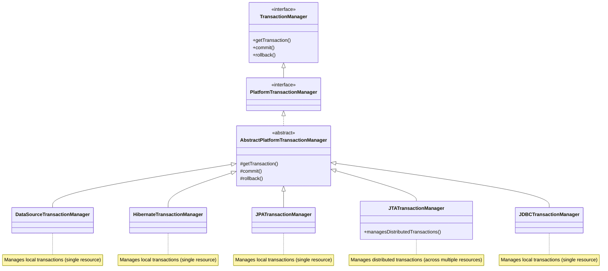

# Hierarchy of Transaction Managers Explained

The diagram shows the hierarchy of transaction managers in Java, particularly in the context of Spring Framework. Here's a detailed explanation with a corresponding Mermaid diagram:

## Detailed Explanation

1. **TransactionManager Interface**: The root interface that defines the basic contract for transaction management with three essential methods:
   - `getTransaction()`: Retrieves the currently active transaction or creates a new one
   - `commit()`: Commits the given transaction
   - `rollback()`: Rolls back the given transaction

2. **PlatformTransactionManager**: Extends the basic TransactionManager interface with additional capabilities needed for platform-specific transaction management.

3. **AbstractPlatformTransactionManager**: An abstract class that provides default implementations of the transaction methods, implementing common behavior that concrete transaction managers can inherit.

4. **Concrete Implementations**:
   - **DataSourceTransactionManager**: For JDBC-based transactions (plain JDBC)
   - **HibernateTransactionManager**: For Hibernate-based persistence
   - **JPATransactionManager**: For JPA-based persistence
   - **JTATransactionManager**: For JTA (Java Transaction API) distributed transactions
   - **JDBCTransactionManager**: Another variant for JDBC transactions

5. **Transaction Types**:
   - Most implementations manage local transactions (single resource)
   - JTA is special as it can manage distributed transactions (multiple resources)

## Mermaid Diagram



## Key Points

1. The hierarchy follows good OOP principles with interfaces at the top and concrete implementations at the bottom.

2. The abstract class provides reusable implementations that concrete classes can extend or override as needed.

3. Most transaction managers handle local transactions (single database/resource), while JTA handles distributed transactions (multiple resources that need to participate in the same transaction).

4. This design allows applications to work with different persistence technologies (JDBC, Hibernate, JPA) while maintaining a consistent transaction management API.

5. In Spring applications, you typically configure one of these transaction managers based on your persistence technology choice.

<br/>
<br/>

# Transaction Management in Spring: Declarative vs Programmatic

The image explains the two primary approaches to transaction management in Spring applications: Declarative and Programmatic. Let me break this down in detail.

## 1. Declarative Transaction Management

### Overview
Declarative transaction management is the preferred approach in Spring, where transaction behavior is declared through metadata (annotations) rather than being hard-coded in business logic.

### Example from Image
```java
@Component
public class User {
    @Transactional  
    public void updateUser() {  
        System.out.println("UPDATE QUERY TO update the user table values");
    }
}
```

### Key Points:
- **@Transactional Annotation**: Marks methods that need transactional behavior
- **Automatic Management**: Spring automatically:
  - Begins transaction before method execution
  - Commits if method completes successfully
  - Rolls back if runtime exceptions occur
- **DataSource Adaptation**: Spring Boot auto-configures the appropriate transaction manager based on your project's dependencies:
  - JDBC → DataSourceTransactionManager
  - JPA → JPATransactionManager
  - Hibernate → HibernateTransactionManager
  - JTA → JTATransactionManager (for distributed transactions)

### Advantages:
- Clean separation of business logic from transaction management
- Less boilerplate code
- Easy to maintain and modify transaction behavior

## 2. Programmatic Transaction Management

### Overview
Programmatic management involves manually controlling transactions through code using TransactionTemplate or PlatformTransactionManager.

### Example Scenario from Image:
```java
@Component
public class User {
    @Transactional
    public void updateUser() {
        //1. update DB
        //2. External API call
        //3. update DB
    }
}
```

### Why It's Flexible but Difficult to Maintain:
1. **Flexibility**:
   - Fine-grained control over transaction boundaries
   - Can handle complex scenarios like:
     - Conditional transaction behavior
     - Mixing multiple transaction strategies
     - Custom rollback rules
     - Manual recovery scenarios

2. **Maintenance Challenges**:
   - Transaction code is mixed with business logic
   - Harder to read and understand
   - More prone to errors if not implemented carefully
   - Changes require modifying business code

### Why the Example Shows Flexibility:
The example demonstrates a case where you might need programmatic control:
1. First database update
2. External API call (which might fail or have different transaction requirements)
3. Second database update

In declarative approach, if the API call fails, the entire transaction would rollback (including the first DB update), which might not be the desired behavior. Programmatic approach allows handling this case specifically.

## Comparison Table

| Aspect                | Declarative                     | Programmatic                   |
|-----------------------|----------------------------------|--------------------------------|
| Implementation        | Annotations (declarative)       | Manual code                    |
| Complexity            | Simple                          | Complex                        |
| Control               | Less control                    | Full control                   |
| Maintenance           | Easier                          | Harder                         |
| Use Case              | Most common cases               | Special edge cases             |
| Code Mixing           | Business logic stays clean      | Mixed with transaction code    |
| Transaction Managers  | Auto-selected by Spring         | Must be manually configured    |

## Best Practices

1. **Prefer Declarative** for most cases - it's cleaner and sufficient for 90% of requirements
2. **Use Programmatic** only when you need:
   - Very specific transaction boundaries
   - Mixed transaction strategies
   - Conditional transaction behavior
   - Integration with non-transactional resources

3. **For complex cases** like the example with API calls:
   - Consider breaking into multiple methods
   - Use transaction propagation attributes (@Transactional(propagation = REQUIRES_NEW))
   - Or use TransactionTemplate for specific parts

The image effectively shows how Spring provides both approaches to handle different transaction management needs in applications.


<br/>
<br/>

# Declarative Transaction Management in Spring Boot

This image demonstrates declarative transaction management in Spring Boot using annotations, along with configuration of a transaction manager. Let me explain it in detail.

## Core Components

### 1. Transactional Method
```java
@Component
public class User {
    @Transactional
    public void updateUser() {
        System.out.println("UPDATE QUERY TO update the user db values");
    }
}
```

- **@Component**: Marks the class as a Spring-managed component
- **@Transactional**: Declares that the method should be executed within a transaction
  - Spring automatically:
    - Begins transaction before method execution
    - Commits if method completes successfully
    - Rolls back if runtime exceptions occur

### 2. Configuration Class
```java
@Configuration
public class AppConfig {
    @Bean
    public DataSource dataSource() {
        DriverManagerDataSource dataSource = new DriverManagerDataSource();
        dataSource.setDriverClassName("org.h2.Driver");
        dataSource.setUrl("jdbc:h2:mem:testdb");
        dataSource.setUsername("sa");
        dataSource.setPassword("");
        return dataSource;
    }

    @Bean
    public PlatformTransactionManager userTransactionManager(DataSource dataSource) {
        return new DataSourceTransactionManager(dataSource);
    }
}
```

- **DataSource Configuration**:
  - Creates an in-memory H2 database connection
  - Configures driver, URL, username, and password
- **Transaction Manager**:
  - Creates a `DataSourceTransactionManager` bean
  - Automatically wired with the DataSource
  - Manages JDBC-based transactions

### 3. Explicit Transaction Manager Usage
```java
@Component
public class UserDeclarative {
    @Transactional(transactionManager = "userTransactionManager")
    public void updateUserProgrammatic() {
        //SOME DB OPERATIONS
        System.out.println("Insert Query ran");
        System.out.println("Update Query ran");
    }
}
```

- Explicitly specifies which transaction manager to use (`userTransactionManager`)
- Useful when multiple transaction managers are configured

## How It Works

1. **Auto-configuration**:
   - Spring Boot automatically configures transaction management based on dependencies
   - With JDBC: `DataSourceTransactionManager`
   - With JPA: `JpaTransactionManager`
   - With Hibernate: `HibernateTransactionManager`

2. **Transaction Flow**:
   - When `updateUser()` is called:
     1. Transaction begins
     2. Method executes
     3. If successful → transaction commits
     4. If exception → transaction rolls back

3. **Customization Options**:
   - Transaction isolation level
   - Propagation behavior
   - Timeout settings
   - Rollback rules

## Key Benefits

1. **Simplified Code**: Business logic remains clean and focused
2. **Consistent Behavior**: Standardized transaction handling
3. **Flexible Configuration**: Can work with different persistence technologies
4. **Easy Maintenance**: Transaction behavior can be modified without changing business logic

## Transaction Attributes (Can be added to @Transactional)

```java
@Transactional(
    transactionManager = "userTransactionManager",
    propagation = Propagation.REQUIRED,
    isolation = Isolation.DEFAULT,
    timeout = 30,
    rollbackFor = {SQLException.class},
    noRollbackFor = {NullPointerException.class}
)
```

This declarative approach is the recommended way to handle transactions in most Spring applications, providing a good balance of power and simplicity.

<br/>
<br/>

# Programmatic Transaction Management in Spring: Two Approaches

The image demonstrates two ways to implement programmatic transaction management in Spring applications. Let me explain each approach in detail with corrections to the syntax.

## Approach 1: Direct PlatformTransactionManager Usage

### Configuration
```java
@Configuration
public class AppConfig {

    @Bean
    public DataSource dataSource() {
        DriverManagerDataSource dataSource = new DriverManagerDataSource();
        dataSource.setDriverClassName("org.h2.Driver");
        dataSource.setUrl("jdbc:h2:mem:testdb");
        dataSource.setUsername("sa");
        dataSource.setPassword("");
        return dataSource;
    }

    @Bean
    public PlatformTransactionManager userTransactionManager(DataSource dataSource) {
        return new DataSourceTransactionManager(dataSource);
    }
}
```

### Usage
```java
@Service
public class UserService {
    
    @Autowired
    private PlatformTransactionManager transactionManager;

    public void updateUserProgrammatic() {
        TransactionStatus status = transactionManager.getTransaction(new DefaultTransactionDefinition());
        
        try {
            // Business logic
            System.out.println("Insert Query run");
            System.out.println("Update Query run");
            
            transactionManager.commit(status);
        } catch (Exception e) {
            transactionManager.rollback(status);
            throw e;
        }
    }
}
```

**Key Points:**
1. Manually control transaction boundaries
2. Explicitly call `getTransaction()`, `commit()`, and `rollback()`
3. More verbose but provides complete control
4. Must handle transaction status and exceptions properly

## Approach 2: Using TransactionTemplate

### Configuration
```java
@Configuration
public class AppConfig {

    @Bean
    public DataSource dataSource() {
        DriverManagerDataSource dataSource = new DriverManagerDataSource();
        dataSource.setDriverClassName("org.h2.Driver");
        dataSource.setUrl("jdbc:h2:mem:testdb");
        dataSource.setUsername("sa");
        dataSource.setPassword("");
        return dataSource;
    }

    @Bean
    public PlatformTransactionManager userTransactionManager(DataSource dataSource) {
        return new DataSourceTransactionManager(dataSource);
    }

    @Bean
    public TransactionTemplate transactionTemplate(PlatformTransactionManager userTransactionManager) {
        return new TransactionTemplate(userTransactionManager);
    }
}
```

### Component Usage
```java
@Component
public class UserProgrammaticApproach2 {
    private final TransactionTemplate transactionTemplate;

    public UserProgrammaticApproach2(TransactionTemplate transactionTemplate) {
        this.transactionTemplate = transactionTemplate;
    }

    public void updateUserProgrammatic() {
        transactionTemplate.execute(status -> {
            // Business logic
            System.out.println("Insert Query run");
            System.out.println("Update Query run");
            return null;
        });
    }
}
```

**Key Points:**
1. More concise than Approach 1
2. Uses callback pattern with `TransactionTemplate.execute()`
3. Automatically handles commit/rollback based on whether the callback completes normally or throws an exception
4. Can return a value from the transaction
5. Still provides programmatic control but with less boilerplate

## Comparison of Both Approaches

| Feature                      | PlatformTransactionManager (Approach 1) | TransactionTemplate (Approach 2) |
|------------------------------|----------------------------------------|----------------------------------|
| Boilerplate Code             | More                                   | Less                             |
| Control Granularity          | Finer                                 | Slightly coarser                |
| Exception Handling           | Manual                                 | Automatic                       |
| Readability                  | Lower                                  | Higher                          |
| Return Values                | Must handle manually                  | Built-in support                |
| Transaction Definition       | Must configure manually               | Can configure in template       |
| Recommended Use Cases        | Very complex scenarios                | Most programmatic needs         |

## Best Practices

1. **Prefer TransactionTemplate** (Approach 2) for most programmatic needs as it reduces boilerplate
2. **Use PlatformTransactionManager directly** only when you need:
   - Very specific transaction control
   - Custom transaction state handling
   - Complex exception handling scenarios

3. **Configuration Tips**:
   - You can pre-configure TransactionTemplate with:
     ```java
     transactionTemplate.setIsolationLevel(Isolation.READ_COMMITTED);
     transactionTemplate.setPropagationBehavior(Propagation.REQUIRES_NEW);
     transactionTemplate.setTimeout(30); // seconds
     ```

4. **Error Handling**:
   - Both approaches will rollback on runtime exceptions by default
   - For checked exceptions, you need to configure rollback behavior

Programmatic transaction management gives you precise control when declarative (@Transactional) management isn't sufficient, especially for complex transaction scenarios or when you need to integrate with non-transactional resources.

<br/>
<br/>

# Spring Transaction Propagation Explained

Transaction propagation defines how transactions relate to each other when multiple transactional methods call each other. Here's a detailed explanation of all propagation behaviors:

## Core Propagation Types

### 1. REQUIRED (Default)
**Behavior**: 
- If a transaction exists: Join it
- If no transaction exists: Create a new one

**Usage**:
```java
@Transactional(propagation = Propagation.REQUIRED)
public void methodA() {
    // Business logic
}
```

**Scenario**:
- Method A (REQUIRED) calls Method B (REQUIRED)
- Both execute in the same transaction
- If either fails, both are rolled back

### 2. REQUIRES_NEW
**Behavior**:
- Always creates a new transaction
- Suspends current transaction if one exists

**Usage**:
```java
@Transactional(propagation = Propagation.REQUIRES_NEW)
public void auditLog() {
    // Audit logging that should commit independently
}
```

**Scenario**:
- Main transaction executes
- Calls auditLog() with REQUIRES_NEW
- Main transaction is suspended
- New transaction begins for audit
- Audit commits/rolls back independently
- Main transaction resumes

### 3. SUPPORTS
**Behavior**:
- If transaction exists: Join it
- If no transaction: Execute non-transactionally

**Usage**:
```java
@Transactional(propagation = Propagation.SUPPORTS)
public Object getData() {
    // Read-only operation
}
```

**When to Use**:
- For read-only operations that can work with or without transactions

## Specialized Propagation Types

### 4. NOT_SUPPORTED
**Behavior**:
- Always executes non-transactionally
- Suspends current transaction if one exists

**Usage**:
```java
@Transactional(propagation = Propagation.NOT_SUPPORTED)
public void processQueueMessage() {
    // Works with non-transactional resources
}
```

**When to Use**:
- When interacting with non-transactional systems
- To avoid transaction timeouts for long operations

### 5. MANDATORY
**Behavior**:
- Must have an existing transaction
- Throws exception if no transaction exists

**Usage**:
```java
@Transactional(propagation = Propagation.MANDATORY)
public void updateCriticalData() {
    // Must be part of larger transaction
}
```

**When to Use**:
- When method should never be called outside transaction context
- For enforcing proper transactional boundaries

### 6. NEVER
**Behavior**:
- Must NOT have an existing transaction
- Throws exception if transaction exists

**Usage**:
```java
@Transactional(propagation = Propagation.NEVER)
public void generateReport() {
    // Should never run in transaction
}
```

**When to Use**:
- For operations that shouldn't be transactional
- To prevent accidental transactional execution

## Propagation Behavior Summary Table

| Propagation    | Current Transaction | Behavior                          |
|----------------|---------------------|-----------------------------------|
| REQUIRED       | None                | Create new transaction            |
|                | Exists              | Join current transaction          |
| REQUIRES_NEW   | None                | Create new transaction            |
|                | Exists              | Suspend current, create new       |
| SUPPORTS       | None                | Execute non-transactionally       |
|                | Exists              | Join current transaction          |
| NOT_SUPPORTED  | None                | Execute non-transactionally       |
|                | Exists              | Suspend current, execute non-tx   |
| MANDATORY      | None                | Throw IllegalTransactionStateEx   |
|                | Exists              | Join current transaction          |
| NEVER          | None                | Execute non-transactionally       |
|                | Exists              | Throw IllegalTransactionStateEx   |

## Practical Considerations

1. **Default is REQUIRED**: Most methods should use this
2. **REQUIRES_NEW** creates independent transactions:
   - Outer transaction failure won't affect inner
   - Inner transaction failure won't affect outer (unless exception propagates)
   
3. **Performance Impact**:
   - REQUIRES_NEW and NOT_SUPPORTED involve transaction suspension
   - Suspension has overhead (thread-local storage management)

4. **Exception Handling**:
   - Checked exceptions don't trigger rollback by default
   - Use `@Transactional(rollbackFor = MyException.class)`

## Example Scenario

```java
@Service
public class OrderService {
    
    @Transactional // Default REQUIRED
    public void processOrder(Order order) {
        // Main order processing
        inventoryService.updateStock(order); // REQUIRED
        auditService.logOrder(order); // REQUIRES_NEW
        reportService.generateSalesReport(); // NOT_SUPPORTED
    }
}

@Service
public class InventoryService {
    @Transactional(propagation = Propagation.REQUIRED)
    public void updateStock(Order order) {...}
}

@Service
public class AuditService {
    @Transactional(propagation = Propagation.REQUIRES_NEW)
    public void logOrder(Order order) {...}
}

@Service
public class ReportService {
    @Transactional(propagation = Propagation.NOT_SUPPORTED)
    public void generateSalesReport() {...}
}
```

Understanding propagation is crucial for designing proper transactional boundaries in Spring applications. Choose the propagation behavior that matches your business requirements for atomicity and isolation.


<br/>
<br/>

# Declarative Transaction Management with Propagation in Spring

The image demonstrates declarative transaction management using `@Transactional` with propagation behaviors, along with transaction status inspection using `TransactionSynchronizationManager`. Here's a detailed explanation:

## Key Components

### 1. Transaction Inspection Class
```java
public class UserDeclaration {
    public void operation() {
        System.out.println("Is transaction active: " + 
            TransactionSynchronizationManager.isActualTransactionActive());
        System.out.println("Current transaction name: " + 
            TransactionSynchronizationManager.getCurrentTransactionName());
        System.out.println("Some initial DB operation");
        // DB operations
        System.out.println("Some final DB operation");
    }
}
```

### 2. Transactional Service Class
```java
public class UserPAMG {
    @Transactional(propagation = Propagation.REQUIRED)
    public void dbOperationWithRequiredPropagation() {
        // EXECUTE DB QUERIES
        boolean isTransactionActive = 
            TransactionSynchronizationManager.isActualTransactionActive();
        String currentTransactionName = 
            TransactionSynchronizationManager.getCurrentTransactionName();
        
        System.out.println("***************************");
        System.out.println("Propagation.REQUIRED: Is transaction active: " + isTransactionActive);
        System.out.println("Propagation.REQUIRED: Current transaction name: " + currentTransactionName);
        System.out.println("***************************");
    }
}
```

## Understanding the Output Scenarios

### Scenario 1: Called Within Existing Transaction
**Output:**
```
Is transaction active: true
Current transaction name: com.example.UserDeclaration.updateUser
Some initial DB operation
***************************
Propagation.REQUIRED: Is transaction active: true
Propagation.REQUIRED: Current transaction name: com.example.UserDeclaration.updateUser
***************************
Some final DB operation
```

**Behavior:**
1. Outer method (`UserDeclaration.operation()`) is transactional
2. When it calls `dbOperationWithRequiredPropagation()`:
   - Since propagation is REQUIRED (default) and transaction exists
   - The method joins the existing transaction
3. Transaction name remains the same (outer method's transaction)

### Scenario 2: Called Without Existing Transaction
**Output:**
```
Is transaction active: false
Current transaction name: null
Some initial DB operation
***************************
Propagation.REQUIRED: Is transaction active: true
Propagation.REQUIRED: Current transaction name: com.example.UserData.dbOperationWithRequiredPropagation
***************************
Some final DB operation
```

**Behavior:**
1. Outer method (`UserDeclaration.operation()`) is non-transactional
2. When it calls `dbOperationWithRequiredPropagation()`:
   - Since no transaction exists and propagation is REQUIRED
   - Spring creates a new transaction
3. New transaction gets the name of the method that started it

## Key Concepts Explained

1. **TransactionSynchronizationManager**:
   - Utility class for inspecting current transaction status
   - `isActualTransactionActive()`: Checks if transaction is active
   - `getCurrentTransactionName()`: Gets name of current transaction

2. **REQUIRED Propagation**:
   - Default propagation behavior
   - Joins existing transaction if available
   - Creates new transaction if none exists
   - Most commonly used propagation

3. **Transaction Naming**:
   - By default, Spring names transactions after the fully qualified method name
   - Can be customized using `@Transactional`'s `transactionManager` property

## Practical Usage Patterns

1. **Checking Transaction Status**:
```java
if (TransactionSynchronizationManager.isActualTransactionActive()) {
    // Transaction-specific logic
}
```

2. **Debugging Transaction Boundaries**:
```java
@Transactional
public void complexOperation() {
    log.debug("Transaction: {}", 
        TransactionSynchronizationManager.getCurrentTransactionName());
    // ... business logic
}
```

3. **Transaction-Aware Resource Handling**:
```java
@Transactional
public void processData() {
    // Will participate in same transaction
    Connection conn = DataSourceUtils.getConnection(dataSource);
    // ... use connection
}
```

## Best Practices

1. **Use REQUIRED for most operations** - It provides natural transaction scoping
2. **Minimize transaction inspection** - Rely on Spring's declarative model when possible
3. **Use meaningful method names** - They become transaction identifiers
4. **Combine with isolation/timeout**:
```java
@Transactional(
    propagation = Propagation.REQUIRED,
    isolation = Isolation.READ_COMMITTED,
    timeout = 30
)
```

This example demonstrates how Spring's transaction abstraction works in practice, showing both the declarative configuration and programmatic inspection capabilities. The REQUIRED propagation ensures proper transaction scoping while maintaining flexibility in how transactional methods are composed.

<br/>
<br/>

# Programmatic Transaction Management with REQUIRED Propagation

This image demonstrates programmatic transaction management using `PlatformTransactionManager` with REQUIRED propagation behavior. Let me break it down with detailed explanation and expected outputs.

## Core Components

### 1. Service Class with Transactional Methods
```java
@Component
public class UserDeclarative {
    @Autowired
    UserDAO userDAOObj;

    @Transactional
    public void updateUser() {
        System.out.println("Is transaction active: " + 
            TransactionSynchronizationManager.isActualTransactionActive());
        System.out.println("Current transaction name: " + 
            TransactionSynchronizationManager.getCurrentTransactionName());
        System.out.println("Some initial DB operation");
        userDAOObj.dbOperationWithRequiredPropagationUsingProgrammaticApproach1();
        System.out.println("Some final DB operation");
    }

    public void updateUserFromNonTransactionalMethod() {
        System.out.println("Is transaction active: " + 
            TransactionSynchronizationManager.isActualTransactionActive());
        System.out.println("Current transaction name: " + 
            TransactionSynchronizationManager.getCurrentTransactionName());
        System.out.println("Some initial DB operation");
        userDAOObj.dbOperationWithRequiredPropagationUsingProgrammaticApproach1();
        System.out.println("Some final DB operation");
    }
}
```

### 2. DAO Class with Programmatic Transaction
```java
@Component
public class UserDAO {
    PlatformTransactionManager userTransactionManager;

    UserDAO(PlatformTransactionManager userTransactionManager) {
        this.userTransactionManager = userTransactionManager;
    }

    public void dbOperationWithRequiredPropagationUsingProgrammaticApproach1() {
        DefaultTransactionDefinition transactionDefinition = new DefaultTransactionDefinition();
        transactionDefinition.setName("Testing REQUIRED propagation");
        transactionDefinition.setPropagationBehavior(TransactionDefinition.PROPAGATION_REQUIRED);
        
        TransactionStatus status = userTransactionManager.getTransaction(transactionDefinition);
        
        try {
            // EXECUTE operation
            System.out.println("***********");
            System.out.println("Propagation.REQUIRED: Is transaction active: " + 
                TransactionSynchronizationManager.isActualTransactionActive());
            System.out.println("Propagation.REQUIRED: Current transaction name: " + 
                TransactionSynchronizationManager.getCurrentTransactionName());
            System.out.println("***********");
            
            userTransactionManager.commit(status);
        } catch (Exception e) {
            userTransactionManager.rollback(status);
            throw e;
        }
    }
}
```

## Expected Output Scenarios

### Scenario 1: Called from Transactional Method (`updateUser()`)
**Output:**
```
Is transaction active: true
Current transaction name: com.example.UserDeclarative.updateUser
Some initial DB operation
***********
Propagation.REQUIRED: Is transaction active: true
Propagation.REQUIRED: Current transaction name: com.example.UserDeclarative.updateUser
***********
Some final DB operation
```

**Behavior Explanation:**
1. `updateUser()` starts with `@Transactional` - creates new transaction (Tx1)
2. When calling DAO method with PROPAGATION_REQUIRED:
   - Detects existing transaction (Tx1)
   - Joins the same transaction rather than creating new one
3. Entire operation commits/rolls back as single unit

### Scenario 2: Called from Non-Transactional Method (`updateUserFromNonTransactionalMethod()`)
**Output:**
```
Is transaction active: false
Current transaction name: null
Some initial DB operation
***********
Propagation.REQUIRED: Is transaction active: true
Propagation.REQUIRED: Current transaction name: Testing REQUIRED propagation
***********
Some final DB operation
```

**Behavior Explanation:**
1. `updateUserFromNonTransactionalMethod()` has no transaction
2. When calling DAO method with PROPAGATION_REQUIRED:
   - No existing transaction found
   - Creates new transaction (Tx2) with name "Testing REQUIRED propagation"
3. Only the DAO operations are transactional

## Key Concepts

1. **REQUIRED Propagation Behavior**:
   - Joins existing transaction if available
   - Creates new transaction if none exists
   - Matches the behavior of `@Transactional(propagation = Propagation.REQUIRED)`

2. **Programmatic Transaction Management**:
   - Manual control using `PlatformTransactionManager`
   - Requires explicit:
     - Transaction definition configuration
     - Transaction start/commit/rollback
     - Exception handling

3. **TransactionSynchronizationManager**:
   - Provides current transaction status
   - Useful for debugging and conditional logic

4. **Transaction Naming**:
   - Can be set programmatically via `DefaultTransactionDefinition`
   - Helps in debugging complex transaction flows

## Best Practices

1. **Consistent Propagation**:
   - Match programmatic propagation with surrounding declarative transactions
   - Avoid mixing REQUIRED and REQUIRES_NEW without good reason

2. **Proper Cleanup**:
   - Always ensure `rollback()` is called in catch blocks
   - Consider try-with-resources pattern for transaction resources

3. **Transaction Definition Reuse**:
   ```java
   public class TransactionUtils {
       public static TransactionDefinition getRequiredDefinition(String name) {
           DefaultTransactionDefinition def = new DefaultTransactionDefinition();
           def.setName(name);
           def.setPropagationBehavior(TransactionDefinition.PROPAGATION_REQUIRED);
           return def;
       }
   }
   ```

4. **Exception Handling**:
   - Remember to rethrow exceptions after rollback
   - Consider wrapping in appropriate unchecked exceptions

This example shows how programmatic transaction management gives precise control while maintaining consistent behavior with Spring's declarative model. The REQUIRED propagation ensures proper transaction scoping whether called from transactional or non-transactional contexts.


<br/>
<br/>

# Transaction Management Using TransactionTemplate (Approach 2)

This example demonstrates programmatic transaction management using Spring's `TransactionTemplate` with REQUIRED propagation. Below is the corrected and explained version with expected outputs.

## Corrected and Explained Code

### 1. Configuration Class
```java
@Configuration
public class AppConfig {
    
    @Bean
    public DataSource dataSource() {
        DriverManagerDataSource dataSource = new DriverManagerDataSource();
        dataSource.setDriverClassName("org.h2.Driver");
        dataSource.setUrl("jdbc:h2:mem:testdb");
        dataSource.setUsername("sa");
        dataSource.setPassword("");
        return dataSource;
    }

    @Bean
    public PlatformTransactionManager transactionManager(DataSource dataSource) {
        return new DataSourceTransactionManager(dataSource);
    }

    @Bean
    public TransactionTemplate transactionTemplate(PlatformTransactionManager transactionManager) {
        TransactionTemplate transactionTemplate = new TransactionTemplate(transactionManager);
        transactionTemplate.setPropagationBehavior(TransactionDefinition.PROPAGATION_REQUIRED);
        transactionTemplate.setName("Transaction template with REQUIRED propagation");
        return transactionTemplate;
    }
}
```

### 2. Service Class
```java
@Service
public class UserService {
    
    @Autowired
    private UserDAO userDAO;
    
    @Transactional
    public void updateUser() {
        System.out.println("Is transaction active: " + 
            TransactionSynchronizationManager.isActualTransactionActive());
        System.out.println("Current transaction name: " + 
            TransactionSynchronizationManager.getCurrentTransactionName());
        System.out.println("Some initial DB operation");
        userDAO.dbOperationWithRequiredPropagationUsingTemplate();
        System.out.println("Some final DB operation");
    }
    
    public void updateUserFromNonTransactionalMethod() {
        System.out.println("Is transaction active: " + 
            TransactionSynchronizationManager.isActualTransactionActive());
        System.out.println("Current transaction name: " + 
            TransactionSynchronizationManager.getCurrentTransactionName());
        System.out.println("Some initial DB operation");
        userDAO.dbOperationWithRequiredPropagationUsingTemplate();
        System.out.println("Some final DB operation");
    }
}
```

### 3. DAO Class with TransactionTemplate
```java
@Repository
public class UserDAO {
    
    private final TransactionTemplate transactionTemplate;
    
    public UserDAO(TransactionTemplate transactionTemplate) {
        this.transactionTemplate = transactionTemplate;
    }
    
    public void dbOperationWithRequiredPropagationUsingTemplate() {
        transactionTemplate.execute(status -> {
            System.out.println("***********");
            System.out.println("Propagation.REQUIRED: Is transaction active: " + 
                TransactionSynchronizationManager.isActualTransactionActive());
            System.out.println("Propagation.REQUIRED: Current transaction name: " + 
                TransactionSynchronizationManager.getCurrentTransactionName());
            System.out.println("***********");
            return null;
        });
    }
}
```

## Expected Output Scenarios

### Scenario 1: Called from Transactional Method (`updateUser()`)
**Output:**
```
Is transaction active: true
Current transaction name: com.example.UserService.updateUser
Some initial DB operation
***********
Propagation.REQUIRED: Is transaction active: true
Propagation.REQUIRED: Current transaction name: com.example.UserService.updateUser
***********
Some final DB operation
```

**Behavior Explanation:**
1. `updateUser()` starts with `@Transactional` - creates new transaction (Tx1)
2. When calling DAO method with TransactionTemplate (REQUIRED):
   - Detects existing transaction (Tx1)
   - Joins the same transaction rather than creating new one
3. Transaction name remains the outer method's transaction name
4. Entire operation commits/rolls back as single unit

### Scenario 2: Called from Non-Transactional Method (`updateUserFromNonTransactionalMethod()`)
**Output:**
```
Is transaction active: false
Current transaction name: null
Some initial DB operation
***********
Propagation.REQUIRED: Is transaction active: true
Propagation.REQUIRED: Current transaction name: Transaction template with REQUIRED propagation
***********
Some final DB operation
```

**Behavior Explanation:**
1. `updateUserFromNonTransactionalMethod()` has no transaction
2. When calling DAO method with TransactionTemplate (REQUIRED):
   - No existing transaction found
   - Creates new transaction with the name configured in TransactionTemplate
3. Only the DAO operations are transactional
4. Transaction commits automatically if no exceptions occur

## Key Advantages of TransactionTemplate

1. **Reduced Boilerplate**:
   - Automatic commit/rollback handling
   - No need for explicit try-catch blocks

2. **Consistent Configuration**:
   - Transaction properties set once in configuration
   - Applied consistently across all uses

3. **Lambda Support**:
   - Clean syntax with functional interface
   - Can return values from transactions

4. **Integration**:
   - Works seamlessly with both programmatic and declarative transactions
   - Respects existing transaction contexts

## Comparison with PlatformTransactionManager Approach

| Feature                | TransactionTemplate           | PlatformTransactionManager     |
|------------------------|-------------------------------|-------------------------------|
| Boilerplate            | Less                          | More                          |
| Readability            | Higher (lambda syntax)        | Lower                         |
| Error Handling         | Automatic                     | Manual                        |
| Configuration          | Centralized                   | Per-method                    |
| Return Values          | Supported                     | Must handle manually          |
| Recommended For        | Most programmatic needs       | Very complex scenarios        |

This approach using TransactionTemplate provides a cleaner, more maintainable way to handle programmatic transactions while maintaining all the flexibility of Spring's transaction management.