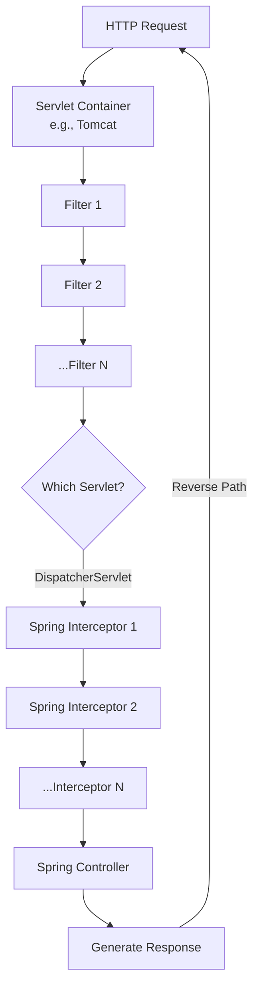

# **Filters vs. Interceptors in Spring Boot: A Detailed Guide**

#### **Core Concept in One Line**
*   **Filter:** Intercepts HTTP requests and responses **before** they reach any Servlet.
*   **Interceptor:** Intercepts HTTP requests and responses **after** a Servlet is chosen but **before** it reaches the Controller (and vice-versa for the response). It is specific to the Spring Framework.

---

### **1. The Big Picture: Request Journey**

To understand the difference, we must first understand the path an HTTP request takes through a Java web application, especially Spring Boot.



**Key Stages Explained:**
1.  **Servlet Container:** The entry point (e.g., Tomcat, Jetty). It receives the raw HTTP request.
2.  **Filters:** A chain of filters processes the request. They are part of the Jakarta EE (formerly Java EE) specification and are **container-managed**.
3.  **Servlet Routing:** The container determines which Servlet should handle the request based on URL mappings (e.g., `/api/*`, `/soap/*`).
4.  **DispatcherServlet:** In Spring Boot, this is the central Servlet that handles all incoming requests destined for your controllers. It is the heart of Spring MVC.
5.  **Interceptors:** After the `DispatcherServlet` is invoked but before it delegates to the specific controller, a chain of Spring Interceptors gets a chance to act. They are **Spring-managed**.
6.  **Controller:** Your actual business logic (e.g., `@RestController`, `@Controller`) is executed here.
7.  **Response:** The generated response travels back through the Interceptors (in reverse order), then the Filters (in reverse order), and finally out through the container.

---

### **2. Detailed Comparison: Filter vs. Interceptor**

| Aspect | Filter | Interceptor |
| :--- | :--- | :--- |
| **Specification** | Jakarta EE (Java EE) Servlet API. | Spring Framework specific. |
| **Placement** | Executes **before** the request reaches **any Servlet**. | Executes **after** a Servlet is chosen but **before** the Controller. |
| **Dependency** | No dependency on Spring. Works in any Servlet-based application. | Tightly coupled with the Spring Framework. |
| **Usage Scope** | **Generic & Servlet-Agnostic.** Logic applies to all Servlets (REST, SOAP, file uploads). | **Servlet-Specific.** Logic applies only to requests handled by the `DispatcherServlet`. |
| **Access** | Has access to the raw `ServletRequest` and `ServletResponse`. | Has access to the `HttpServletRequest` and `HttpServletResponse`, but also the `HandlerMethod` object (which contains controller method info). |
| **Ordering** | Yes, defined via `@Order` or `FilterRegistrationBean.setOrder()`. | Yes, defined by the order in which they are added to the `InterceptorRegistry`. |

---

### **3. When to Use Which?**

#### **Use a Filter when:**
*   You need to implement logic that is **completely independent of Spring**.
*   The logic must apply to **all types of requests** entering the application, regardless of which Servlet handles them (e.g., REST, SOAP, static resources).
*   **Perfect Examples:**
    *   **Spring Security:** Needs to authenticate/authorize all requests upfront.
    *   **Logging & Auditing:** Log all incoming requests and outgoing responses.
    *   **CORS:** Handle Cross-Origin Resource Sharing headers at a very early stage.
    *   **Compression:** GZIP compression of responses.
    *   **XSS Protection:** Sanitize input globally.

#### **Use an Interceptor when:**
*   Your logic is **specific to your Spring application** and the business endpoints it exposes.
*   You need access to Spring's context, like the `HandlerMethod` (to check which controller method will be invoked).
*   **Perfect Examples:**
    *   **Authorization Checks:** Validate user permissions based on the specific endpoint being called.
    *   **Controller-Specific Logging:** Detailed logs for API performance, timing, etc.
    *   **Adding Common Model Attributes:** Adding data to every model before a view is rendered.
    *   **Validation:** Pre-validate certain aspects of a request before it hits the controller.

---

### **4. Order of Execution (Code Perspective)**

#### **For Interceptors (Spring-Managed):**
If you have two interceptors, `Interceptor1` and `Interceptor2`, registered in that order:

1.  `Interceptor1.preHandle()`
2.  `Interceptor2.preHandle()`
3.  **Controller Method Executes**
4.  `Interceptor2.postHandle()`
5.  `Interceptor1.postHandle()`
6.  `Interceptor2.afterCompletion()`
7.  `Interceptor1.afterCompletion()`

*   **`preHandle()`:** If returns `false`, the chain is broken, and the request does not proceed to the controller or further interceptors.

#### **For Filters (Servlet-Managed):**
If you have two filters, `Filter1` (Order=1) and `Filter2` (Order=2):

1.  `Filter1.doFilter()` (first half, before `chain.doFilter()`)
2.  `Filter2.doFilter()` (first half, before `chain.doFilter()`)
3.  **Servlet and Controller Execute**
4.  `Filter2.doFilter()` (second half, after `chain.doFilter()`)
5.  `Filter1.doFilter()` (second half, after `chain.doFilter()`)

*   The `FilterChain.doFilter()` call is crucial—it passes the request to the next filter or the servlet.

---

### **Conclusion & Key Takeaway**

*   **They are not competitors; they operate at different layers.** One is not "better" than the other. They are complementary tools.
*   **Think about scope:** Use a **Filter** for **broad, infrastructure-level** concerns that apply to your entire application. Use an **Interceptor** for **narrow, application-level** concerns specific to your Spring controllers.
*   The placement of a Filter (before the Servlet) makes it more powerful for tasks like security, as it can block a request before it even enters the Spring ecosystem.

This layered approach provides a clean separation of concerns, allowing you to apply cross-cutting logic at the most appropriate level.

<br/>
<br/>

## Let's dive into code examples for both Filters and Interceptors to solidify the concepts.

### **1. Creating and Registering Filters**

Filters are part of the Servlet API. We create them by implementing the `jakarta.servlet.Filter` interface (or `javax.servlet.Filter` for older applications).

#### **Example 1: A Simple Logging Filter**

```java
import jakarta.servlet.*;
import jakarta.servlet.http.HttpServletRequest;
import org.slf4j.Logger;
import org.slf4j.LoggerFactory;
import org.springframework.core.annotation.Order;
import org.springframework.stereotype.Component;
import java.io.IOException;

@Component
@Order(1) // Defines execution order. Lower numbers have higher priority.
public class LoggingFilter implements Filter {

    private static final Logger LOGGER = LoggerFactory.getLogger(LoggingFilter.class);

    @Override
    public void doFilter(ServletRequest request, ServletResponse response, FilterChain chain)
            throws IOException, ServletException {
        
        // This code runs BEFORE the request reaches the Servlet/Controller
        HttpServletRequest httpRequest = (HttpServletRequest) request;
        String requestURI = httpRequest.getRequestURI();
        LOGGER.info("Incoming request for URI: {}", requestURI);
        long startTime = System.currentTimeMillis();

        // Pass the request along the filter chain. 
        // This is crucial - it calls the next filter or the servlet.
        chain.doFilter(request, response);

        // This code runs AFTER the request has been processed and 
        // the response is on its way back to the client.
        long duration = System.currentTimeMillis() - startTime;
        LOGGER.info("Request {} completed in {} ms", requestURI, duration);
    }

    // Optionally override init() and destroy() methods if needed.
    // @Override
    // public void init(FilterConfig filterConfig) throws ServletException {}
    //
    // @Override
    // public void destroy() {}
}
```
*   **`chain.doFilter(request, response)`** is the critical line. It passes control to the next item in the chain.

#### **Example 2: An Authentication Filter (Checking for an API Key)**

```java
import jakarta.servlet.*;
import jakarta.servlet.http.HttpServletRequest;
import jakarta.servlet.http.HttpServletResponse;
import org.springframework.core.annotation.Order;
import org.springframework.stereotype.Component;
import java.io.IOException;

@Component
@Order(2) // This filter will run after the LoggingFilter (higher order value)
public class AuthFilter implements Filter {

    private static final String VALID_API_KEY = "secret-key-123"; // In real life, use environment variables!

    @Override
    public void doFilter(ServletRequest request, ServletResponse response, FilterChain chain)
            throws IOException, ServletException {
        
        HttpServletRequest httpRequest = (HttpServletRequest) request;
        HttpServletResponse httpResponse = (HttpServletResponse) response;

        String apiKey = httpRequest.getHeader("X-API-KEY");

        // Check for a valid API key
        if (apiKey == null || !apiKey.equals(VALID_API_KEY)) {
            // Block the request. The chain is NOT continued.
            httpResponse.setStatus(HttpServletResponse.SC_UNAUTHORIZED);
            httpResponse.getWriter().write("Invalid or Missing API Key");
            return; // Stop further processing
        }

        // If the key is valid, continue down the chain
        chain.doFilter(request, response);
    }
}
```

**Registration (Alternative to `@Component`):**
While `@Component` and `@Order` work, you can also register filters explicitly for more control (e.g., URL patterns).

```java
import org.springframework.boot.web.servlet.FilterRegistrationBean;
import org.springframework.context.annotation.Bean;
import org.springframework.context.annotation.Configuration;

@Configuration
public class FilterConfig {

    @Bean
    public FilterRegistrationBean<LoggingFilter> loggingFilter() {
        FilterRegistrationBean<LoggingFilter> registrationBean = new FilterRegistrationBean<>();
        registrationBean.setFilter(new LoggingFilter());
        registrationBean.addUrlPatterns("/api/*"); // Apply only to /api endpoints
        registrationBean.setOrder(1);
        return registrationBean;
    }
    
    // AuthFilter can be registered similarly if not using @Component
}
```

---

### **2. Creating and Registering Interceptors**

Interceptors are a Spring-specific concept. We create them by implementing the `HandlerInterceptor` interface.

#### **Example: A Logging and User Validation Interceptor**

```java
import jakarta.servlet.http.HttpServletRequest;
import jakarta.servlet.http.HttpServletResponse;
import org.slf4j.Logger;
import org.slf4j.LoggerFactory;
import org.springframework.stereotype.Component;
import org.springframework.web.servlet.HandlerInterceptor;
import org.springframework.web.servlet.ModelAndView;

@Component
public class CustomInterceptor implements HandlerInterceptor {

    private static final Logger LOGGER = LoggerFactory.getLogger(CustomInterceptor.class);

    @Override
    public boolean preHandle(HttpServletRequest request, HttpServletResponse response, Object handler) throws Exception {
        // Executes before the Controller method
        long startTime = System.currentTimeMillis();
        request.setAttribute("startTime", startTime); // Store data for use in postHandle

        LOGGER.info("Pre Handle: Preparing to call controller method for {}", request.getRequestURI());

        // Example: Check if a user is logged in (simplified)
        String user = (String) request.getSession().getAttribute("user");
        if (user == null && request.getRequestURI().startsWith("/api/secure")) {
            response.sendError(HttpServletResponse.SC_FORBIDDEN, "Please log in");
            return false; // Stop the execution chain. Controller is NOT called.
        }
        return true; // Continue to the controller
    }

    @Override
    public void postHandle(HttpServletRequest request, HttpServletResponse response, Object handler, ModelAndView modelAndView) throws Exception {
        // Executes after the Controller method but before the response is rendered/written
        long startTime = (Long) request.getAttribute("startTime");
        long duration = System.currentTimeMillis() - startTime;
        LOGGER.info("Post Handle: Controller for {} executed in {} ms", request.getRequestURI(), duration);

        // You can modify the ModelAndView object here (for MVC applications)
        if (modelAndView != null) {
            modelAndView.addObject("processingTime", duration);
        }
    }

    @Override
    public void afterCompletion(HttpServletRequest request, HttpServletResponse response, Object handler, Exception ex) throws Exception {
        // Executes after the request is complete and the response is sent to the client.
        // Useful for resource cleanup.
        LOGGER.info("After Completion: Request is complete for {}", request.getRequestURI());
        if (ex != null) {
            LOGGER.error("Exception occurred during processing: ", ex);
        }
    }
}
```

#### **Registering the Interceptor**
You must register your interceptor with Spring's `WebMvcConfigurer`.

```java
import org.springframework.beans.factory.annotation.Autowired;
import org.springframework.context.annotation.Configuration;
import org.springframework.web.servlet.config.annotation.InterceptorRegistry;
import org.springframework.web.servlet.config.annotation.WebMvcConfigurer;

@Configuration
public class InterceptorConfig implements WebMvcConfigurer {

    @Autowired
    private CustomInterceptor customInterceptor;

    @Override
    public void addInterceptors(InterceptorRegistry registry) {
        registry.addInterceptor(customInterceptor)
                .addPathPatterns("/api/**") // Apply to all API endpoints
                .excludePathPatterns("/api/public/**"); // Exclude a specific path
    }
}
```

#### **Adding Multiple Interceptors with Order**
```java
@Configuration
public class InterceptorConfig implements WebMvcConfigurer {

    @Autowired
    private CustomInterceptor customInterceptor;
    
    @Autowired
    private SecondInterceptor secondInterceptor;

    @Override
    public void addInterceptors(InterceptorRegistry registry) {
        registry.addInterceptor(customInterceptor).order(1);
        registry.addInterceptor(secondInterceptor).order(2); 
        // Order is ascending: 1 runs first, then 2.
        // For the response, the order is reversed: 2's postHandle runs first, then 1's.
    }
}
```

---

### **3. Sample Output**

If you had both the `LoggingFilter` and `CustomInterceptor` enabled for a request to `GET /api/hello`, the console output would look like this:

```
INFO  LoggingFilter - Incoming request for URI: /api/hello
INFO  CustomInterceptor - Pre Handle: Preparing to call controller method for /api/hello
... (Controller method executes) ...
INFO  CustomInterceptor - Post Handle: Controller for /api/hello executed in 15 ms
INFO  CustomInterceptor - After Completion: Request is complete for /api/hello
INFO  LoggingFilter - Request /api/hello completed in 20 ms
```

This clearly shows the order: **Filter (before) -> Interceptor (before) -> Controller -> Interceptor (after) -> Filter (after)**.