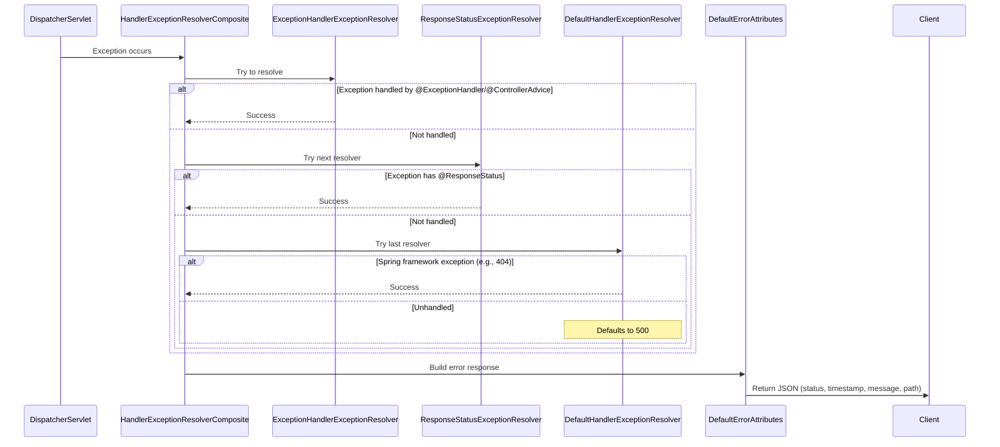
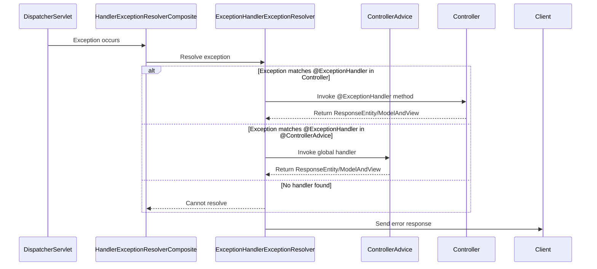
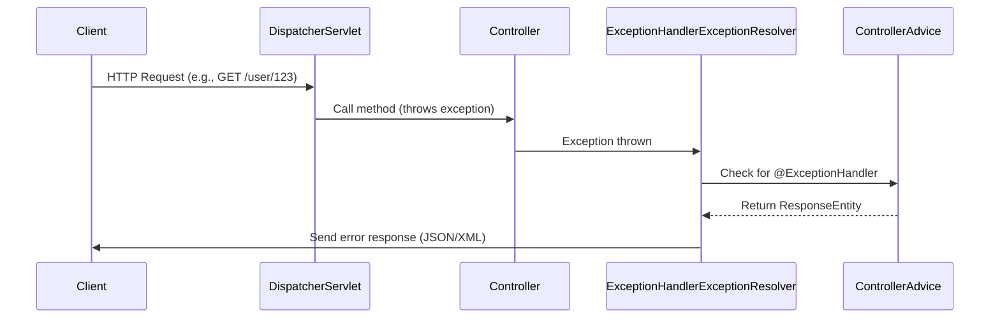
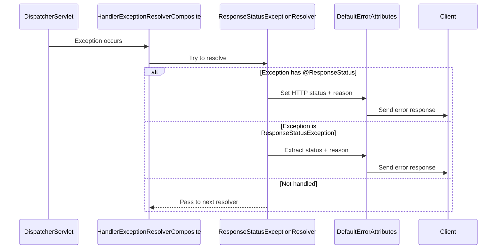

# **Exception Handling in Spring Boot - Detailed Notes**  

## **1. Introduction**  
- Exception handling is a crucial topic in Spring Boot interviews and real-world applications.  
- Beyond `@ControllerAdvice` and `@ResponseStatus`, there are multiple classes involved in exception resolution.  

---

## **2. Classes Involved in Exception Handling**  
Spring Boot uses a hierarchy of classes to handle exceptions. The key classes are:  

1. **HandlerExceptionResolver (Interface)**  
   - Defines the contract for exception resolution.  
   - Contains `resolveException()` method.  

2. **HandlerExceptionResolverComposite (Helper Class)**  
   - Orchestrates the sequence of exception resolvers.  
   - Invokes resolvers in order.  

3. **Three Main Resolvers (Execution Order)**  
   - **ExceptionHandlerExceptionResolver** → Handles `@ExceptionHandler` & `@ControllerAdvice`.  
   - **ResponseStatusExceptionResolver** → Handles `@ResponseStatus` on uncaught exceptions.  
   - **DefaultHandlerExceptionResolver** → Handles Spring-specific exceptions (e.g., `NoHandlerFoundException`).  

4. **DefaultErrorAttributes (Helper Class)**  
   - Constructs the final error response (status, timestamp, message, path).  

---

## **3. Exception Handling Flow**  
When an exception occurs:  
1. **DispatcherServlet** receives the request and detects an exception.  
2. **HandlerExceptionResolverComposite** is invoked.  
3. The composite sequentially calls the three resolvers:  
   - **First:** `ExceptionHandlerExceptionResolver` → Checks `@ExceptionHandler` methods.  
   - **Second:** `ResponseStatusExceptionResolver` → Checks `@ResponseStatus` on uncaught exceptions.  
   - **Third:** `DefaultHandlerExceptionResolver` → Handles Spring framework exceptions.  
4. If any resolver handles the exception, execution stops, and `DefaultErrorAttributes` constructs the response.  
5. If no resolver handles it, `DefaultErrorAttributes` sets a **500 Internal Server Error** by default.  

---

## **4. Ways to Handle Exceptions**  

### **A. Using `ResponseEntity` (Manual Handling)**  
- **Best for fine-grained control.**  
- Example:  
  ```java
  @GetMapping("/get-user")
  public ResponseEntity<?> getUser() {
      try {
          // Business logic
      } catch (CustomException e) {
          ErrorResponse error = new ErrorResponse(LocalDateTime.now(), e.getMessage(), e.getStatus());
          return new ResponseEntity<>(error, e.getStatus());
      }
  }
  ```
- **Pros:**  
  - Full control over response body and status.  
  - No dependency on Spring’s exception resolvers.  
- **Cons:**  
  - Code duplication if used across multiple controllers.  

---

### **B. Using `@ExceptionHandler` (Controller-Level Handling)**  
- **Best for handling exceptions within a single controller.**  
- Example:  
  ```java
  @RestController
  public class UserController {
      
      @ExceptionHandler(CustomException.class)
      public ResponseEntity<ErrorResponse> handleCustomException(CustomException e) {
          ErrorResponse error = new ErrorResponse(LocalDateTime.now(), e.getMessage(), e.getStatus());
          return new ResponseEntity<>(error, e.getStatus());
      }
  }
  ```
- **Pros:**  
  - Avoids repetitive `try-catch` blocks.  
  - Clean separation of error handling logic.  
- **Cons:**  
  - Limited to the controller where it’s defined.  

---

### **C. Using `@ControllerAdvice` (Global Handling)**  
- **Best for application-wide exception handling.**  
- Example:  
  ```java
  @ControllerAdvice
  public class GlobalExceptionHandler {
      
      @ExceptionHandler(CustomException.class)
      public ResponseEntity<ErrorResponse> handleCustomException(CustomException e) {
          ErrorResponse error = new ErrorResponse(LocalDateTime.now(), e.getMessage(), e.getStatus());
          return new ResponseEntity<>(error, e.getStatus());
      }
  }
  ```
- **Pros:**  
  - Centralized exception handling.  
  - Reusable across all controllers.  
- **Priority:**  
  - Controller-level `@ExceptionHandler` > Global `@ControllerAdvice`.  

---

### **D. Using `@ResponseStatus` (Uncaught Exceptions)**  
- **Best for marking exceptions with HTTP status codes.**  
- Example:  
  ```java
  @ResponseStatus(value = HttpStatus.BAD_REQUEST, reason = "Invalid request")
  public class CustomException extends RuntimeException {
      // ...
  }
  ```
- **Works only if:**  
  - The exception is **uncaught** (not handled by `@ExceptionHandler`).  
  - `ResponseStatusExceptionResolver` processes it.  
- **Limitations:**  
  - Cannot customize response body (only status + reason).  

---

### **E. Using `DefaultHandlerExceptionResolver` (Spring Framework Exceptions)**  
- Automatically handles Spring-specific errors like:  
  - `NoHandlerFoundException` (404)  
  - `HttpRequestMethodNotSupportedException` (405)  
  - `MissingServletRequestParameterException` (400)  

---

## **5. Common Pitfalls & Best Practices**  

### **Pitfall 1: Mixing `@ExceptionHandler` and `@ResponseStatus`**  
❌ **Problem:**  
```java
@ExceptionHandler(CustomException.class)
@ResponseStatus(HttpStatus.BAD_REQUEST)  
public ResponseEntity<String> handleException(CustomException e) {
    return ResponseEntity.status(HttpStatus.FORBIDDEN).body("Unauthorized");
}
```
- **Expected:** `400 Bad Request` (from `@ResponseStatus`).  
- **Actual:** `403 Forbidden` (from `ResponseEntity`).  
- **Why?** `@ResponseStatus` is overridden by `ResponseEntity`.  

✅ **Solution:**  
- Use **either** `@ResponseStatus` **or** `ResponseEntity`.  

---

### **Pitfall 2: `response.sendError()` with `@ResponseStatus`**  
❌ **Problem:**  
```java
@ExceptionHandler(CustomException.class)
@ResponseStatus(HttpStatus.BAD_REQUEST)
public void handleException(CustomException e, HttpServletResponse response) throws IOException {
    response.sendError(HttpStatus.FORBIDDEN.value(), "Unauthorized");
}
```
- **Expected:** `400 Bad Request`  
- **Actual:** `500 Internal Server Error`  
- **Why?** `sendError()` commits the response, causing a conflict with `@ResponseStatus`.  

✅ **Solution:**  
- Avoid mixing `sendError()` and `@ResponseStatus`.  

---

### **Pitfall 3: Unhandled Exceptions Default to 500**  
❌ **Problem:**  
```java
@GetMapping("/get-user")
public String getUser() {
    throw new CustomException("User not found", HttpStatus.NOT_FOUND);
}
```
- **Expected:** `404 Not Found`  
- **Actual:** `500 Internal Server Error`  
- **Why?** No resolver handles the exception → `DefaultErrorAttributes` sets 500.  

✅ **Solution:**  
- Use `@ExceptionHandler`, `@ControllerAdvice`, or `@ResponseStatus`.  

---

## **6. Summary Table**  

| **Approach**               | **When to Use**                     | **Pros**                          | **Cons**                          |
|----------------------------|-------------------------------------|-----------------------------------|-----------------------------------|
| `ResponseEntity`           | Fine-grained control                | Full customization                | Code duplication                  |
| `@ExceptionHandler`        | Controller-specific handling        | Clean separation                  | Limited to one controller         |
| `@ControllerAdvice`        | Global exception handling           | Reusable, centralized             | Lower priority than controller    |
| `@ResponseStatus`          | Simple status codes on exceptions   | No manual handling needed         | No response body customization    |
| `DefaultHandlerExceptionResolver` | Spring framework errors       | Automatic handling                | Limited to Spring exceptions      |

---

## **7. Key Takeaways**  
✔ **Use `@ControllerAdvice` for global exception handling.**  
✔ **Use `ResponseEntity` when full control over response is needed.**  
✔ **Avoid mixing `@ResponseStatus` with `ResponseEntity` or `sendError()`.**  
✔ **Default behavior for unhandled exceptions is `500 Internal Server Error`.**  
✔ **Spring’s resolvers follow a strict order (`ExceptionHandler` → `ResponseStatus` → `Default`).**  

---

## **8. Final Thoughts**  
- Understand the **exception resolution flow** to debug issues effectively.  
- Prefer **global exception handling** (`@ControllerAdvice`) for cleaner code.  
- Avoid **anti-patterns** like mixing `@ResponseStatus` with manual responses.  

For doubts, drop a comment! 🚀 Happy coding!# **Exception Handling in Spring Boot - Detailed Notes**  

## **1. Introduction**  
- Exception handling is a crucial topic in Spring Boot interviews and real-world applications.  
- Beyond `@ControllerAdvice` and `@ResponseStatus`, there are multiple classes involved in exception resolution.  

---

## **2. Classes Involved in Exception Handling**  
Spring Boot uses a hierarchy of classes to handle exceptions. The key classes are:  

1. **HandlerExceptionResolver (Interface)**  
   - Defines the contract for exception resolution.  
   - Contains `resolveException()` method.  

2. **HandlerExceptionResolverComposite (Helper Class)**  
   - Orchestrates the sequence of exception resolvers.  
   - Invokes resolvers in order.  

3. **Three Main Resolvers (Execution Order)**  
   - **ExceptionHandlerExceptionResolver** → Handles `@ExceptionHandler` & `@ControllerAdvice`.  
   - **ResponseStatusExceptionResolver** → Handles `@ResponseStatus` on uncaught exceptions.  
   - **DefaultHandlerExceptionResolver** → Handles Spring-specific exceptions (e.g., `NoHandlerFoundException`).  

4. **DefaultErrorAttributes (Helper Class)**  
   - Constructs the final error response (status, timestamp, message, path).  

---

## **3. Exception Handling Flow**  
When an exception occurs:  
1. **DispatcherServlet** receives the request and detects an exception.  
2. **HandlerExceptionResolverComposite** is invoked.  
3. The composite sequentially calls the three resolvers:  
   - **First:** `ExceptionHandlerExceptionResolver` → Checks `@ExceptionHandler` methods.  
   - **Second:** `ResponseStatusExceptionResolver` → Checks `@ResponseStatus` on uncaught exceptions.  
   - **Third:** `DefaultHandlerExceptionResolver` → Handles Spring framework exceptions.  
4. If any resolver handles the exception, execution stops, and `DefaultErrorAttributes` constructs the response.  
5. If no resolver handles it, `DefaultErrorAttributes` sets a **500 Internal Server Error** by default.  

---

## **4. Ways to Handle Exceptions**  

### **A. Using `ResponseEntity` (Manual Handling)**  
- **Best for fine-grained control.**  
- Example:  
  ```java
  @GetMapping("/get-user")
  public ResponseEntity<?> getUser() {
      try {
          // Business logic
      } catch (CustomException e) {
          ErrorResponse error = new ErrorResponse(LocalDateTime.now(), e.getMessage(), e.getStatus());
          return new ResponseEntity<>(error, e.getStatus());
      }
  }
  ```
- **Pros:**  
  - Full control over response body and status.  
  - No dependency on Spring’s exception resolvers.  
- **Cons:**  
  - Code duplication if used across multiple controllers.  

---

### **B. Using `@ExceptionHandler` (Controller-Level Handling)**  
- **Best for handling exceptions within a single controller.**  
- Example:  
  ```java
  @RestController
  public class UserController {
      
      @ExceptionHandler(CustomException.class)
      public ResponseEntity<ErrorResponse> handleCustomException(CustomException e) {
          ErrorResponse error = new ErrorResponse(LocalDateTime.now(), e.getMessage(), e.getStatus());
          return new ResponseEntity<>(error, e.getStatus());
      }
  }
  ```
- **Pros:**  
  - Avoids repetitive `try-catch` blocks.  
  - Clean separation of error handling logic.  
- **Cons:**  
  - Limited to the controller where it’s defined.  

---

### **C. Using `@ControllerAdvice` (Global Handling)**  
- **Best for application-wide exception handling.**  
- Example:  
  ```java
  @ControllerAdvice
  public class GlobalExceptionHandler {
      
      @ExceptionHandler(CustomException.class)
      public ResponseEntity<ErrorResponse> handleCustomException(CustomException e) {
          ErrorResponse error = new ErrorResponse(LocalDateTime.now(), e.getMessage(), e.getStatus());
          return new ResponseEntity<>(error, e.getStatus());
      }
  }
  ```
- **Pros:**  
  - Centralized exception handling.  
  - Reusable across all controllers.  
- **Priority:**  
  - Controller-level `@ExceptionHandler` > Global `@ControllerAdvice`.  

---

### **D. Using `@ResponseStatus` (Uncaught Exceptions)**  
- **Best for marking exceptions with HTTP status codes.**  
- Example:  
  ```java
  @ResponseStatus(value = HttpStatus.BAD_REQUEST, reason = "Invalid request")
  public class CustomException extends RuntimeException {
      // ...
  }
  ```
- **Works only if:**  
  - The exception is **uncaught** (not handled by `@ExceptionHandler`).  
  - `ResponseStatusExceptionResolver` processes it.  
- **Limitations:**  
  - Cannot customize response body (only status + reason).  

---

### **E. Using `DefaultHandlerExceptionResolver` (Spring Framework Exceptions)**  
- Automatically handles Spring-specific errors like:  
  - `NoHandlerFoundException` (404)  
  - `HttpRequestMethodNotSupportedException` (405)  
  - `MissingServletRequestParameterException` (400)  

---

## **5. Common Pitfalls & Best Practices**  

### **Pitfall 1: Mixing `@ExceptionHandler` and `@ResponseStatus`**  
❌ **Problem:**  
```java
@ExceptionHandler(CustomException.class)
@ResponseStatus(HttpStatus.BAD_REQUEST)  
public ResponseEntity<String> handleException(CustomException e) {
    return ResponseEntity.status(HttpStatus.FORBIDDEN).body("Unauthorized");
}
```
- **Expected:** `400 Bad Request` (from `@ResponseStatus`).  
- **Actual:** `403 Forbidden` (from `ResponseEntity`).  
- **Why?** `@ResponseStatus` is overridden by `ResponseEntity`.  

✅ **Solution:**  
- Use **either** `@ResponseStatus` **or** `ResponseEntity`.  

---

### **Pitfall 2: `response.sendError()` with `@ResponseStatus`**  
❌ **Problem:**  
```java
@ExceptionHandler(CustomException.class)
@ResponseStatus(HttpStatus.BAD_REQUEST)
public void handleException(CustomException e, HttpServletResponse response) throws IOException {
    response.sendError(HttpStatus.FORBIDDEN.value(), "Unauthorized");
}
```
- **Expected:** `400 Bad Request`  
- **Actual:** `500 Internal Server Error`  
- **Why?** `sendError()` commits the response, causing a conflict with `@ResponseStatus`.  

✅ **Solution:**  
- Avoid mixing `sendError()` and `@ResponseStatus`.  

---

### **Pitfall 3: Unhandled Exceptions Default to 500**  
❌ **Problem:**  
```java
@GetMapping("/get-user")
public String getUser() {
    throw new CustomException("User not found", HttpStatus.NOT_FOUND);
}
```
- **Expected:** `404 Not Found`  
- **Actual:** `500 Internal Server Error`  
- **Why?** No resolver handles the exception → `DefaultErrorAttributes` sets 500.  

✅ **Solution:**  
- Use `@ExceptionHandler`, `@ControllerAdvice`, or `@ResponseStatus`.  

---

## **6. Summary Table**  

| **Approach**               | **When to Use**                     | **Pros**                          | **Cons**                          |
|----------------------------|-------------------------------------|-----------------------------------|-----------------------------------|
| `ResponseEntity`           | Fine-grained control                | Full customization                | Code duplication                  |
| `@ExceptionHandler`        | Controller-specific handling        | Clean separation                  | Limited to one controller         |
| `@ControllerAdvice`        | Global exception handling           | Reusable, centralized             | Lower priority than controller    |
| `@ResponseStatus`          | Simple status codes on exceptions   | No manual handling needed         | No response body customization    |
| `DefaultHandlerExceptionResolver` | Spring framework errors       | Automatic handling                | Limited to Spring exceptions      |

---

## **7. Key Takeaways**  
✔ **Use `@ControllerAdvice` for global exception handling.**  
✔ **Use `ResponseEntity` when full control over response is needed.**  
✔ **Avoid mixing `@ResponseStatus` with `ResponseEntity` or `sendError()`.**  
✔ **Default behavior for unhandled exceptions is `500 Internal Server Error`.**  
✔ **Spring’s resolvers follow a strict order (`ExceptionHandler` → `ResponseStatus` → `Default`).**  

---

## **8. Final Thoughts**  
- Understand the **exception resolution flow** to debug issues effectively.  
- Prefer **global exception handling** (`@ControllerAdvice`) for cleaner code.  
- Avoid **anti-patterns** like mixing `@ResponseStatus` with manual responses.  

<br/>
<br/>

## Here’s a **Mermaid diagram** illustrating the sequence of exception handling in Spring Boot:



---

### **Diagram Explanation**  
1. **DispatcherServlet** detects an exception and delegates to `HandlerExceptionResolverComposite`.  
2. Resolvers are invoked **in sequence**:  
   - **1st:** `ExceptionHandlerExceptionResolver` → Checks `@ExceptionHandler` and `@ControllerAdvice`.  
   - **2nd:** `ResponseStatusExceptionResolver` → Checks `@ResponseStatus` on uncaught exceptions.  
   - **3rd:** `DefaultHandlerExceptionResolver` → Handles Spring-specific errors (e.g., 404).  
3. If no resolver handles the exception, `DefaultErrorAttributes` sets a **500 Internal Server Error**.  
4. The final error response (JSON) is sent to the client.  

---

### **Key Points from the Diagram**  
- Resolvers execute **in a strict order**.  
- If a resolver succeeds, **the chain stops**.  
- Unhandled exceptions default to **500**.  
- `DefaultErrorAttributes` constructs the final response.  

<br/>
<br/>

# **ExceptionHandlerExceptionResolver - Deep Dive**

The `ExceptionHandlerExceptionResolver` is the **first and most powerful resolver** in Spring's exception handling flow. It processes exceptions using **`@ExceptionHandler`** methods (controller-level) and **`@ControllerAdvice`** (global-level). Below is a detailed breakdown with use cases and flow.

---

## **1. How It Works**
### **Flow Diagram**


---

## **2. Key Features**
1. **Handles `@ExceptionHandler` methods** (defined inside controllers).
2. **Supports `@ControllerAdvice`** (global exception handling).
3. **Priority Order**:
   - Controller-level `@ExceptionHandler` > Global `@ControllerAdvice`.
4. **Flexible Return Types**:
   - `ResponseEntity` (custom HTTP response)
   - `ModelAndView` (for Spring MVC views)
   - `String` (error message)
   - `void` (with `HttpServletResponse` modifications)

---

## **3. Use Cases & Examples**
### **Case 1: Controller-Level Exception Handling**
```java
@RestController
public class UserController {

    @GetMapping("/user/{id}")
    public User getUser(@PathVariable Long id) {
        if (id == 0) {
            throw new UserNotFoundException("User not found");
        }
        return userService.getUser(id);
    }

    @ExceptionHandler(UserNotFoundException.class)
    public ResponseEntity<ErrorResponse> handleUserNotFound(UserNotFoundException ex) {
        ErrorResponse error = new ErrorResponse(
            LocalDateTime.now(),
            ex.getMessage(),
            HttpStatus.NOT_FOUND.value()
        );
        return new ResponseEntity<>(error, HttpStatus.NOT_FOUND);
    }
}
```
✅ **When to use?**  
- When an exception is **specific to a single controller**.  

❌ **Limitation:**  
- Not reusable across multiple controllers.  

---

### **Case 2: Global Exception Handling (`@ControllerAdvice`)**
```java
@ControllerAdvice
public class GlobalExceptionHandler {

    @ExceptionHandler(UserNotFoundException.class)
    public ResponseEntity<ErrorResponse> handleUserNotFound(UserNotFoundException ex) {
        ErrorResponse error = new ErrorResponse(
            LocalDateTime.now(),
            ex.getMessage(),
            HttpStatus.NOT_FOUND.value()
        );
        return new ResponseEntity<>(error, HttpStatus.NOT_FOUND);
    }

    @ExceptionHandler(Exception.class) // Fallback for all exceptions
    public ResponseEntity<ErrorResponse> handleAllExceptions(Exception ex) {
        ErrorResponse error = new ErrorResponse(
            LocalDateTime.now(),
            "Internal Server Error",
            HttpStatus.INTERNAL_SERVER_ERROR.value()
        );
        return new ResponseEntity<>(error, HttpStatus.INTERNAL_SERVER_ERROR);
    }
}
```
✅ **When to use?**  
- When you want **application-wide exception handling**.  
- Avoids duplicate `@ExceptionHandler` methods in every controller.  

❌ **Limitation:**  
- Controller-level `@ExceptionHandler` takes **precedence** over `@ControllerAdvice`.  

---

### **Case 3: Multiple Exception Handlers in One Controller**
```java
@RestController
public class OrderController {

    @ExceptionHandler(OrderNotFoundException.class)
    public ResponseEntity<ErrorResponse> handleOrderNotFound(OrderNotFoundException ex) {
        // Handle order not found
    }

    @ExceptionHandler(PaymentFailedException.class)
    public ResponseEntity<ErrorResponse> handlePaymentFailed(PaymentFailedException ex) {
        // Handle payment failure
    }
}
```
✅ **When to use?**  
- When a controller throws **multiple custom exceptions**.  

---

### **Case 4: Handling Multiple Exceptions in One Method**
```java
@ControllerAdvice
public class GlobalExceptionHandler {

    @ExceptionHandler({
        UserNotFoundException.class,
        OrderNotFoundException.class
    })
    public ResponseEntity<ErrorResponse> handleNotFoundExceptions(RuntimeException ex) {
        ErrorResponse error = new ErrorResponse(
            LocalDateTime.now(),
            ex.getMessage(),
            HttpStatus.NOT_FOUND.value()
        );
        return new ResponseEntity<>(error, HttpStatus.NOT_FOUND);
    }
}
```
✅ **When to use?**  
- When **multiple exceptions** should return the **same response structure**.  

---

### **Case 5: Using `HttpServletResponse` Instead of `ResponseEntity`**
```java
@ExceptionHandler(CustomException.class)
public void handleCustomException(
    CustomException ex,
    HttpServletResponse response
) throws IOException {
    response.sendError(HttpStatus.BAD_REQUEST.value(), ex.getMessage());
}
```
✅ **When to use?**  
- When you need **low-level control** over the HTTP response.  

❌ **Limitation:**  
- Harder to customize response body compared to `ResponseEntity`.  

---

## **4. Execution Flow**
1. **An exception is thrown** in a controller.  
2. **`ExceptionHandlerExceptionResolver` checks**:  
   - Does the controller have an `@ExceptionHandler` for this exception?  
     - If **YES**, execute it and return the response.  
     - If **NO**, check `@ControllerAdvice`.  
3. **If no handler is found**, the next resolver (`ResponseStatusExceptionResolver`) is called.  
4. **If still unhandled**, `DefaultHandlerExceptionResolver` tries to resolve it.  
5. **If all resolvers fail**, `DefaultErrorAttributes` generates a **500 Internal Server Error**.  

---

## **5. Best Practices**
✔ **Use `@ControllerAdvice` for global exceptions.**  
✔ **Keep `@ExceptionHandler` methods small and focused.**  
✔ **Prefer `ResponseEntity` for structured error responses.**  
✔ **Avoid mixing `@ResponseStatus` with `@ExceptionHandler` (can cause conflicts).**  
✔ **Log exceptions before returning responses.**  

---

## **6. Summary Table**
| **Scenario**                          | **Solution**                          | **Best For**                      |
|---------------------------------------|---------------------------------------|-----------------------------------|
| Single controller exception           | `@ExceptionHandler` in controller    | Localized error handling          |
| Application-wide exceptions           | `@ControllerAdvice`                  | Reusable error handling           |
| Multiple exceptions, same response    | `@ExceptionHandler({Ex1.class, Ex2.class})` | Simplifying error responses |
| Low-level HTTP control                | `HttpServletResponse` in handler     | Custom status/message setting     |

---

### **Final Thoughts**
- `ExceptionHandlerExceptionResolver` is the **most flexible** way to handle exceptions in Spring.  
- Prefer **`@ControllerAdvice`** for maintainability.  
- Always **return structured error responses** (e.g., JSON) for APIs.  

<br/>
<br/>

# **Global Exception Handling with `@ControllerAdvice` in Spring Boot**

`@ControllerAdvice` is a **centralized way** to handle exceptions across an entire Spring Boot application. It works alongside `ExceptionHandlerExceptionResolver` to provide **consistent error responses** without duplicating code.

---

## **1. How `@ControllerAdvice` Works**
### **Flow Diagram**


### **Key Points**
- **Intercepts exceptions** before other resolvers (`ResponseStatusExceptionResolver`, `DefaultHandlerExceptionResolver`).  
- **Priority**: Controller-level `@ExceptionHandler` > `@ControllerAdvice`.  
- **Works with `ResponseEntity`** for structured error responses.  

---

## **2. Step-by-Step Implementation**
### **Step 1: Define a Custom Exception**
```java
public class UserNotFoundException extends RuntimeException {
    public UserNotFoundException(String message) {
        super(message);
    }
}
```

### **Step 2: Create a Global Exception Handler**
```java
@ControllerAdvice
public class GlobalExceptionHandler {

    // Handle specific exception
    @ExceptionHandler(UserNotFoundException.class)
    public ResponseEntity<ErrorResponse> handleUserNotFound(UserNotFoundException ex) {
        ErrorResponse error = new ErrorResponse(
            LocalDateTime.now(),
            ex.getMessage(),
            HttpStatus.NOT_FOUND.value()
        );
        return new ResponseEntity<>(error, HttpStatus.NOT_FOUND);
    }

    // Fallback for all other exceptions
    @ExceptionHandler(Exception.class)
    public ResponseEntity<ErrorResponse> handleAllExceptions(Exception ex) {
        ErrorResponse error = new ErrorResponse(
            LocalDateTime.now(),
            "Internal Server Error",
            HttpStatus.INTERNAL_SERVER_ERROR.value()
        );
        return new ResponseEntity<>(error, HttpStatus.INTERNAL_SERVER_ERROR);
    }
}
```

### **Step 3: Define `ErrorResponse` (POJO)**
```java
@Data
@AllArgsConstructor
public class ErrorResponse {
    private LocalDateTime timestamp;
    private String message;
    private int status;
}
```

### **Step 4: Throw Exception in Controller**
```java
@RestController
public class UserController {

    @GetMapping("/user/{id}")
    public User getUser(@PathVariable Long id) {
        if (id == 0) {
            throw new UserNotFoundException("User not found for ID: " + id);
        }
        return userService.getUser(id);
    }
}
```

---

## **3. Advanced Use Cases**
### **Case 1: Handle Multiple Exceptions**
```java
@ExceptionHandler({
    UserNotFoundException.class,
    OrderNotFoundException.class
})
public ResponseEntity<ErrorResponse> handleNotFoundExceptions(RuntimeException ex) {
    ErrorResponse error = new ErrorResponse(
        LocalDateTime.now(),
        ex.getMessage(),
        HttpStatus.NOT_FOUND.value()
    );
    return new ResponseEntity<>(error, HttpStatus.NOT_FOUND);
}
```

### **Case 2: Log Exceptions**
```java
@ExceptionHandler(Exception.class)
public ResponseEntity<ErrorResponse> handleAllExceptions(Exception ex, WebRequest request) {
    logger.error("Error occurred: {}", ex.getMessage());
    ErrorResponse error = new ErrorResponse(...);
    return new ResponseEntity<>(error, HttpStatus.INTERNAL_SERVER_ERROR);
}
```

### **Case 3: Custom Validation Errors (Spring Validation)**
```java
@ExceptionHandler(MethodArgumentNotValidException.class)
public ResponseEntity<ErrorResponse> handleValidationErrors(MethodArgumentNotValidException ex) {
    List<String> errors = ex.getBindingResult()
            .getFieldErrors()
            .stream()
            .map(FieldError::getDefaultMessage)
            .collect(Collectors.toList());

    ErrorResponse error = new ErrorResponse(
        LocalDateTime.now(),
        "Validation Failed: " + errors,
        HttpStatus.BAD_REQUEST.value()
    );
    return new ResponseEntity<>(error, HttpStatus.BAD_REQUEST);
}
```

---

## **4. Best Practices**
1. **Use `@ControllerAdvice` for APIs**  
   - Annotate with `@RestControllerAdvice` (combines `@ControllerAdvice` + `@ResponseBody`).  

2. **Return Structured JSON Responses**  
   - Always use `ResponseEntity<ErrorResponse>` instead of plain strings.  

3. **Log Exceptions**  
   - Log errors before returning responses for debugging.  

4. **Order Exception Handlers**  
   - Specific exceptions first, generic `Exception.class` last.  

5. **Test Exception Scenarios**  
   - Use `@WebMvcTest` or MockMvc to verify error responses.  

---

## **5. Expected Output**
### **Success Case (Valid ID)**
```bash
GET /user/1 → 200 OK
{
    "id": 1,
    "name": "John Doe"
}
```

### **Error Case (Invalid ID)**
```bash
GET /user/0 → 404 Not Found
{
    "timestamp": "2023-10-25T14:30:00",
    "message": "User not found for ID: 0",
    "status": 404
}
```

### **Unhandled Exception (Fallback)**
```bash
GET /user/abc → 500 Internal Server Error
{
    "timestamp": "2023-10-25T14:31:00",
    "message": "Internal Server Error",
    "status": 500
}
```

---

## **6. Comparison: `@ControllerAdvice` vs `@ExceptionHandler`**
| Feature                | `@ControllerAdvice`                     | Controller-Level `@ExceptionHandler`  |
|------------------------|----------------------------------------|--------------------------------------|
| **Scope**              | Global (all controllers)               | Single controller                    |
| **Reusability**        | High (shared logic)                    | Low (per-controller)                 |
| **Priority**           | Lower (if local handler exists)        | Higher                               |
| **Use Case**           | Generic exceptions (e.g., `404`, `500`)| Specific to one controller           |

---

## **7. FAQ**
### **Q1: Can I have multiple `@ControllerAdvice` classes?**  
✅ **Yes**, but use `@Order` to prioritize them.  

### **Q2: How to exclude certain controllers?**  
```java
@ControllerAdvice(assignableTypes = {UserController.class, OrderController.class})
```
→ Only applies to `UserController` and `OrderController`.  

### **Q3: Does `@ControllerAdvice` work with `@ResponseStatus`?**  
⚠️ **Avoid mixing them** (use `ResponseEntity` instead for consistency).  

---

## **8. Final Thoughts**
- `@ControllerAdvice` + `ExceptionHandlerExceptionResolver` = **Powerful global exception handling**.  
- Always return **structured error responses** (e.g., JSON).  
- Log exceptions for debugging.  
- Prefer `@RestControllerAdvice` for REST APIs.  


<br/>
<br/>

# **ResponseStatusExceptionResolver - Deep Dive**

The `ResponseStatusExceptionResolver` is the **second resolver** in Spring's exception handling chain. It handles exceptions annotated with `@ResponseStatus` or subclasses of `ResponseStatusException`. Below is a detailed breakdown with use cases and flow.

---

## **1. How It Works**
### **Flow Diagram**


### **Key Features**
- **Processes two types of exceptions**:
  1. **`@ResponseStatus`-annotated exceptions** (legacy approach).
  2. **`ResponseStatusException`** (programmatic approach, preferred in Spring 5+).
- **Does not create response body** (only sets HTTP status + reason).
- **Runs after `ExceptionHandlerExceptionResolver` but before `DefaultHandlerExceptionResolver`**.

---

## **2. Use Cases & Examples**

### **Case 1: Using `@ResponseStatus` (Declarative Approach)**
```java
@ResponseStatus(code = HttpStatus.NOT_FOUND, reason = "User not found")
public class UserNotFoundException extends RuntimeException {
    // Custom logic (optional)
}
```
**When thrown:**
```java
@GetMapping("/users/{id}")
public User getUser(@PathVariable Long id) {
    if (id == 0) {
        throw new UserNotFoundException(); // Auto-returns 404
    }
    return userService.getUser(id);
}
```
**Response:**
```http
HTTP/1.1 404 Not Found
Content-Type: application/json

{
    "timestamp": "2023-10-25T12:00:00",
    "status": 404,
    "error": "Not Found",
    "message": "User not found",
    "path": "/users/0"
}
```
✅ **Pros**:
- Simple for static status codes.
- No need for `@ExceptionHandler`.

❌ **Cons**:
- Limited flexibility (cannot customize response body).
- Requires creating a custom exception class.

---

### **Case 2: Using `ResponseStatusException` (Programmatic Approach)**
```java
@GetMapping("/users/{id}")
public User getUser(@PathVariable Long id) {
    if (id == 0) {
        throw new ResponseStatusException(
            HttpStatus.NOT_FOUND,
            "User not found",
            new IllegalArgumentException("Invalid ID: " + id)
        );
    }
    return userService.getUser(id);
}
```
**Response:**
```http
HTTP/1.1 404 Not Found
Content-Type: application/json

{
    "timestamp": "2023-10-25T12:00:00",
    "status": 404,
    "error": "Not Found",
    "message": "User not found",
    "path": "/users/0"
}
```
✅ **Pros**:
- No custom exception class needed.
- Dynamic messages/statuses.
- Can attach root cause.

❌ **Cons**:
- Harder to reuse across controllers.

---

### **Case 3: Combining with `@ExceptionHandler`**
If you need **custom response bodies**, use `@ExceptionHandler` to override:
```java
@ControllerAdvice
public class GlobalExceptionHandler {
    @ExceptionHandler(ResponseStatusException.class)
    public ResponseEntity<ErrorResponse> handleResponseStatusException(ResponseStatusException ex) {
        ErrorResponse error = new ErrorResponse(
            LocalDateTime.now(),
            ex.getReason(),
            ex.getStatusCode().value()
        );
        return new ResponseEntity<>(error, ex.getStatusCode());
    }
}
```
**Overrides default behavior** to return a structured JSON body.

---

### **Case 4: Static Messages vs. Dynamic Messages**
| Approach                | Code Example                          | Use Case                     |
|-------------------------|---------------------------------------|------------------------------|
| `@ResponseStatus`       | `reason = "User not found"`           | Static messages              |
| `ResponseStatusException` | `"User " + id + " not found"`       | Dynamic messages             |

---

## **3. Execution Flow**
1. **Exception is thrown** in a controller.
2. **`ExceptionHandlerExceptionResolver`** checks first (skips if no match).
3. **`ResponseStatusExceptionResolver`** checks:
   - Is the exception annotated with `@ResponseStatus`? → Apply status/reason.
   - Is it a `ResponseStatusException`? → Extract status/reason.
4. If resolved, **`DefaultErrorAttributes`** formats the response.
5. If unresolved, passes to **`DefaultHandlerExceptionResolver`**.

---

## **4. Best Practices**
1. **Prefer `ResponseStatusException`** (more flexible than `@ResponseStatus`).
2. **Use `@ExceptionHandler`** if you need custom response bodies.
3. **Avoid mixing `@ResponseStatus` and `ResponseEntity`** (causes conflicts).
4. **Log exceptions** before throwing:
   ```java
   throw new ResponseStatusException(
       HttpStatus.NOT_FOUND,
       "User not found",
       new IllegalArgumentException("Invalid ID: " + id)
   );
   ```

---

## **5. Comparison: `@ResponseStatus` vs `ResponseStatusException`**
| Feature                | `@ResponseStatus`                   | `ResponseStatusException`          |
|------------------------|-------------------------------------|------------------------------------|
| **Type**               | Annotation (class-level)            | Runtime exception                  |
| **Flexibility**        | Low (static messages)               | High (dynamic messages)            |
| **Reusability**        | Requires custom exception class     | Inline (no class needed)           |
| **Response Body**      | Auto-generated by Spring            | Override with `@ExceptionHandler`  |
| **Preferred in**       | Spring 4                            | Spring 5+                          |

---

## **6. FAQ**
### **Q1: Can I customize the response body?**
- **No** (by default). Use `@ExceptionHandler` to override.

### **Q2: Why is my `@ResponseStatus` ignored?**
- Likely **handled earlier** by `ExceptionHandlerExceptionResolver`.

### **Q3: How to add headers?**
- Use `ResponseEntity` instead (not supported natively).

---

## **7. Summary**
- **Purpose**: Handle `@ResponseStatus` and `ResponseStatusException`.
- **Flow**: Runs after `@ExceptionHandler` but before `DefaultHandlerExceptionResolver`.
- **Best for**: Simple status/reason changes without custom bodies.
- **Upgrade tip**: Migrate from `@ResponseStatus` to `ResponseStatusException`.

