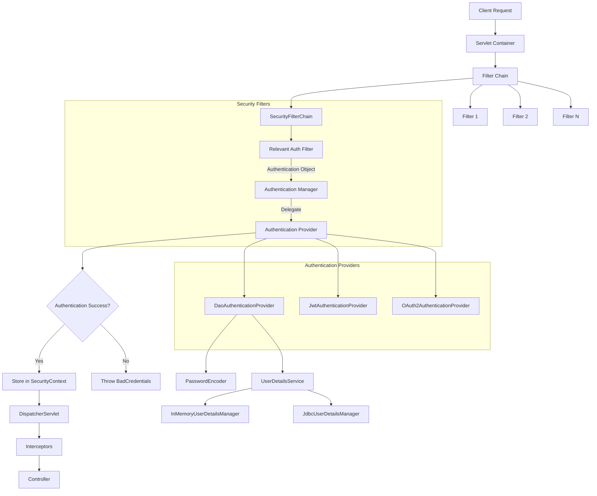

# Spring Boot Security Architecture - Detailed Explanation

## Introduction to Spring Security

Spring Security is a powerful framework that provides:
- Authentication (verifying who you are)
- Authorization (determining what you're allowed to do)
- Protection against common attacks (CSRF, SQL injection, etc.)

## Core Security Concepts

### Authentication vs Authorization
- **Authentication**: Verifies user identity (e.g., username/password)
- **Authorization**: Determines user permissions after authentication

## Spring Security Architecture Flow

### 1. Request Handling Overview
1. Client sends request → Servlet Container
2. Request passes through Filter Chain (multiple filters)
3. DispatcherServlet → Interceptors → Controller

### 2. Security Filter Chain Integration
When Spring Security is enabled:
- A **SecurityFilterChain** gets added to the existing filter chain
- This is not a single filter but a chain of security-related filters
- Positioned among other application filters (Filter 1, Filter 2, etc.)

### 3. Authentication Method Specific Filters
Different authentication methods activate different filters:
- **Form-based auth**: UsernamePasswordAuthenticationFilter
- **Basic auth**: BasicAuthenticationFilter
- **JWT**: JWTFilter
- **OAuth**: OAuth2AuthenticationProcessingFilter

Only the relevant filters for the chosen authentication method get executed.

### 4. Authentication Process Flow

1. **Request reaches security filter**:
   - Relevant security filter creates an `Authentication` object
   - Initially contains partial info (authenticated=false, empty roles)

2. **Authentication Manager**:
   - Interface: `AuthenticationManager`
   - Default implementation: `ProviderManager`
   - Acts as bridge between filters and authentication providers
   - Determines which provider to use based on authentication method

3. **Authentication Providers**:
   - Different providers handle different auth methods:
     - `DaoAuthenticationProvider`: Username/password auth
     - `JwtAuthenticationProvider`: JWT token auth
     - `OAuth2AuthenticationProvider`: OAuth auth
   - Providers contain actual authentication logic

### 5. Authentication Provider Example: DaoAuthenticationProvider
For username/password authentication:
1. Hashes incoming password using `PasswordEncoder`
2. Fetches stored user details via `UserDetailsService`
   - Implementations:
     - `InMemoryUserDetailsManager`: Stores credentials in memory
     - `JdbcUserDetailsManager`: Stores credentials in database
3. Compares hashed passwords
4. Returns fully populated `Authentication` object

### 6. Post-Authentication
- If authentication succeeds:
  - Filter stores `Authentication` object in `SecurityContext`
  - Request continues to DispatcherServlet → Interceptors → Controller
- If authentication fails:
  - Throws `BadCredentialsException`

### 7. Security Context
- Thread-local storage of authentication information
- Accessible throughout request processing:
  - Filters → DispatcherServlet → Interceptors → Controller

## Implementation Setup

### Required Dependencies
```xml
<!-- Core Spring Security -->
<dependency>
    <groupId>org.springframework.boot</groupId>
    <artifactId>spring-boot-starter-security</artifactId>
</dependency>

<!-- Optional: For session persistence in DB -->
<dependency>
    <groupId>org.springframework.session</groupId>
    <artifactId>spring-session-jdbc</artifactId>
</dependency>
```

### Key Points About Dependencies
- `spring-boot-starter-security`: Essential for all security features
- `spring-session-jdbc`: Only needed for:
  - Stateful/session-based authentication
  - When you want to persist sessions in database

## Architecture Variations

The described architecture serves as a base template. Different authentication methods may:
- Skip certain steps (e.g., Basic auth skips form-specific steps)
- Add additional steps
- Use different filters and providers

We'll explore specific flows for each authentication method in future sections.

## Summary of Key Components

| Component | Purpose | Important Implementations |
|-----------|---------|----------------------------|
| SecurityFilterChain | Container for security filters | DefaultSecurityFilterChain |
| AuthenticationManager | Manages authentication process | ProviderManager |
| AuthenticationProvider | Performs actual authentication | DaoAuthenticationProvider, JwtAuthenticationProvider |
| UserDetailsService | Loads user-specific data | InMemoryUserDetailsManager, JdbcUserDetailsManager |
| PasswordEncoder | Handles password encoding/hashing | BCryptPasswordEncoder, Pbkdf2PasswordEncoder |
| SecurityContext | Holds authentication information | SecurityContextHolder |

This architecture provides the foundation for understanding how Spring Security protects your application at each layer of the request processing pipeline.

<br/>
<br/>

# Flow Diagram



### Diagram Explanation:

1. **Request Flow**:
   - Starts from Client → Servlet Container → Filter Chain
   - SecurityFilterChain is one of many possible filters

2. **Security Subsystem**:
   - Request reaches the relevant auth filter (form/JWT/basic)
   - Creates partial Authentication object (authenticated=false)
   - Passes to AuthenticationManager (ProviderManager impl)

3. **Provider Delegation**:
   - Manager delegates to appropriate provider
   - Shows 3 common provider types

4. **DaoAuthenticationProvider Detail**:
   - Shows integration with PasswordEncoder
   - Shows UserDetailsService implementations

5. **Post-Authentication**:
   - Success path: Stores auth in SecurityContext → continues to controller
   - Failure path: Throws BadCredentialsException

6. **Key Characteristics**:
   - Diamond decision node for auth success/failure
   - Clear separation of security subsystem from main flow
   - Provider-specific details in subgraph

This diagram visually represents:
- The filter chain integration point
- The delegation pattern from manager to providers
- The thread-local SecurityContext propagation
- Multiple authentication method support

<br/>
<br/>

