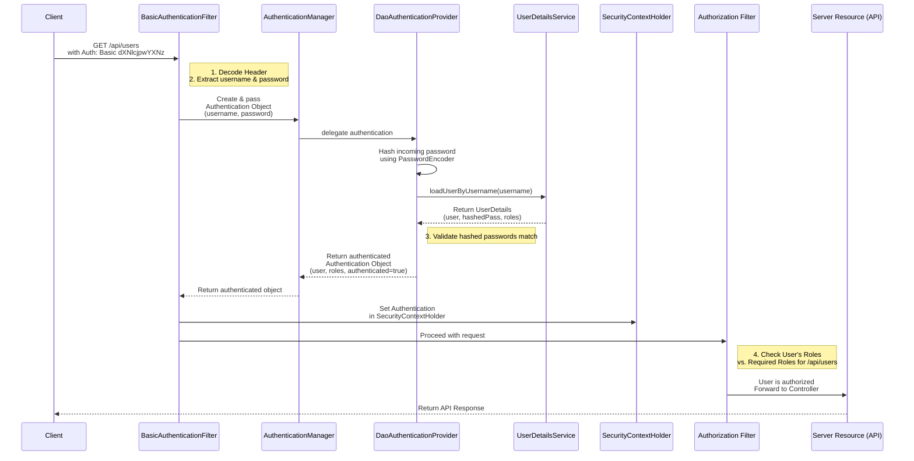

# Spring Security: Basic Authentication Deep Dive

### 1. Core Concept & Definition

**Basic Authentication** is a simple, stateless HTTP authentication scheme. The client sends a username and password with **every single request** to the server. The server validates these credentials on each request without creating or maintaining any session.

*   **Stateless:** The server **does not store** any authentication state (like an HTTP session). Each request must contain all necessary information to be authenticated.
*   **Simple:** Its mechanism is straightforward—encode credentials and put them in a header.

---

### 2. How It Works: The Request Flow

The client must include an `Authorization` header in every HTTP request.

**Header Format:**
```
Authorization: Basic <base64_encoded_credentials>
```

*   `Basic`: Specifies the authentication scheme.
*   `<base64_encoded_credentials>`: The result of encoding the string `username:password` using Base64 encoding.

**Example:**
*   Username: `user`
*   Password: `pass`
*   String to encode: `user:pass`
*   Base64 encoded: `dXNlcjpwYXNz`
*   Final Header: `Authorization: Basic dXNlcjpwYXNz`

> **⚠️ Critical Security Note:** Base64 is **encoding**, not **encryption**. It can be easily reversed by anyone who intercepts the request. Therefore, Basic Authentication **MUST only be used over HTTPS** to protect the credentials in transit.

---

### 3. Why the Authorization Header?

Credentials are passed in the header instead of the request body or URL parameters for three key reasons:

1.  **Standardization (RFC 7617):** HTTP standards define authentication credentials to be passed in the `Authorization` header. This ensures universal acceptance and consistency across all clients (browsers, mobile apps, CLI tools) and APIs.
2.  **Security:**
    *   **Request bodies and URL parameters are often logged** by web servers, proxies, or analytics tools for debugging. Storing credentials in logs is a severe security risk.
    *   **Headers are rarely logged,** significantly reducing the risk of accidental credential exposure.
3.  **Universal Support for HTTP Methods:**
    *   **GET** requests typically do not have a body, so there's no place to put credentials except the header.
    *   Using the header provides a consistent method for passing credentials across **GET, POST, PUT, DELETE**, and all other HTTP methods.

---

### 4. Server-Side Flowchart & Explanation

The following sequence diagram outlines the journey of a request using Basic Authentication in Spring Security:



**Step-by-Step Breakdown:**

1.  **Request Intercepted:** The `BasicAuthenticationFilter` intercepts the request.
2.  **Extract Credentials:** The filter extracts and **Base64-decodes** the `Authorization` header to get the plain-text `username:password`.
3.  **Create Authentication Token:** It creates an `Authentication` object (e.g., `UsernamePasswordAuthenticationToken`) containing the username and password. This object is initially unauthenticated.
4.  **Delegate to Manager:** The filter passes this token to the `AuthenticationManager`.
5.  **Provider Validation:** The `AuthenticationManager` delegates to its list of providers, typically the `DaoAuthenticationProvider`.
6.  **Password Hashing & Lookup:**
    *   The provider uses a `PasswordEncoder` to **hash the incoming raw password**.
    *   It uses a `UserDetailsService` to **load the user's details** (including the stored, hashed password) from the database or in-memory store based on the username.
7.  **Validation:** The provider **compares the hashed incoming password** with the stored hashed password.
8.  **Build Authenticated Object:** If they match, it builds a fully authenticated `Authentication` object, populating it with the user's details and authorities (roles).
9.  **Set Security Context:** This authenticated object is stored in the `SecurityContext`, which is then placed in the `SecurityContextHolder`. This makes the user's identity available for the rest of the request processing.
10. **Authorization Check:** Subsequent filters (like the `AuthorizationFilter`) check if this authenticated user has the required permissions (roles) to access the requested resource (`/api/users`).
11. **Access Grant/Deny:** If authorized, the request reaches the Controller. If not, an HTTP 403 Forbidden error is returned.

---

### 5. Implementation Code (Spring Boot 3.x / Spring Security 6.x)

```java
import org.springframework.context.annotation.Bean;
import org.springframework.context.annotation.Configuration;
import org.springframework.security.config.Customizer;
import org.springframework.security.config.annotation.web.builders.HttpSecurity;
import org.springframework.security.config.annotation.web.configuration.EnableWebSecurity;
import org.springframework.security.config.http.SessionCreationPolicy;
import org.springframework.security.web.SecurityFilterChain;

@Configuration
@EnableWebSecurity
public class BasicAuthSecurityConfig {

    @Bean
    public SecurityFilterChain filterChain(HttpSecurity http) throws Exception {
        http
            .authorizeHttpRequests(auth -> auth
                .requestMatchers("/api/users").hasRole("USER") // Authorization Rule
                .anyRequest().authenticated()
            )
            .httpBasic(Customizer.withDefaults()) // Enable Basic Auth
            .sessionManagement(session -> session
                .sessionCreationPolicy(SessionCreationPolicy.STATELESS) // No Sessions
            )
            .csrf(csrf -> csrf.disable()); // CSRF not needed for stateless APIs

        return http.build();
    }
}
```

**Key Configuration Points:**

*   **`.httpBasic(Customizer.withDefaults())`:** This is the key line that enables Basic Authentication, overriding the default formLogin.
*   **`.sessionManagement(... STATELESS)`:** Explicitly declares the application as stateless. Spring Security will not create HTTP Sessions.
*   **`.csrf().disable()`:** Cross-Site Request Forgery (CSRF) protection is necessary for stateful applications that use sessions. Since we are stateless, it is safe and recommended to disable it.
*   **`/api/users`:** The authorization rule ensuring only users with the role `ROLE_USER` can access this endpoint.

---

### 6. Major Disadvantages & Why It's Not Popular

Despite its simplicity, Basic Auth is rarely used for modern web applications due to its critical flaws:

1.  **Credentials Sent Every Time:** The username and password are transmitted with every single request, increasing the risk of exposure.
2.  **Permanent Credentials:** If compromised, the only remedy is to **change the user's password**. There is no concept of revoking a session or token without affecting the user's permanent credentials.
3.  **Performance Overhead:** Every request requires a **full authentication cycle**:
    *   Hashing the incoming password.
    *   **Database lookup** to fetch user details. This is a significant performance bottleneck for high-traffic applications.
4.  **Poor User Experience (for browsers):** The browser's native Basic Auth pop-up is clunky and cannot be styled. It provides a poor login/logout experience compared to a custom HTML form.

### 7. Conclusion & Next Steps

**Basic Authentication** is a perfect tool for learning the core concepts of HTTP authentication and the Spring Security filter chain. It is also suitable for simple, internal APIs where the overhead is manageable and security is enforced via strict HTTPS.

However, for production-grade public APIs and web applications, its disadvantages are far too great. This is why **token-based authentication (like JWT)** is the modern standard, as it solves these problems by using short-lived, revocable tokens that eliminate the need to send passwords or hit the database on every request.