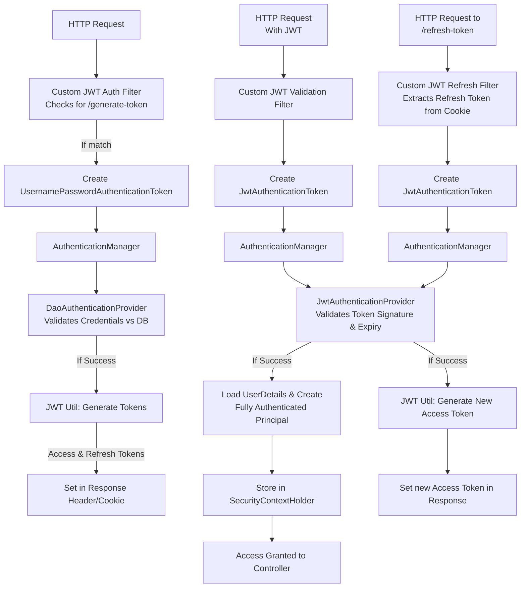

# **JWT Implementation in Spring Boot: A Complete Guide**

This guide will walk you through implementing a secure JWT-based authentication system in a Spring Boot application. We'll cover user registration, token generation, token validation, refresh tokens, and role-based authorization.

---

### **1. Core JWT Concepts Recap**

**What is JWT?**
JSON Web Token (JWT) is a compact, URL-safe means of representing **claims** to be transferred between two parties. It's a **stateless** authentication mechanism, meaning the server does not store any session state.

**JWT Structure:**
A JWT is a string with three parts, separated by dots (`.`):
`header.payload.signature`

*   **Header**: Contains metadata about the token type (JWT) and the signing algorithm (e.g., HS256, RS256).
    *   `{"alg": "HS256", "typ": "JWT"}` -> Base64Url encoded.
*   **Payload**: Contains the **claims** (statements about an entity, typically the user). There are three types of claims:
    *   **Registered claims**: Predefined claims like `iss` (issuer), `exp` (expiration time), `sub` (subject).
    *   **Public claims**: Custom claims defined by those using JWTs.
    *   **Private claims**: Custom claims created to share information between parties.
    *   Example: `{"sub": "sj", "exp": 1735689999}` -> Base64Url encoded.
*   **Signature**: Verifies the message wasn't changed along the way. It is created by signing the encoded header, encoded payload, and a secret using the algorithm specified in the header.
    *   `HMACSHA256(base64UrlEncode(header) + "." + base64UrlEncode(payload), secret)`

**Why JWT?**
*   **Stateless & Scalable**: No server-side session storage is needed.
*   **Decoupled & Portable**: Tokens can be generated anywhere and verified by any service that has the secret/key.
*   **Fine-Grained Authorization**: The payload can contain user roles and permissions.

---

### **2. Implementation Steps & Architecture**

We will integrate JWT into the Spring Security framework by extending its components. Here's the high-level architecture and the steps we'll follow:



**Step 1: User Registration**
*   Expose a `/api/user/register` API.
*   Hash the password (using BCrypt) and save the user details (username, hashed password, role) to the database.
*   Implement a `UserDetailsService` to tell Spring Security how to load users from your database.

**Step 2: Token Generation (`/generate-token`)**
*   Create a custom **Filter** that intercepts login requests (`/generate-token`).
*   This filter creates a `UsernamePasswordAuthenticationToken` and delegates authentication to the `AuthenticationManager` and `DaoAuthenticationProvider`.
*   Upon successful validation, the filter uses a **JWT Utility** class to generate both an **Access Token** (short-lived) and a **Refresh Token** (long-lived).
*   The Access Token is sent in the `Authorization` header, and the Refresh Token is sent as a secure, HTTP-only cookie.

**Step 3: Token Validation (Protecting APIs)**
*   Create another custom **Filter** that runs on every request.
*   It extracts the JWT from the `Authorization` header.
*   It creates a custom `JwtAuthenticationToken` (which is not yet authenticated).
*   It delegates validation to the `AuthenticationManager`, which uses a custom **JWT Authentication Provider**.
*   This provider verifies the token's signature and expiry. If valid, it loads the user's details and creates a *fully authenticated* authentication object.
*   This object is stored in the `SecurityContextHolder`, granting access to the protected controller.

**Step 4: Token Refresh (`/refresh-token`)**
*   Create a third custom **Filter** that intercepts requests to `/refresh-token`.
*   It extracts the long-lived Refresh Token from the secure cookie.
*   It validates this token using the same **JWT Authentication Provider**.
*   If valid, it generates a *new* Access Token and returns it in the response.

**Step 5: Authorization**
*   Use Spring Security's `authorizeHttpRequests` to define access rules based on user roles contained within the JWT.

---

### **3. Detailed Code Implementation**

#### **Dependencies (`pom.xml`)**
You need libraries to create and parse JWTs.
```xml
<!-- JJWT for JWT creation and validation -->
<dependency>
    <groupId>io.jsonwebtoken</groupId>
    <artifactId>jjwt-api</artifactId>
    <version>0.11.5</version>
</dependency>
<dependency>
    <groupId>io.jsonwebtoken</groupId>
    <artifactId>jjwt-impl</artifactId>
    <version>0.11.5</version>
    <scope>runtime</scope>
</dependency>
<dependency>
    <groupId>io.jsonwebtoken</groupId>
    <artifactId>jjwt-jackson</artifactId>
    <version>0.11.5</version>
    <scope>runtime</scope>
</dependency>
```

#### **JWT Utility Class (`JwtUtil.java`)**
This class handles the creation and validation of JWTs.
```java
import io.jsonwebtoken.*;
import org.springframework.stereotype.Component;
import java.util.Date;

@Component
public class JwtUtil {
    // In production, store this securely (e.g., environment variable, secret manager)
    private static final String SECRET_KEY = "myVerySecretKeyThatIsLongEnoughForHS512";
    private static final long ACCESS_TOKEN_EXPIRATION_MS = 15 * 60 * 1000; // 15 min
    private static final long REFRESH_TOKEN_EXPIRATION_MS = 7 * 24 * 60 * 60 * 1000; // 7 days

    public String generateAccessToken(String username) {
        return generateToken(username, ACCESS_TOKEN_EXPIRATION_MS);
    }

    public String generateRefreshToken(String username) {
        return generateToken(username, REFRESH_TOKEN_EXPIRATION_MS);
    }

    private String generateToken(String subject, long expirationMs) {
        return Jwts.builder()
                .setSubject(subject)
                .setIssuedAt(new Date())
                .setExpiration(new Date(System.currentTimeMillis() + expirationMs))
                .signWith(SignatureAlgorithm.HS512, SECRET_KEY)
                .compact();
    }

    public String extractUsername(String token) {
        return Jwts.parserBuilder()
                .setSigningKey(SECRET_KEY)
                .build()
                .parseClaimsJws(token)
                .getBody()
                .getSubject();
    }

    public boolean validateToken(String token) {
        try {
            Jwts.parserBuilder().setSigningKey(SECRET_KEY).build().parseClaimsJws(token);
            return true;
        } catch (JwtException | IllegalArgumentException e) {
            // Log the exception
            return false;
        }
    }
}
```

#### **Custom JWT Authentication Filter (`JwtAuthenticationFilter.java`)**
Handles the `/generate-token` endpoint.
```java
public class JwtAuthenticationFilter extends OncePerRequestFilter {
    private final AuthenticationManager authenticationManager;
    private final JwtUtil jwtUtil;

    @Override
    protected void doFilterInternal(HttpServletRequest request, HttpServletResponse response, FilterChain chain) throws ServletException, IOException {
        if (!"/generate-token".equals(request.getServletPath())) {
            chain.doFilter(request, response);
            return;
        }

        // 1. Read credentials from request body
        LoginRequest loginRequest = new ObjectMapper().readValue(request.getInputStream(), LoginRequest.class);
        String username = loginRequest.getUsername();
        String password = loginRequest.getPassword();

        // 2. Create authentication object
        Authentication authentication = new UsernamePasswordAuthenticationToken(username, password);

        // 3. Delegate validation to AuthenticationManager & DaoAuthenticationProvider
        Authentication authenticated = authenticationManager.authenticate(authentication);

        // 4. If successful, generate tokens
        String accessToken = jwtUtil.generateAccessToken(username);
        String refreshToken = jwtUtil.generateRefreshToken(username);

        // 5. Set tokens in response
        response.setHeader("Authorization", "Bearer " + accessToken);
        ResponseCookie refreshCookie = ResponseCookie.from("refreshToken", refreshToken)
                .httpOnly(true)
                .secure(true) // Send only over HTTPS
                .path("/refresh-token") // Only sent for refresh requests
                .maxAge(REFRESH_TOKEN_EXPIRATION_MS / 1000)
                .build();
        response.addHeader("Set-Cookie", refreshCookie.toString());
    }
}
// DTO for login request
class LoginRequest {
    private String username;
    private String password;
    // getters and setters
}
```

#### **Custom JWT Validation Filter (`JwtValidationFilter.java`)**
Validates the JWT on every request.
```java
public class JwtValidationFilter extends OncePerRequestFilter {
    private final AuthenticationManager authenticationManager;

    @Override
    protected void doFilterInternal(HttpServletRequest request, HttpServletResponse response, FilterChain chain) throws ServletException, IOException {
        // 1. Extract JWT from header
        String header = request.getHeader("Authorization");
        if (header == null || !header.startsWith("Bearer ")) {
            chain.doFilter(request, response);
            return;
        }
        String token = header.substring(7);

        // 2. Create a custom authentication token
        JwtAuthenticationToken authRequest = new JwtAuthenticationToken(token);

        // 3. Delegate validation to our custom JwtAuthenticationProvider
        Authentication authResult = authenticationManager.authenticate(authRequest);

        // 4. If successful, set the authentication in the SecurityContext
        SecurityContextHolder.getContext().setAuthentication(authResult);
        chain.doFilter(request, response);
    }
}

// Custom Authentication Token
class JwtAuthenticationToken extends AbstractAuthenticationToken {
    private final String token;
    public JwtAuthenticationToken(String token) {
        super(null);
        this.token = token;
        setAuthenticated(false); // Not authenticated until validated by provider
    }
    @Override
    public Object getCredentials() { return token; }
    @Override
    public Object getPrincipal() { return null; } // Will be populated by the provider
}
```

#### **Custom JWT Authentication Provider (`JwtAuthenticationProvider.java`)**
Validates the token and creates a fully authenticated principal.
```java
public class JwtAuthenticationProvider implements AuthenticationProvider {
    private final JwtUtil jwtUtil;
    private final UserDetailsService userDetailsService;

    @Override
    public boolean supports(Class<?> authentication) {
        // This provider only handles our custom JwtAuthenticationToken
        return JwtAuthenticationToken.class.isAssignableFrom(authentication);
    }

    @Override
    public Authentication authenticate(Authentication authentication) throws AuthenticationException {
        JwtAuthenticationToken authToken = (JwtAuthenticationToken) authentication;
        String jwt = (String) authToken.getCredentials();

        // 1. Validate JWT signature and expiry
        if (!jwtUtil.validateToken(jwt)) {
            throw new BadCredentialsException("Invalid JWT token");
        }

        // 2. Extract username from token
        String username = jwtUtil.extractUsername(jwt);

        // 3. Load user details from database
        UserDetails userDetails = userDetailsService.loadUserByUsername(username);

        // 4. Create a fully authenticated authentication object
        JwtAuthenticationToken authenticatedToken = new JwtAuthenticationToken(jwt, userDetails.getAuthorities());
        authenticatedToken.setDetails(userDetails);
        authenticatedToken.setAuthenticated(true); // Mark as fully authenticated
        return authenticatedToken;
    }
}
```

#### **Security Configuration (`SecurityConfig.java`)**
Ties everything together.
```java
@Configuration
@EnableWebSecurity
public class SecurityConfig {
    @Bean
    public SecurityFilterChain filterChain(HttpSecurity http, AuthenticationManager authManager, JwtUtil jwtUtil, UserDetailsService userDetailsService) throws Exception {
        // Create custom providers
        DaoAuthenticationProvider daoProvider = new DaoAuthenticationProvider();
        daoProvider.setUserDetailsService(userDetailsService);
        daoProvider.setPasswordEncoder(passwordEncoder());

        JwtAuthenticationProvider jwtProvider = new JwtAuthenticationProvider(jwtUtil, userDetailsService);

        // Build a custom AuthenticationManager with our providers
        AuthenticationManager customAuthManager = new ProviderManager(Arrays.asList(daoProvider, jwtProvider));

        // Create custom filters
        JwtAuthenticationFilter jwtAuthFilter = new JwtAuthenticationFilter(customAuthManager, jwtUtil);
        JwtValidationFilter jwtValidationFilter = new JwtValidationFilter(customAuthManager);

        http
            .csrf(csrf -> csrf.disable()) // Consider implications for stateless API
            .sessionManagement(session -> session.sessionCreationPolicy(SessionCreationPolicy.STATELESS))
            .authorizeHttpRequests(authz -> authz
                .requestMatchers("/api/user/register", "/generate-token").permitAll()
                .requestMatchers("/refresh-token").authenticated()
                .requestMatchers("/admin/**").hasRole("ADMIN")
                .requestMatchers("/user/**").hasAnyRole("ADMIN", "USER")
                .anyRequest().authenticated()
            )
            // Add filters in the correct order
            .addFilterBefore(jwtAuthFilter, UsernamePasswordAuthenticationFilter.class)
            .addFilterAfter(jwtValidationFilter, JwtAuthenticationFilter.class)
            .addFilterAfter(new JwtRefreshFilter(customAuthManager, jwtUtil), JwtValidationFilter.class)
            .authenticationManager(customAuthManager);

        return http.build();
    }

    @Bean
    public PasswordEncoder passwordEncoder() {
        return new BCryptPasswordEncoder();
    }
}
```

---

### **4. Key Takeaways & Best Practices**

*   **Statelessness**: The server does not store any token state. All necessary information is contained within the JWT itself.
*   **Secret Key**: The signing key **must** be kept secret and strong enough for the algorithm (e.g., >256 bits for HS256). Never hardcode it in production; use environment variables or a secret management service.
*   **Token Expiry**: Use short-lived access tokens (minutes) and long-lived refresh tokens (days/weeks) to minimize the risk of token compromise.
*   **Secure Transmission**: Always use **HTTPS** to prevent tokens from being intercepted.
*   **Storage on Client**:
    *   **Access Token**: Store in memory (e.g., JS variable). Avoid `localStorage` due to XSS risks.
    *   **Refresh Token**: Store in an **HttpOnly, Secure, SameSite=Strict** cookie to mitigate XSS and CSRF attacks.
*   **Framework Integration**: By creating custom filters and providers, we seamlessly integrate JWT authentication into the Spring Security framework, leveraging its powerful authorization and exception handling mechanisms.

This implementation provides a robust and secure foundation for a modern, stateless REST API using Spring Boot and JWT.

<br/>
<br/>

# **Bonus**

### **1. Security Hardening**

This is the most crucial category, addressing potential vulnerabilities.

*   **1.1. Refresh Token Rotation & Reuse Detection:**
    *   **The Problem:** If a refresh token is stolen, an attacker can use it to generate new access tokens indefinitely.
    *   **The Solution:** Invalidate the used refresh token and issue a *new* refresh token along with the new access token. Store a hash of the current valid refresh token for the user. On a refresh request, check the submitted token against the stored hash. If an old token is used, it indicates theft—immediately invalidate *all* tokens for that user.

*   **1.2. Token Blacklisting for Logout:**
    *   **The Problem:** JWTs are valid until they expire. If a user logs out, the token is still valid until its expiry time.
    *   **The Solution:** Implement a short-lived blacklist (e.g., using a Redis cache with TTL). On logout, store the token's unique identifier (a "jti" claim) or the token itself until its natural expiry time. During validation, check this blacklist.

*   **1.3. Stronger JWT Signing Algorithms (Asymmetric Cryptography):**
    *   **The Problem:** Using a symmetric key (HS256) means everyone who can validate a token can also create one. This is a risk if multiple services need to validate tokens but only one should create them.
    *   **The Solution:** Use RS256 (RSA) or ES256 (ECDSA). The Auth Server holds the **private key** to *sign* tokens. Other services use the corresponding **public key** only to *validate* them. This is more secure and scalable for microservices.

*   **1.4. Advanced Claim Validation:**
    *   Validate the `iss` (Issuer) claim to ensure the token was created by your service.
    *   Validate the `aud` (Audience) claim to ensure the token is intended for your specific service.

*   **1.5. Secret Management:**
    *   **Never** hardcode the secret key. Use environment variables, a secure vault (like HashiCorp Vault, AWS Secrets Manager, or Azure Key Vault), or pull it from a secure configuration service.

---

### **2. Production Readiness & Operational Excellence**

*   **2.1. Comprehensive Logging and Monitoring:**
    *   Log authentication successes and failures (without logging passwords or tokens).
    *   Monitor endpoints for brute-force attacks (e.g., many failed `/generate-token` requests).
    *   Set up alerts for unexpected error rates related to authentication.

*   **2.2. Detailed Error Handling:**
    *   Don't expose too much information in errors. Avoid messages like "Invalid Signature." Instead, use generic messages like "Invalid credentials" or "Authentication failed" and log the detailed reason internally.

*   **2.3. API Documentation:**
    *   Document your auth flows using **OpenAPI (Swagger)**. Clearly show the `/generate-token`, `/refresh-token`, and protected endpoints, including required headers and expected responses.

*   **2.4. Rate Limiting:**
    *   Implement rate limiting on the `/generate-token` and `/refresh-token` endpoints to prevent abuse and brute-force attacks. Use frameworks like Spring Boot's built-in support or Bucket4j.

*   **2.5. Unit and Integration Tests:**
    *   Write tests for your `JwtUtil` class (token creation/parsing).
    *   Write tests for your custom filters and providers, mocking dependencies.
    *   Write integration tests that simulate the entire flow: registration -> token generation -> accessing a protected endpoint.

---

### **3. Functionality & User Experience (UX)**

*   **3.1. Proper Login Response DTO:**
    *   Instead of just putting tokens in headers, also consider returning a JSON body for the `/generate-token` and `/refresh-token` endpoints. This is helpful for clients that might not be web browsers.

    ```json
    {
      "accessToken": "eyJ...",
      "refreshToken": "eyJ...", // If not using HttpOnly cookie
      "expiresIn": 3600,
      "tokenType": "Bearer"
    }
    ```

*   **3.2. Token Introspection Endpoint:**
    *   Create an endpoint like `/api/validate` or `/api/me` that a client can call with its access token to check if it's still valid and get basic user information (e.g., username, roles).

*   **3.3. Multi-Factor Authentication (MFA) Ready:**
    *   Design your token payload and auth flow to accommodate future MFA integration. You might have a claim like `mfa_authenticated: true`.

---

### **4. Code Structure & Best Practices**

*   **4.1. Centralized Security Constants:**
    *   Define constants for header names (`Authorization`), token prefixes (`Bearer `), cookie names, and secret key names in one place.

*   **4.2. Custom Security Exceptions:**
    *   Create a dedicated exception handler for security-related exceptions (`@RestControllerAdvice`) to return consistent, structured error responses for all auth failures.

    ```java
    @RestControllerAdvice
    public class AuthExceptionHandler {
        @ExceptionHandler(BadCredentialsException.class)
        public ResponseEntity<ErrorResponse> handleBadCredentials() {
            return ResponseEntity.status(HttpStatus.UNAUTHORIZED).body(new ErrorResponse("Invalid login credentials"));
        }
        // ... handle other exceptions
    }
    ```

*   **4.3. Using a Dedicated `UserDetails` Implementation:**
    *   Instead of using Spring's default `User` class, create your own class implementing `UserDetails`. This allows you to add custom fields (e.g., `userId`, `email`) directly to the principal.

### **Summary: What's Next?**

| Category | Action Item | Priority for Production |
| :--- | :--- | :--- |
| **Security** | Implement Refresh Token Rotation | Critical |
| **Security** | Implement Token Blacklisting | High |
| **Security** | Switch to RS256/ES256 Algorithms | High (for microservices) |
| **Operational** | Centralized Logging & Monitoring | High |
| **Operational** | Comprehensive Testing | High |
| **UX** | Structured JSON Login Response | Medium |
| **Code Quality**| Custom Exception Handling | Medium |

You have built the engine. Now it's time to add the safety features, monitoring systems, and polish needed to run it reliably and securely in a real-world environment.