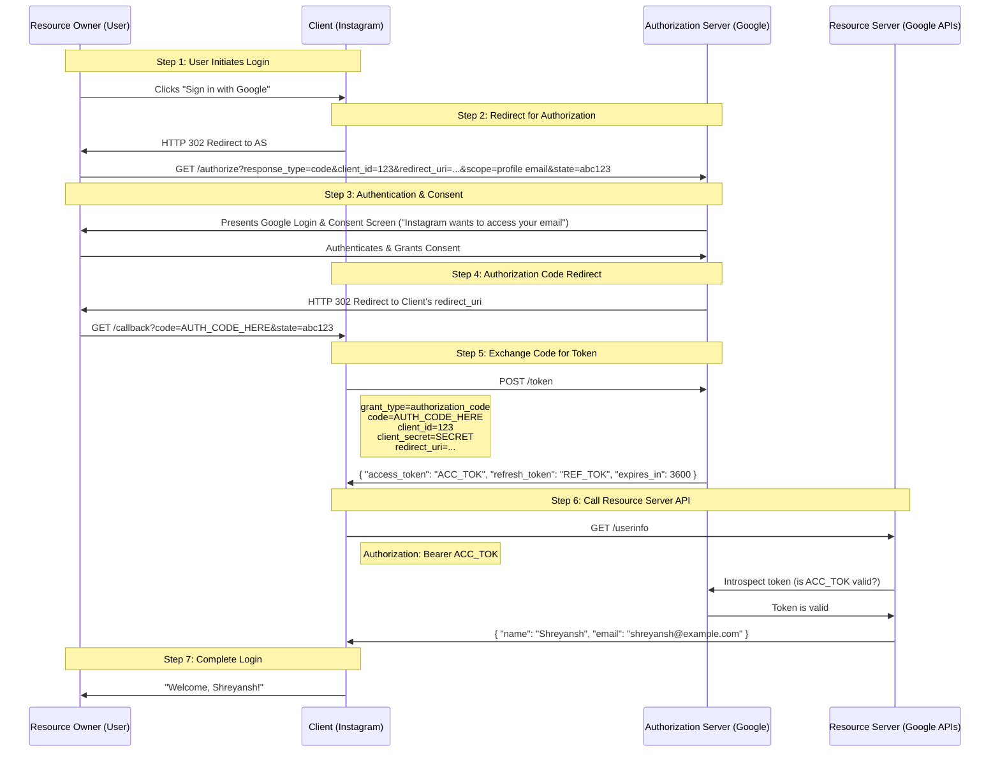
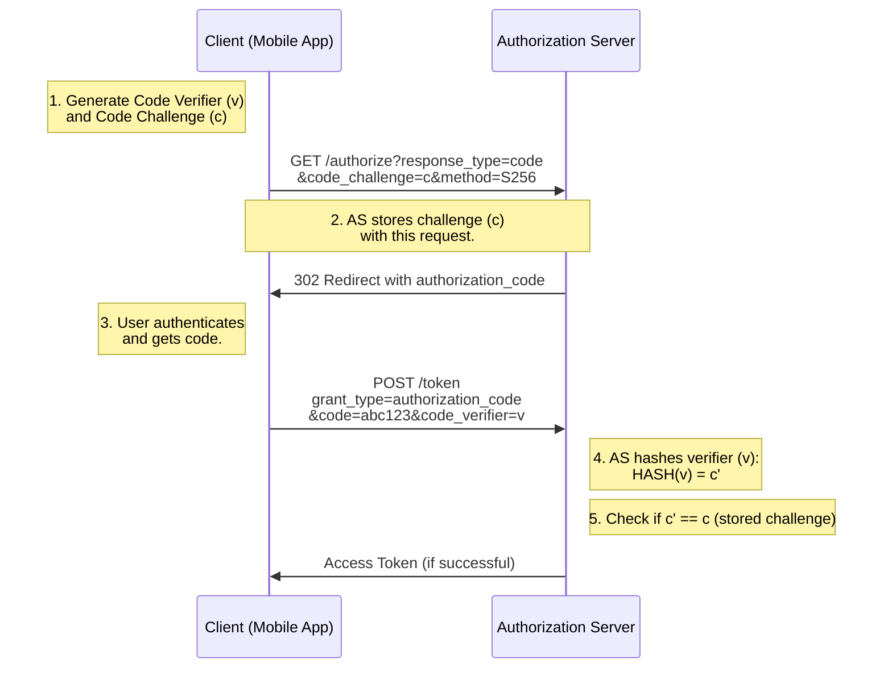
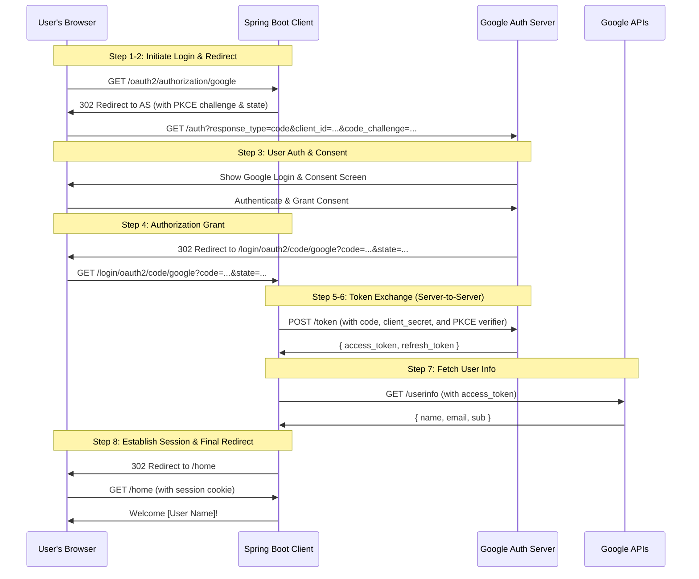
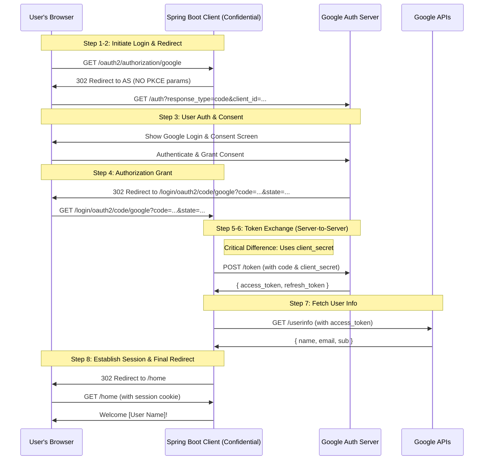

# **OAuth 2.0 - Comprehensive Guide**

#### **What is OAuth 2.0?**
**OAuth 2.0** stands for **Open Authorization**. It is an **authorization framework** (not an authentication protocol) that enables secure, third-party access to user-protected resources without exposing user credentials.

**Core Problem it Solves:** It allows a user to grant a website or application (the client) access to their information stored on another service (like Google or Facebook) without sharing their password.

---

### **The 4 Key Roles (Actors) in OAuth 2.0**

To understand OAuth, you must understand the four actors involved in every flow:

1.  **Resource Owner:** The user who owns the data and can grant access to it. (e.g., *You, the user with a Gmail account*).
2.  **Client:** The application that wants to access the user's data. (e.g., *Instagram wanting to log you in with Gmail*).
3.  **Authorization Server:** The server that authenticates the Resource Owner and issues access tokens after obtaining consent. This is the engine of OAuth. (e.g., *Google's OAuth server*).
4.  **Resource Server:** The server that hosts the user's protected data. It accepts access tokens and returns the requested data. (e.g., *Google's API that serves your profile information*).

> **Note:** Often, the Authorization Server and Resource Server are both run by the same service (like Google), but they are logically separate components.

---

### **The "Grants" (Authorization Flows)**

A "grant" is a method of obtaining an access token. OAuth 2.0 defines several grants for different scenarios. The most important and secure one is the **Authorization Code Grant**.

---

### **1. Authorization Code Grant (Most Common & Secure)**

This is the flow you see with "Sign in with Google/Facebook/etc." It involves a two-step process: first getting an authorization code, then exchanging it for a token.

#### **Step 0: Client Registration**
Before any flow begins, the Client (e.g., Instagram) must register with the Authorization Server (e.g., Google).
*   **Request:** `POST /register`
    *   `client_name`: "Instagram"
    *   `redirect_uris`: ["https://instagram.com/callback"] (Up to 3 URIs)
*   **Response:**
    *   `client_id`: Public identifier for the app.
    *   `client_secret`: Confidential password for the app. **Must be kept secret!**

#### **Step-by-Step Flow & APIs**



**Key API Details:**

*   **`GET /authorize`** (User is redirected here)
    *   `response_type=code`: (Mandatory) tells the AS the client expects an authorization code.
    *   `client_id`: (Mandatory) from registration.
    *   `redirect_uri`: (Optional) must match one of the URIs registered. If omitted, the AS uses a pre-registered one.
    *   `scope`: (Optional) space-separated list of permissions the app is requesting (e.g., `profile email`).
    *   `state`: (Highly Recommended) A random, unguessable string (e.g., `sJ111`) to prevent CSRF attacks.

*   **`POST /token`** (Back-channel call, app-to-server)
    *   `grant_type=authorization_code`: (Mandatory) specifies the flow.
    *   `code=...`: (Mandatory) the authorization code from the previous step.
    *   `client_id=...&client_secret=...`: (Mandatory) authenticates the client itself.
    *   `redirect_uri=...`: (Often required) must be the same as used in the `/authorize` step.

*   **Response from `/token`**
    *   `access_token`: The key to the castle! A short-lived token (e.g., 1 hour) used to access data. Often a JWT.
    *   `token_type`: Usually `Bearer`, meaning the client must send this token in the `Authorization: Bearer <token>` header.
    *   `expires_in`: Lifetime of the access token in seconds.
    *   `refresh_token`: (Optional) A long-lived token used to get new access tokens without user interaction.

#### **The Critical Role of the `state` Parameter**
**Purpose:** To prevent **Cross-Site Request Forgery (CSRF)** attacks.
**How it works:**
1.  The client generates a unique, random value (`state=abc123`) and stores it locally before redirecting the user to the AS.
2.  The AS returns this same `state` value with the authorization code.
3.  The client compares the returned `state` with the one it stored.
4.  If they **match**, the request is legitimate. Proceed.
5.  If they **do not match** or are missing, the request might be from an attacker and must be **rejected**.

---

### **2. Refresh Token Grant**

When the `access_token` expires, the client doesn't need to bother the user again. It uses the `refresh_token`.

*   **Request: `POST /token`**
    *   `grant_type=refresh_token`
    *   `refresh_token=...` (the refresh token from the initial exchange)
    *   `client_id=...&client_secret=...`
*   **Response:** A new `access_token` and often a new `refresh_token`.

---

### **Other Grant Types (Less Common)**

#### **3. Implicit Grant (Deprecated)**
*   **Flow:** Designed for single-page apps (SPAs) or apps without a backend. The AS returns the `access_token` directly to the user's browser after the `/authorize` call (`response_type=token`).
*   **Why it's bad:** The token is exposed in the browser history and URL. **No refresh token is issued.** This grant is now considered insecure and is deprecated in modern best practices.

#### **4. Resource Owner Password Credentials Grant**
*   **Flow:** The user gives their username and password **directly to the client app**, which then sends them to the AS (`POST /token` with `grant_type=password`, `username`, `password`).
*   **When to use:** Only for highly trusted applications (e.g., first-party apps made by the same company that owns the AS). **Never use this for third-party apps.** It defeats the purpose of OAuth (not sharing passwords).

#### **5. Client Credentials Grant**
*   **Flow:** The client authenticates with itself to get an access token. (`POST /token` with `grant_type=client_credentials`, `client_id`, `client_secret`).
*   **When to use:** For machine-to-machine (M2M) communication where the client is accessing its own resources, not on behalf of a user. (e.g., a backend service making an API call to another service). **No user involvement. No refresh tokens.**

---

### **Summary of Grant Types**

| Grant Type | Best For | User Involved? | Steps | Secure? |
| :--- | :--- | :--- | :--- | :--- |
| **Authorization Code** | Web apps, mobile apps, SPAs (with PKCE) | Yes | 2 (Code -> Token) | **Very Secure** (Recommended) |
| **Implicit** | (Deprecated) | Yes | 1 | **Insecure** (Avoid) |
| **Password** | 1st-party, highly trusted apps | Yes | 1 | **Less Secure** (Avoid for 3rd party) |
| **Client Credentials** | Machine-to-machine communication | No | 1 | Secure for M2M |

---

### **Key Takeaways**

*   OAuth 2.0 is about **authorization** (access), not authentication (proving identity). (OpenID Connect builds on OAuth 2.0 to handle authentication).
*   The **Authorization Code Grant with PKCE** is the gold standard for today's applications.
*   The `state` parameter is **critical** for security.
*   **Never expose your `client_secret`** in public clients (like mobile apps or SPAs). The PKCE extension is used to secure these flows.
*   Access tokens are short-lived; refresh tokens are long-lived and must be stored securely.
*   Always follow the official OAuth 2.0 RFCs for implementation details.

<br/>
<br/>

# **What is PKCE?**

**PKCE** stands for **Proof Key for Code Exchange** (RFC 7636). It is an extension to the OAuth 2.0 Authorization Code flow specifically designed to secure **public clients**.

*   **Public Client:** A client application that cannot keep a secret confidential. This includes:
    *   **Single-Page Applications (SPAs)** (JavaScript in the browser)
    *   **Native Mobile Apps** (iOS, Android, desktop apps)
    *   **CLI Applications**

These clients are considered "public" because their `client_secret` would be embedded in their source code or easily extractable from the app, making it useless for authentication.

### **The Problem PKCE Solves: The Authorization Code Interception Attack**

Imagine the standard Authorization Code flow for a mobile app:
1.  The app opens a browser to send the user to the Authorization Server.
2.  The user logs in and consents.
3.  The Authorization Server redirects back to the app with an `authorization_code` in the URL.
4.  The app exchanges this code for an `access_token`.

**The Vulnerability:** A malicious app on the same device could intercept the redirect containing the `authorization_code`. If it steals this code, it could use it itself to get an access token. Since the mobile app is a public client and its `client_secret` is not truly secret, the attacker could successfully complete the token exchange.

**PKCE solves this by making the token request "proof-of-possession."** The legitimate client proves that it was the one who initiated the original request, even if the `authorization_code` is intercepted.

---

### **How PKCE Works: The "Pixie" Dance**

PKCE adds two crucial steps to the standard flow: one at the beginning and one at the end. It uses a cryptographically generated pair: a **Code Verifier** and a **Code Challenge**.

#### **Step 1: The Client Prepares (Before Redirecting)**

Before the app redirects the user to the Authorization Server, it generates two values:

1.  **Code Verifier:** A high-entropy cryptographically random string. It's just a very long, very random password that only the client knows.
    *   Example: `dBjftJeZ4CVP-mB92K27uhbUJU1p1r_wW1gFWFOEjXk`

2.  **Code Challenge:** A transformed version of the Code Verifier. The transformation is either:
    *   **Plain:** `code_challenge = code_verifier` (if the verifier is short enough)
    *   **S256 (Recommended):** `code_challenge = BASE64URL-ENCODE(SHA-256(ASCII(code_verifier)))`
    *   This is a one-way hash. You can't reverse-engineer the verifier from the challenge.

The client stores the **Code Verifier** locally (in memory or secure storage).

#### **Step 2: The Initial Authorization Request**

The client includes the **Code Challenge** and the method it used to create it (`S256` or `plain`) in the initial redirect to the Authorization Server.

**`GET /authorize?`**
*   `response_type=code`
*   `client_id=123`
*   `redirect_uri=...`
*   `state=abc123` (still used for CSRF protection)
*   `code_challenge=dBjftJeZ4CVP-mB92K27uhbUJU1p1r_wW1gFWFOEjXk`
*   `code_challenge_method=S256` **<- The new PKCE parameters**

The Authorization Server receives this request, associates the `code_challenge` with the soon-to-be-created authorization code, and stores it.

#### **Step 3: User Authenticates & Consent (Unchanged)**

The user logs in and grants consent as usual. The AS redirects back with an `authorization_code`.

#### **Step 4: The Token Request (The "Proof")**

This is the critical step. When the client app calls `POST /token` to exchange the code for a token, it must now include the original **Code Verifier**.

**`POST /token`**
*   `grant_type=authorization_code`
*   `code=AUTH_CODE_HERE`
*   `client_id=123`
*   `redirect_uri=...`
*   `code_verifier=dBjftJeZ4CVP-mB92K27uhbUJU1p1r_wW1gFWFOEjXk` **<- The Proof**

#### **Step 5: The Server Verifies**

The Authorization Server now:
1.  Looks up the `authorization_code` it just received and finds the stored `code_challenge` associated with it.
2.  Takes the submitted `code_verifier` and performs the same transformation (`S256` hash) that the client claimed it used initially.
3.  **Compares the result of this transformation with the stored `code_challenge`.**

*   **If they match:** The client has proven it possesses the original Code Verifier, meaning it is the same instance that started the flow. The AS issues the tokens.
*   **If they don't match:** The request is rejected, even if the `authorization_code` is valid.



### **Why This is Secure**

An attacker who intercepts the `authorization_code` **cannot use it**. They are missing the original **Code Verifier** needed to complete the token request. The legitimate client is the only one who has it.

*   The `code_challenge` is public (it's in the URL).
*   The `code_verifier` is private and never leaves the client app until the crucial token request.

### **Summary: Key Points about PKCE**

*   **Purpose:** To prevent authorization code interception attacks for public clients (mobile apps, SPAs).
*   **How:** It adds a proof-of-possession mechanism using a cryptographically linked code verifier and challenge.
*   **It replaces the need for a `client_secret`** for public clients. You often see PKCE flows that do not send a `client_secret` at all, as it's redundant.
*   **It is now a mandatory best practice** for all authorization code flows, even for confidential clients (backend web apps), as it provides an additional layer of security. Major providers like Google and Apple require it for all OAuth clients.

<br/>
<br/>

# **Project: Spring Boot "Login with Google" App**

**Goal:** Create a Spring Boot application where users can log in with their Google account. The app will redirect to Google for authentication and then display the user's name and email.

---

### **Architecture**

We will use Spring Security's OAuth 2.0 Client support. The key components are:
1.  **Your App (Client):** Spring Boot Application with Spring Security.
2.  **Authorization Server:** Google.
3.  **Resource Server:** Google APIs.

### **Prerequisites**

*   Java 17+
*   Maven or Gradle
*   A Google Cloud Project (Follow **Step 1** from the previous project to get `CLIENT_ID` and `CLIENT_SECRET`)

---

### **Step 1: Create a Spring Boot Project**

Use [Spring Initializr](https://start.spring.io/) to generate a project with the following dependencies:
*   **Spring Web**
*   **Spring Security**
*   **Thymeleaf** (for templating)
*   **OAuth2 Client** (This is the crucial one)

Your `pom.xml` will include these key dependencies:
```xml
<dependency>
    <groupId>org.springframework.boot</groupId>
    <artifactId>spring-boot-starter-oauth2-client</artifactId>
</dependency>
<dependency>
    <groupId>org.springframework.boot</groupId>
    <artifactId>spring-boot-starter-thymeleaf</artifactId>
</dependency>
<dependency>
    <groupId>org.springframework.boot</groupId>
    <artifactId>spring-boot-starter-web</artifactId>
</dependency>
<dependency>
    <groupId>org.springframework.boot</groupId>
    <artifactId>spring-boot-starter-security</artifactId>
</dependency>
```

---

### **Step 2: Configure Application Properties**

Add your Google OAuth credentials to `src/main/resources/application.properties`.

```properties
# Server Port
server.port=8080

# Google OAuth2 Configuration
spring.security.oauth2.client.registration.google.client-id=YOUR_GOOGLE_CLIENT_ID
spring.security.oauth2.client.registration.google.client-secret=YOUR_GOOGLE_CLIENT_SECRET
spring.security.oauth2.client.registration.google.scope=profile,email

# Spring Security specific configuration
# Allows redirects to /login/oauth2/code/google (the default callback URL)
spring.security.oauth2.client.registration.google.redirect-uri=http://localhost:8080/login/oauth2/code/google

# Optional: To avoid having to log in every time during development
spring.security.oauth2.client.provider.google.user-name-attribute=email
```

**Explanation:**
*   `spring.security.oauth2.client.registration.google`: Defines a client registration named "google".
*   `scope`: Requests access to the user's `profile` and `email` information.
*   `redirect-uri`: The default callback URL pattern for Spring Security is `/login/oauth2/code/{registrationId}`.

**Important:** You must add `http://localhost:8080/login/oauth2/code/google` as an **Authorized redirect URI** in your Google Cloud Console project.

---

### **Step 3: Create a Security Configuration Class**

This class configures Spring Security to use OAuth 2.0 Login and defines access rules.

```java
package com.example.oauthproject.config;

import org.springframework.context.annotation.Bean;
import org.springframework.context.annotation.Configuration;
import org.springframework.security.config.annotation.web.builders.HttpSecurity;
import org.springframework.security.config.annotation.web.configuration.EnableWebSecurity;
import org.springframework.security.web.SecurityFilterChain;
import static org.springframework.security.config.Customizer.withDefaults;

@Configuration
@EnableWebSecurity
public class SecurityConfig {

    @Bean
    public SecurityFilterChain securityFilterChain(HttpSecurity http) throws Exception {
        http
            .authorizeHttpRequests(authorize -> authorize
                .requestMatchers("/", "/login**", "/webjars/**", "/error**").permitAll() // Public pages
                .anyRequest().authenticated() // All other requests require authentication
            )
            .oauth2Login(oauth2Login -> oauth2Login
                .loginPage("/login") // Optional: custom login page
                .defaultSuccessUrl("/home", true) // Redirect here after successful login
            )
            .logout(logout -> logout
                .logoutSuccessUrl("/").permitAll()
            );
        return http.build();
    }
}
```

---

### **Step 4: Create a Controller to Handle Requests**

This controller will handle the home page and a page that displays the user's information.

```java
package com.example.oauthproject.controller;

import org.springframework.security.core.annotation.AuthenticationPrincipal;
import org.springframework.security.oauth2.core.user.OAuth2User;
import org.springframework.stereotype.Controller;
import org.springframework.ui.Model;
import org.springframework.web.bind.annotation.GetMapping;

@Controller
public class HomeController {

    @GetMapping("/")
    public String home() {
        return "index"; // Renders index.html
    }

    @GetMapping("/home")
    public String userHome(Model model, @AuthenticationPrincipal OAuth2User principal) {
        // The OAuth2User object contains the user's attributes from Google
        if (principal != null) {
            String name = principal.getAttribute("name");
            String email = principal.getAttribute("email");
            model.addAttribute("name", name);
            model.addAttribute("email", email);
            // You can explore all attributes:
            // model.addAttribute("attributes", principal.getAttributes());
        }
        return "home"; // Renders home.html
    }
}
```

---

### **Step 5: Create the Thymeleaf HTML Templates**

**1. `src/main/resources/templates/index.html`**
The public landing page with a login link.
```html
<!DOCTYPE html>
<html xmlns:th="http://www.thymeleaf.org">
<head>
    <title>My OAuth App</title>
</head>
<body>
    <h1>Welcome!</h1>
    <p>Please log in to continue.</p>
    <!-- Spring Security automatically provides this endpoint -->
    <a th:href="@{/oauth2/authorization/google}">Login with Google</a>
</body>
</html>
```

**2. `src/main/resources/templates/home.html`**
The protected page shown after successful login.
```html
<!DOCTYPE html>
<html xmlns:th="http://www.thymeleaf.org">
<head>
    <title>Home</title>
</head>
<body>
    <h1>Welcome, <span th:text="${name}">User</span>!</h1>
    <p>Your email is: <span th:text="${email}">email@example.com</span></p>
    <hr>
    <form th:action="@{/logout}" method="post">
        <input type="submit" value="Logout"/>
    </form>
</body>
</html>
```

---

### **Step 6: Run and Test Your Application**

1.  Start your Spring Boot application:
    ```bash
    ./mvnw spring-boot:run
    # or
    mvn spring-boot:run
    ```

2.  Open your browser and go to `http://localhost:8080`.
3.  Click on "Login with Google". You will be redirected to Google.
4.  Choose your Google account and grant consent to the application.
5.  You will be redirected back to `/home` in your app, where you will see your name and email displayed!

### **How It Works (The Spring Magic)**

1.  **Request to `/oauth2/authorization/google`:** This is a built-in endpoint provided by Spring Security. It handles generating the PKCE code verifier/challenge, building the correct Google authorization URL, and redirecting the user.
2.  **User Authentication & Consent:** Happens entirely on Google's side.
3.  **Callback to `/login/oauth2/code/google`:** Google redirects back here with the authorization code. Spring Security's `OAuth2AuthorizationCodeGrantFilter` handles this request automatically.
4.  **Token Exchange:** Spring Security exchanges the authorization code for an access token (and optionally a refresh token) behind the scenes. It also fetches the user info from Google's userinfo endpoint.
5.  **Create Security Context:** Spring Security creates an `OAuth2User` principal with the attributes (name, email, etc.) returned from Google and authenticates the user in the security context.
6.  **Redirect to Success URL:** The user is finally redirected to `/home`, where the controller can access the authenticated user's details via `@AuthenticationPrincipal OAuth2User`.

This approach abstracts away the complex HTTP calls and PKCE logic, allowing you to add robust OAuth 2.0 login to your application with just a few lines of configuration.

<br/>
<br/>

# **The Internal HTTP Flow (What Spring Handles For You)**

#### **Step 0: Prerequisites**
*   Client is registered with Google AS, obtaining:
    *   `client_id`: `your_google_client_id`
    *   `client_secret`: `your_google_client_secret`
*   Client has configured the redirect URI in Google's console: `http://localhost:8080/login/oauth2/code/google`

#### **Step 1: User Initiates Login (The Trigger)**
1.  User clicks a link to `/oauth2/authorization/google`.
2.  **Spring's Job:** It prepares to build the Authorization Request. It generates the PKCE code verifier and challenge.

#### **Step 2: Client -> AS: Authorization Request (The Redirect)**
**Spring's Internal Logic:** It builds the URL and redirects the user's browser.
```http
GET https://accounts.google.com/o/oauth2/v2/auth?
  response_type=code
  &client_id=your_google_client_id
  &redirect_uri=http://localhost:8080/login/oauth2/code/google
  &scope=openid profile email
  &state=aL9X7zF4mivNk3vI... // CSRF Token (generated and stored by Spring)
  &code_challenge=3VYl8fJqJX6S5u2TgZz9W... // Generated from the verifier
  &code_challenge_method=S256
```
**What Happens Next:** The user's browser is redirected to Google. The user authenticates and consents.

#### **Step 3: AS -> Client: Authorization Grant (The Callback)**
After user consent, Google's AS redirects the user's browser back to the `redirect_uri` with two key parameters:
```http
GET http://localhost:8080/login/oauth2/code/google?
  code=4%2F0Adeu5BVlSpOaQ9U... // The Authorization Code
  &state=aL9X7zF4mivNk3vI... // The same state value sent in Step 2
```
**Spring's Job:** The `OAuth2AuthorizationCodeGrantFilter` intercepts this request.
1.  It validates the `state` parameter against the one it stored in Step 2 (crucial for CSRF protection).
2.  If valid, it extracts the `code`. It now has the "grant" to request an Access Token.

#### **Step 4: Client -> AS: Token Request (The Back-Channel Exchange)**
**This is a critical server-to-server (back-channel) POST request. The browser is not involved.**
**Spring's Internal Logic:** It makes this call using a `RestTemplate` or `WebClient`.

```http
POST https://oauth2.googleapis.com/token
Content-Type: application/x-www-form-urlencoded

grant_type=authorization_code
&code=4%2F0Adeu5BVlSpOaQ9U... // The code from the callback
&redirect_uri=http://localhost:8080/login/oauth2/code/google
&client_id=your_google_client_id
&client_secret=your_google_client_secret // Authenticates the client itself
&code_verifier=abc123def456ghi789... // The original plaintext verifier
```
**This is the Proof in PKCE.** The AS hashes the `code_verifier` and checks if it matches the `code_challenge` from Step 2. If it does, the exchange is successful.

#### **Step 5: AS -> Client: Token Response**
The AS responds with a JSON payload containing the tokens.
```json
{
  "access_token": "ya29.a0AfB_byz3...",
  "expires_in": 3599,
  "refresh_token": "1//03eDPMcC5X...",
  "scope": "openid https://www.googleapis.com/auth/userinfo.profile https://www.googleapis.com/auth/userinfo.email",
  "token_type": "Bearer",
  "id_token": "eyJhbGciOiJSUzI1NiIsImtpZCI6IjFmN..." // JWT containing user identity (from OpenID Connect)
}
```
**Spring's Job:** It parses this response, creates an `OAuth2AccessToken` object, and stores it in the security context.

#### **Step 6: Client -> RS: Fetch User Info (Optional but Common)**
Spring Security is configured to get standard claims (name, email) from a standard endpoint. It automatically uses the `access_token` to call the UserInfo endpoint.
```http
GET https://www.googleapis.com/oauth2/v3/userinfo
Authorization: Bearer ya29.a0AfB_byz3...
```
The Resource Server (Google APIs) validates the token and responds:
```json
{
  "sub": "110169484474386276334",
  "name": "Shreyansh Sheth",
  "given_name": "Shreyansh",
  "family_name": "Sheth",
  "picture": "https://lh3.googleusercontent.com/a/...",
  "email": "shreyansh@example.com",
  "email_verified": true
}
```
**Spring's Job:** It maps this JSON response to an `OAuth2User` object, with these attributes becoming the user's "authorities" and details.

#### **Step 7: Authentication Complete & Session Established**
Spring Security now has a fully authenticated user.
1.  It creates an `OAuth2User` principal.
2.  It stores this principal in the security context, which is tied to the user's HTTP session.
3.  It redirects the user's browser to the default success URL (`/home`).

#### **Step 8: Subsequent Requests**
The user's browser now has a session cookie (`JSESSIONID`). For each new request, Spring Security checks the session, finds the authenticated `OAuth2User` principal, and allows access to protected resources without going through OAuth again until the session expires.



### **Summary: What Spring Boot Abstracts Away**

| Step | Manual HTTP Task | Spring Boot Automation |
| :--- | :--- | :--- |
| **1-2** | Generate PKCE verifier/challenge, build auth URL, redirect. | `OAuth2AuthorizationRequestRedirectFilter` |
| **3** | Catch callback, validate `state` parameter, extract `code`. | `OAuth2LoginAuthenticationFilter` |
| **4-5** | Create & send secure back-channel POST request for token exchange. | `NimbusJwtClient`, `RestOperations` |
| **6** | Use `access_token` to call UserInfo endpoint and parse JSON. | `OAuth2UserService` |
| **7** | Create security principal and session. Handle success redirect. | `AuthenticationSuccessHandler` |
| **8** | Session management, token refresh logic. | Spring Security & Session Management |

By using `spring-boot-starter-oauth2-client`, you configure the `application.properties` and a security filter chain, and Spring automatically executes this entire complex flow for you. This is the "magic" of the framework.

<br/>
<br/>

# **Key Difference: Confidential vs. Public Client**

The flow changes based on the client's ability to keep a secret.
*   **Confidential Client:** A client that can **securely store** its `client_secret`. This is typically a web application with a server-side component. The secret never leaves the backend.
*   **Public Client:** A client that **cannot** keep a secret (e.g., a Single-Page App or Mobile App). PKCE was invented to secure flows for these clients.

**Without PKCE, the flow relies entirely on the `client_secret` for authentication during the token exchange.**

---

## **The Internal HTTP Flow (Without PKCE)**

Let's walk through the same steps, but now the Spring Boot app is acting as a confidential client.

#### **Step 1: User Initiates Login**
1.  User clicks a link to `/oauth2/authorization/google`.
2.  **Spring's Job:** It prepares the Authorization Request. **No PKCE verifier or challenge is generated.**

#### **Step 2: Client -> AS: Authorization Request (The Redirect)**
**Spring's Internal Logic:** It builds the URL and redirects the user's browser. Notice the missing PKCE parameters.
```http
GET https://accounts.google.com/o/oauth2/v2/auth?
  response_type=code
  &client_id=your_google_client_id
  &redirect_uri=http://localhost:8080/login/oauth2/code/google
  &scope=openid profile email
  &state=aL9X7zF4mivNk3vI... // CSRF Token (generated and stored by Spring)
  // NO code_challenge or code_challenge_method
```
**What Happens Next:** The user's browser is redirected to Google. The user authenticates and consents.

#### **Step 3: AS -> Client: Authorization Grant (The Callback)**
This step is identical. After user consent, Google's AS redirects back with the code.
```http
GET http://localhost:8080/login/oauth2/code/google?
  code=4%2F0Adeu5BVlSpOaQ9U... // The Authorization Code
  &state=aL9X7zF4mivNk3vI... // The same state value sent in Step 2
```
**Spring's Job:** The filter intercepts the request, validates the `state`, and extracts the `code`.

#### **Step 4: Client -> AS: Token Request (The Critical Difference)**
This is the crucial change. The client authenticates itself using the `client_secret`, not a PKCE verifier.

**Spring's Internal Logic:** It makes a server-to-server POST request.

```http
POST https://oauth2.googleapis.com/token
Content-Type: application/x-www-form-urlencoded

grant_type=authorization_code
&code=4%2F0Adeu5BVlSpOaQ9U... // The code from the callback
&redirect_uri=http://localhost:8080/login/oauth2/code/google
&client_id=your_google_client_id
&client_secret=your_google_client_secret // *** THIS IS THE AUTHENTICATION ***
```
**The `client_secret` is the proof.** The Authorization Server checks if the provided secret matches the one registered for the given `client_id`. If it does, the exchange is successful.

#### **Step 5: AS -> Client: Token Response**
The response is the same.
```json
{
  "access_token": "ya29.a0AfB_byz3...",
  "expires_in": 3599,
  "refresh_token": "1//03eDPMcC5X...",
  "scope": "openid https://www.googleapis.com/auth/userinfo.profile ...",
  "token_type": "Bearer",
  "id_token": "eyJhbGciOiJSUzI1NiIsImtpZCI6IjFmN..."
}
```
**Spring's Job:** It parses this response and creates the `OAuth2AccessToken`.

#### **Steps 6, 7, 8:** These remain identical. Spring fetches user info, establishes the session, and manages subsequent requests.



### **Why PKCE is Now Preferred (Even for Confidential Clients)**

While the flow without PKCE is secure for confidential clients, PKCE provides **defense in depth**. Here’s why it's now a best practice for all clients:

1.  **Prevents Authorization Code Interception:** If a malicious actor somehow steals the `authorization_code` from the redirect (e.g., through a compromised browser plugin), they cannot use it without the `client_secret`. However, if the `client_secret` were also leaked (e.g., in a source code repository), the attack would be possible. PKCE adds an extra, dynamic secret (the code verifier) that is never stored, making this attack virtually impossible.

2.  **Protects the Client Secret:** The `client_secret` is a long-lived credential. PKCE verifiers are single-use, dynamic secrets. Relying less on the long-lived secret is inherently more secure.

3.  **Standardization:** The latest security best practices (e.g., OAuth 2.1) **mandate PKCE** for all authorization code flows, regardless of client type.

### **Spring Boot Configuration Difference**

The configuration in your `application.properties` remains **exactly the same**. Spring Security is smart enough to handle both flows.

*   **If you provide a `client_secret`**, Spring will use the standard Authorization Code flow (without PKCE) for a web application.
*   **If you explicitly configure PKCE** (or if you omit the `client_secret`, as you might for a public client), Spring will automatically add the PKCE parameters.

**Conclusion:** For a typical Spring Boot web application with a backend, you are essentially using the flow *without* PKCE, as you are providing the `client_secret`. However, the framework is designed to seamlessly support both patterns, and the internal HTTP mechanics are exactly as described above. The move in the industry is towards always using PKCE to maximize security.