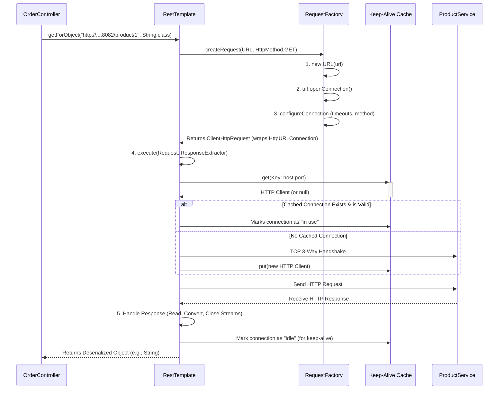

# **Microservice Communication: Synchronous HTTP with RestTemplate**

### **1. Goal of the Session**
To set up two independent Spring Boot microservices (`order-service` and `product-service`) running on different ports and establish **synchronous HTTP communication** between them.

*   **Order Service:** Runs on port `8081`
*   **Product Service:** Runs on port `8082`
*   **Communication Flow:** `order-service` will call an API exposed by `product-service` and wait for its response.

---

### **2. Understanding Synchronous HTTP Communication**

**Definition:** A communication style where the client (e.g., `order-service`) sends a request and **blocks its thread**, waiting for the response from the server (e.g., `product-service`) before it can proceed.

*   **Nature:** Blocking.
*   **Protocol:** HTTP (which is stateless).
*   **Common Tools in Spring:**
    1.  **RestTemplate** (Legacy, covered in this lecture)
    2.  **WebClient** (Modern, reactive)
    3.  **Feign Client** (Declarative, part of Spring Cloud)

---

### **3. The Foundation: Anatomy of an HTTP Request/Response**

To understand the abstractions Spring provides, we must first understand what happens under the hood.

#### **A. HTTP GET Request**
```http
GET /product/1 HTTP/1.1       // HTTP Method, URI, Protocol Version
Host: localhost:8082          // Target Host (Server)
User-Agent: Postman           // Client making the request
Accept: application/json      // Expected Response Format
```

#### **B. HTTP POST Request**
```http
POST /product HTTP/1.1
Host: localhost:8082
User-Agent: curl/7.64.1
Content-Type: application/json // Format of the data being sent
Content-Length: 36             // Size of the request body

{"name":"Laptop","price":1200}  // Request Body (Payload)
```

#### **C. HTTP Response**
```http
HTTP/1.1 200 OK                // Protocol, Status Code
Content-Type: application/json
Content-Length: 28
Connection: keep-alive         // Important Header!
Keep-Alive: timeout=5, max=50  // Important Header!

{"id":1,"name":"Laptop"}       // Response Body
```

#### **D. Key Concept: HTTP Keep-Alive & Connection Persistence**
*   **HTTP/1.0 (Old):** Connection closed immediately after the response.
*   **HTTP/1.1 (Default):** Connection is **persistent** (kept alive) due to the `Connection: keep-alive` header.
*   **How it works:**
    1.  **TCP 3-Way Handshake** establishes the connection.
    2.  HTTP Request is sent.
    3.  HTTP Response is received.
    4.  The connection is **NOT closed**. It is returned to a **connection pool**.
    5.  Future requests to the **same host** can **reuse** this existing connection.
    6.  The connection is closed only after being idle for the `timeout` period or after serving the `max` number of requests.
*   **Benefit:** Drastically reduces the overhead of repeatedly establishing TCP connections.

---

### **4. Communication Methods: From Low-Level to Spring Abstraction**

The lecture walks through three levels of abstraction.

#### **Level 1: Plain Java (`HttpURLConnection`) - The Hard Way**
This is how you would make an HTTP call without any frameworks.

**Code in `OrderService` to call `ProductService`:**
```java
// 1. Create URL Object (The address)
URL url = new URL("http://localhost:8082/product/1");

// 2. Create & Configure Connection Object (The envelope)
HttpURLConnection connection = (HttpURLConnection) url.openConnection();
connection.setRequestMethod("GET");
connection.setRequestProperty("Accept", "application/json");
connection.setConnectTimeout(5000); // Time to establish connection
connection.setReadTimeout(5000);    // Time to wait for response

// 3. Establish Connection & Send Request (The post office sends the letter)
// This triggers the TCP handshake and sends the HTTP request.
InputStream inputStream = connection.getInputStream(); // Internally calls connect()

// 4. Read Response (Open the reply letter)
BufferedReader reader = new BufferedReader(new InputStreamReader(inputStream));
StringBuilder response = new StringBuilder();
String line;
while ((line = reader.readLine()) != null) {
    response.append(line);
}
reader.close();
System.out.println("Response: " + response.toString());

// 5. Manage Connection (Clean up)
// This handles the keep-alive logic. It may close the connection or return it to the pool.
connection.disconnect();
```
**Disadvantages:**
*   **Boilerplate Code:** Too much code for a simple task.
*   **Manual Parsing:** You must manually read streams and convert responses to objects.
*   **No Advanced Features:** Hard to implement retries, load balancing, etc.

---

#### **Level 2: Spring's RestTemplate - The Easy Abstraction**
Spring abstracts the complex `HttpURLConnection` logic into a simple, powerful class.

**Step 1: Create a `RestTemplate` Bean**
```java
@Configuration
public class AppConfig {
    @Bean
    public RestTemplate restTemplate() {
        // Simple creation
        return new RestTemplate();
        
        // OR with custom timeouts
        SimpleClientHttpRequestFactory factory = new SimpleClientHttpRequestFactory();
        factory.setConnectTimeout(3000);
        factory.setReadTimeout(3000);
        return new RestTemplate(factory);
    }
}
```

**Step 2: Use it in your Service/Controller**
```java
@RestController
public class OrderController {

    @Autowired
    private RestTemplate restTemplate;

    @GetMapping("/order")
    public String getOrder() {
        // One line replaces all the plain Java code!
        String response = restTemplate.getForObject(
            "http://localhost:8082/product/1", // URL
            String.class                        // Response Type
        );
        return "Order call successful. " + response;
    }
}
```

**How `RestTemplate` Works Internally:**
1.  **`getForObject()`** is called.
2.  It uses a `ClientHttpRequestFactory` (default: `SimpleClientHttpRequestFactory`) to create a `ClientHttpRequest`.
3.  The factory creates an `HttpURLConnection` object internally and configures it.
4.  **`connection.connect()`** is called, which leverages the HTTP Keep-Alive cache.
5.  The request is executed, and the response is retrieved.
6.  Spring automatically **converts (deserializes)** the response JSON into the specified object type (e.g., `String.class`, `Product.class`).
7.  It manages the connection lifecycle, handling the stream closing and returning the connection to the pool if keep-alive is active.

**Common RestTemplate Methods:**
| Method | Use Case | Returns |
| :--- | :--- | :--- |
| `getForObject(url, Class)` | Simple GET request | Response body directly |
| `getForEntity(url, Class)` | GET request with full response | `ResponseEntity` (headers, status, body) |
| `postForObject(url, request, Class)` | Simple POST request | Response body directly |
| `postForEntity(url, request, Class)` | POST with full response | `ResponseEntity` |
| `put(url, request)` | PUT request (update) | `void` |
| `delete(url)` | DELETE request | `void` |
| `exchange(url, method, entity, Class)` | **Full control** over method, headers, body | `ResponseEntity` |
| `execute(url, method, callback, extractor)` | **Maximum control**, handle everything manually | Whatever the extractor returns |

**Example of `exchange()` for full control:**
```java
HttpHeaders headers = new HttpHeaders();
headers.set("Authorization", "Bearer my-token");
headers.setContentType(MediaType.APPLICATION_JSON);

Product productToCreate = new Product("Tablet", 600);
HttpEntity<Product> requestEntity = new HttpEntity<>(productToCreate, headers);

ResponseEntity<Product> response = restTemplate.exchange(
    "http://localhost:8082/product",
    HttpMethod.POST,
    requestEntity,
    Product.class
);

Product createdProduct = response.getBody();
```

---

### **5. Why RestTemplate is Considered "Legacy"**

Despite its power, `RestTemplate` has major drawbacks:
1.  **API Bloat:** It has a vast number of overloaded methods (`getForObject`, `getForEntity`, etc.), making the API confusing and hard to maintain.
2.  **Lack of Modern Features:** It was designed before patterns like Circuit Breakers and retries became standard. Adding these features requires complex configuration or more overloaded methods.
3.  **Maintenance Mode:** The Spring team has stopped major development on it and recommends using the modern **WebClient** instead.

**The Future:**
*   **WebClient:** A modern, reactive, non-blocking client with a fluent API. It is the successor to `RestTemplate`.
*   **Feign Client:** A declarative HTTP client that works beautifully with Spring Cloud (Eureka, Load Balancer). You define an interface, and Spring implements the HTTP calls for you.

---

### **Summary & Key Takeaways**

| Concept | Description | Key Point |
| :--- | :--- | :--- |
| **Synchronous Comm** | Client blocks and waits for the server's response. | Simple but can lead to thread exhaustion. |
| **HTTP Keep-Alive** | Reuses TCP connections for multiple requests. | **Critical for performance.** Managed automatically by the JVM/Spring. |
| **Plain Java (`HttpURLConnection`)** | Low-level way to make HTTP calls. | Understand this to appreciate what Spring abstracts away. |
| **RestTemplate** | Spring's abstraction over HTTP clients. | **Easy to use** but **legacy**. Know `getForObject`, `postForEntity`, and `exchange`. |
| **Legacy Status** | API is bulky and not designed for modern patterns. | Prefer **WebClient** or **Feign Client** for new projects. |

The notes provides a solid foundation by building up from the raw HTTP protocol to Spring's abstraction, explaining not just the "how" but also the "why" behind the connection management that makes microservice communication efficient.

<br/>
<br/>

# **High-Level Internal Flow of `RestTemplate`**

The entire process can be visualized in the following sequence, which we will then break down piece by piece:



---

### **Phase 1: The Setup - Creating the Request Envelope**

When you call `restTemplate.getForObject(url, String.class)`, the journey begins.

**Step 1: Delegation to the `ClientHttpRequestFactory`**
The `RestTemplate` itself doesn't know how to create HTTP requests. It delegates this task to a strategy interface called `ClientHttpRequestFactory`.
*   The **default implementation** is `SimpleClientHttpRequestFactory`.
*   This factory is responsible for creating the low-level `HttpURLConnection` objects.

**Step 2: Inside `SimpleClientHttpRequestFactory.createRequest()`**
1.  **Create URL Object:** `URL url = new URL("http://localhost:8082/product/1");`
2.  **Open Connection:** `HttpURLConnection connection = (HttpURLConnection) url.openConnection();`
    *   This is a crucial point. `url.openConnection()` does **not** immediately establish a network connection. It merely creates a concrete `HttpURLConnection` object that represents the request "envelope."
3.  **Configure Connection:** The factory now configures this envelope based on the `RestTemplate`'s settings:
    *   `connection.setRequestMethod("GET");`
    *   `connection.setReadTimeout(3000); // if configured`
    *   `connection.setConnectTimeout(3000); // if configured`
    *   It also sets headers like `Accept: application/json`.
4.  **Wrap and Return:** The factory wraps this raw `HttpURLConnection` inside a Spring-specific `ClientHttpRequest` object (typically a `SimpleStreamingClientHttpRequest`) and returns it to the `RestTemplate`. This object now holds the fully configured connection.

---

### **Phase 2: Execution - Sending the Request and Getting the Response**

Now, `RestTemplate` calls `request.execute()` on the `ClientHttpRequest` it received.

**Step 3: The Actual Network Call**
The `execute()` method of the `SimpleStreamingClientHttpRequest` is where the magic (and the network traffic) happens.
1.  **Getting the Output Stream:** The method calls `connection.getOutputStream()` if it's a POST/PUT request (to write the body) or, more importantly for a GET, `connection.connect()`.
2.  **Triggering the Connection:** The `connect()` or `getOutputStream()` method is the **trigger** that forces the underlying `HttpURLConnection` implementation to initiate the actual network interaction. This is where the internal mechanics of the Java runtime take over.

**Step 4: The Keep-Alive Cache & Connection Reuse (The Secret Sauce)**
This is the most critical part of the internal flow. The JVM maintains a static, transparent **HTTP connection cache** (often called the keep-alive cache).
*   **Key:** The cache key is based on the destination `(host, port)` tuple (e.g., `(localhost, 8082)`).
*   **Value:** The value is a list of idle, persistent TCP connections (wrapped as `HttpClient` objects) to that host that are still alive within their `keep-alive` timeout.

**When `connect()` is called:**
1.  The underlying implementation **first checks the cache** for an existing, idle TCP connection to the target host.
2.  **If Found:** It **reuses** this existing connection. This avoids the expensive TCP 3-way handshake, drastically improving performance.
3.  **If Not Found:** It performs a **brand new TCP 3-way handshake** to establish a connection, sends the request, and then, upon receiving the response, **stores this connection in the cache** for future reuse (if the response headers indicate `Connection: keep-alive`).

**Step 5: Sending and Receiving**
*   The HTTP request packet is sent over the established (new or reused) TCP connection.
*   The `RestTemplate` then blocks the current thread and waits for the response.
*   It checks the HTTP response code (e.g., `connection.getResponseCode()`).

---

### **Phase 3: Response Handling - Conversion and Cleanup**

**Step 6: Reading the Response Body**
*   The `RestTemplate` receives an `InputStream` from the connection (`connection.getInputStream()`).
*   It doesn't just hand you this stream. Instead, it uses a `HttpMessageConverter` to convert the raw bytes from the stream into the object you requested.

**Step 7: Message Conversion**
*   The `RestTemplate` has a list of `HttpMessageConverter` beans (e.g., `MappingJackson2HttpMessageConverter` for JSON).
*   It iterates through these converters, asking each one: "Can you convert this `application/json` response into a `String.class`?"
*   The `StringHttpMessageConverter` says "yes!" and takes the `InputStream`, reads the bytes, and constructs a `String` object from them.

**Step 8: Resource Cleanup and Connection Management**
*   The `InputStream` is **closed automatically** by the `RestTemplate`. This is a key service it provides, preventing resource leaks.
*   **Crucially, closing the stream does NOT necessarily close the underlying TCP connection.**
*   If the response headers indicated `Connection: keep-alive` (the default in HTTP/1.1), the connection is **returned to the JVM's keep-alive cache**.
*   It is now marked as idle and available for reuse by any part of the application for future requests to the same `(host, port)` until the keep-alive timeout expires.

**Step 9: Return Result**
The fully constructed object (our `String`) is returned from `getForObject()` to your calling code.

---

### **Why the Internal Flow Matters: Key Takeaways**

1.  **Lazy Connection Establishment:** No network activity happens until you call a method (`execute()`, `connect()`, `getOutputStream()`) that forces it.
2.  **Automatic Connection Pooling/Reuse:** The performance boost from HTTP keep-alive is handled **transparently by the JVM**, not directly by Spring. `RestTemplate` leverages this perfectly by ensuring streams are closed properly to allow connections to be recycled.
3.  **Abstraction Layers:** `RestTemplate` -> `ClientHttpRequestFactory` -> `HttpURLConnection` -> JVM's HTTP Implementation -> OS Networking Stack. Understanding these layers helps debug complex issues.
4.  **The Role of `RestTemplate`:** Its primary jobs are to:
    *   **Configure** the request (through the factory).
    *   **Trigger** the execution.
    *   **Handle** the response conversion elegantly using message converters.
    *   **Manage** resources (streams) correctly to facilitate connection reuse.
5.  **It's Not a "Pool" in the Spring Context:** The connection cache is managed by the JVM, not the Spring application context. You cannot configure it via Spring properties (though some JVM system properties can influence it). This is a key difference between `RestTemplate` and more advanced clients like Apache's `HttpClient` or the reactive `WebClient`.