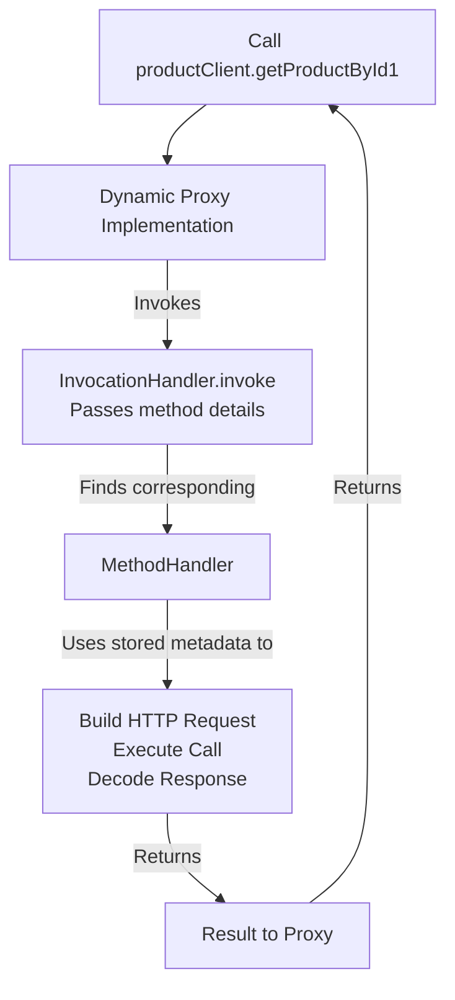
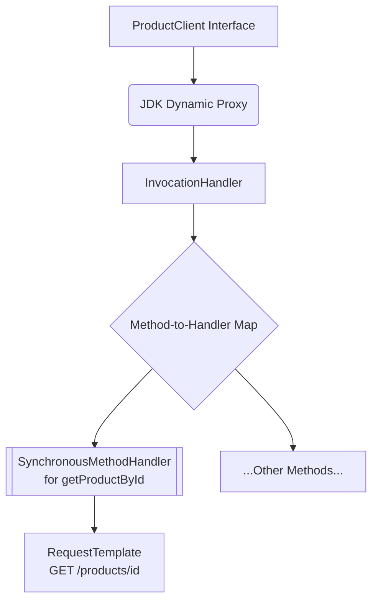

# **Spring Cloud OpenFeign**


### **1. Introduction & Why OpenFeign?**

*   **Problem:** Microservices need to communicate with each other. Using `RestTemplate` or the new `RestClient` requires writing a lot of boilerplate code (setting up URLs, handling requests/responses, etc.).
*   **Solution: OpenFeign.** A **declarative** HTTP client from Netflix. "Declarative" means you describe *what* you want to do (e.g., "call this API"), not *how* to do it. The Feign framework handles the implementation.
*   **Spring Integration:** This capability is integrated into the Spring ecosystem via the **Spring Cloud OpenFeign** library.
*   **Why it's the Future:** It's part of the larger **Spring Cloud** suite, which provides tools for building distributed systems (Service Discovery, Load Balancing, API Gateway, etc.). OpenFeign integrates seamlessly with these tools, making it the ideal choice for future-proof microservice communication.

---

### **2. Core Concepts & Setup**

#### **Maven Dependency (`pom.xml`)**

We use the `dependencyManagement` section to let Spring Cloud manage compatible versions of all its libraries (OpenFeign, Service Discovery, Load Balancer, etc.) to avoid conflicts.

```xml
<dependencyManagement>
    <dependencies>
        <spring-cloud.version>2023.0.2</spring-cloud.version> <!-- Use latest version -->
        <dependency>
            <groupId>org.springframework.cloud</groupId>
            <artifactId>spring-cloud-dependencies</artifactId>
            <version>${spring-cloud.version}</version>
            <type>pom</type>
            <scope>import</scope>
        </dependency>
    </dependencies>
</dependencyManagement>

<dependencies>
    <!-- Other dependencies -->
    <dependency>
        <groupId>org.springframework.cloud</groupId>
        <artifactId>spring-cloud-starter-openfeign</artifactId>
        <!-- Version is managed by spring-cloud-dependencies -->
    </dependency>
</dependencies>
```

#### **Application Setup**

Enable Feign Clients in your main application class. This tells Spring to scan for interfaces annotated with `@FeignClient`.

```java
@SpringBootApplication
@EnableFeignClients // <<-- This is crucial
public class OrderServiceApplication {
    public static void main(String[] args) {
        SpringApplication.run(OrderServiceApplication.class, args);
    }
}
```

---

### **3. Creating Your First Feign Client**

**Scenario:** Order Service (8081) needs to call Product Service (8082) at the endpoint `GET http://localhost:8082/products/{id}`.

#### **Step 1: Define the Feign Client Interface**

Create an interface and annotate it with `@FeignClient`. Define the method signatures just like you would in a Spring MVC controller.

```java
// ProductClient.java

@FeignClient(
    name = "product-service", // Arbitrary logical name for this client
    url = "${feign.client.product-service.url}" // Base URL read from properties
)
public interface ProductClient {

    @GetMapping("/products/{id}") // Relative path to the endpoint
    String getProductById(@PathVariable("id") Long id); // Use Spring MVC annotations

}
```

#### **Step 2: Configure Base URL (`application.properties`)**

```properties
# application.properties
feign.client.product-service.url=http://localhost:8082
```

#### **Step 3: Use the Client in your Service/Controller**

Simply inject the interface and call its methods. Spring provides the implementation automatically.

```java
// OrderController.java

@RestController
@RequestMapping("/orders")
public class OrderController {

    @Autowired
    private ProductClient productClient; // Inject the Feign Client

    @PostMapping
    public String createOrder() {
        // Using the Feign Client is as simple as this!
        String productDetails = productClient.getProductById(1L);
        System.out.println("Response from Product API call is: " + productDetails);
        return "Order call successful";
    }
}
```

---

### **4. How Does It Work? The Magic Behind `@FeignClient`**

Since we only wrote an interface, Spring must create a runtime implementation. This is done using **Dynamic Proxies** and the **Reflective Feign** library.

Here’s the internal flow when you call `productClient.getProductById(1)`:



1.  **Scanning & Parsing:** At startup, `@EnableFeignClients` triggers a scan for all `@FeignClient` interfaces. For each method, Feign parses the annotations (`@GetMapping`, `@PathVariable`, etc.) and creates a **`MethodHandler`**.
2.  **The MethodHandler:** This object is the brain. It contains all metadata needed to execute the request:
    *   **Target URL:** Base URL + Relative Path (e.g., `http://localhost:8082/products/{id}`)
    *   **HTTP Method:** GET, POST, etc.
    *   **Request Parameters:** Headers, Path Variables, Query Params, Body.
    *   **Encoders/Decoders:** Objects to convert Java objects to/from HTTP messages (e.g., JSON).
    *   **Retry Logic, Logger, etc.**
3.  **The Proxy:** Spring uses Java's dynamic proxy mechanism to create a runtime implementation of your `ProductClient` interface.
4.  **The Invocation:** When you call `productClient.getProductById(1)`, the call is intercepted by the proxy. The proxy looks up the `MethodHandler` for that specific method and delegates the actual HTTP request execution to it.
5.  **Execution:** The `MethodHandler` uses its metadata to build the HTTP request, execute it using a default or configured HTTP client (like Java's `HttpURLConnection`), decode the response, and return the result.

---

### **5. Advanced Configuration (Per-Client)**

You can customize each Feign client's behavior (timeout, encoder, error handling, etc.) by providing a configuration class.

#### **Creating a Configuration Class**

```java
// ProductClientConfig.java
@Configuration
public class ProductClientConfig {

    // Custom Encoder (Java Object -> HTTP Request Body)
    @Bean
    public Encoder productEncoder() {
        return (object, bodyType, template) -> {
            // Custom logic to convert object to JSON/other format
            ObjectMapper mapper = new ObjectMapper();
            String json = mapper.writeValueAsString(object);
            template.body(json); // Set the body of the request
        };
    }

    // Custom Decoder (HTTP Response Body -> Java Object)
    @Bean
    public Decoder productDecoder() {
        return (response, type) -> {
            // Custom logic to read response and convert to Java object
            String body = Util.toString(response.body().asReader(StandardCharsets.UTF_8));
            ObjectMapper mapper = new ObjectMapper();
            return mapper.readValue(body, type);
        };
    }

    // Custom Error Handling (for non-2xx status codes)
    @Bean
    public ErrorDecoder productErrorDecoder() {
        return (methodKey, response) -> {
            int status = response.status();
            if (status == 400) {
                throw new CustomBadRequestException("Bad Request from Product Service");
            } else if (status >= 500) {
                throw new CustomServerException("Server error from Product Service");
            }
            // For all other errors, use the default handling
            return new ErrorDecoder.Default().decode(methodKey, response);
        };
    }

    // Custom Retryer
    @Bean
    public Retryer productRetryer() {
        // Custom retry logic: max 3 attempts, backoff starting at 1000 ms
        return new Retryer.Default(1000, 2000, 3);
    }
}
```

#### **Attaching Configuration to the Client**

Reference the config class in the `@FeignClient` annotation.

```java
@FeignClient(
    name = "product-service",
    url = "${feign.client.product-service.url}",
    configuration = ProductClientConfig.class // Attach the config
)
public interface ProductClient {
    // ... methods
}
```

#### **Configuring Timeouts via `application.properties`**

You can also configure settings specifically for a client using its `name` in the properties file.

```properties
# application.properties
feign.client.config.product-service.connect-timeout=5000   # 5 seconds
feign.client.config.product-service.read-timeout=30000     # 30 seconds
feign.client.config.product-service.logger-level=full      # Logging level

# Apply a default to all Feign clients
feign.client.config.default.connect-timeout=5000
```

---

### **6. A More Complex Client Example**

Feign supports all the rich Spring MVC annotations.

```java
@FeignClient(name = "product-service", url = "...", configuration = ...)
public interface ProductClient {

    @GetMapping("/products/{id}")
    String getProductById(@PathVariable Long id);

    @PutMapping(value = "/products/update/{id}",
                consumes = "application/json")
    Product updateProduct(@PathVariable("id") Long id,
                         @RequestParam("sendEmail") boolean sendEmail,
                         @RequestHeader("X-Custom-Header") String customHeader,
                         @RequestBody Product product); // Complex object as body

}
```

---

### **Summary: Key Advantages of OpenFeign**

1.  **Declarative Style:** Write clean, intention-revealing interfaces without boilerplate code.
2.  **Spring Integration:** Seamlessly works with other Spring Cloud components (Eureka, LoadBalancer, etc.).
3.  **Annotation-Based:** Uses familiar Spring MVC annotations.
4.  **Easy Customization:** Configure encoders, decoders, error handling, retry logic, and timeouts on a per-client basis.
5.  **Simplified Maintenance:** The code is much easier to read, write, and maintain compared to imperative clients like `RestTemplate`.

By understanding both the simple usage and the powerful configuration options, you can effectively use Spring Cloud OpenFeign to build robust and resilient communication between your microservices.


# **The Internal Workings of a Feign Client: A Step-by-Step Journey**


Imagine you have a `ProductClient` interface like this:

```java
@FeignClient(name = "product-service", url = "localhost:8082")
public interface ProductClient {
    @GetMapping("/products/{id}")
    String getProductById(@PathVariable("id") Long id);
}
```

And you use it in a controller:

```java
@RestController
public class OrderController {
    @Autowired
    private ProductClient productClient; // How can we autowire an interface?

    @PostMapping("/order")
    public String createOrder() {
        String product = productClient.getProductById(1L); // Magic happens here!
        return "Order created with product: " + product;
    }
}
```

Here’s the detailed play-by-play of the "magic".

---

### **Phase 1: Application Startup & The Scan (The Setup)**

**Step 1: The Trigger (`@EnableFeignClients`)**
When your Spring Boot application starts, the `@EnableFeignClients` annotation triggers a component scan specifically for interfaces annotated with `@FeignClient`.

**Step 2: Registration & Bean Definition**
For each found interface (e.g., `ProductClient`), Spring doesn't register a simple bean. Instead, it registers a **Bean Definition** of type `FeignClientFactoryBean`. This factory bean's job is to later create the actual proxy object that will be injected into your controller.

---

### **Phase 2: The Proxy Creation (The Illusion)**

This is the core of Feign's magic. It uses the **JDK Dynamic Proxy** mechanism.

**Step 3: The Factory Bean Creates a Proxy**
When the `OrderController` needs to be autowired and requires the `ProductClient` bean, the `FeignClientFactoryBean` springs into action. Its `getObject()` method is called, which performs the following:

*   **Feign Builder:** It uses a Feign builder (e.g., `Feign.builder()`) to configure components like Encoder (object -> JSON), Decoder (JSON -> object), Logger, Contract (how to parse annotations), and HTTP Client.
*   **Target:** It sets the "target" – the base URL (`localhost:8082`) and the type of the interface (`ProductClient.class`).
*   **Invocation:** The key call is `feign.build().newInstance(target)`, which eventually leads to the `ReflectiveFeign` class.

**Step 4: `ReflectiveFeign` - The Brain Behind the Operation**
The `ReflectiveFeign.newInstance()` method is where the dynamic proxy is created. It does two critical things:

**a) Creates Method Handlers (The Muscle):**
It iterates over every method in the `ProductClient` interface (in our case, just `getProductById`). For each method, it creates a **`SynchronousMethodHandler`**.

*   This handler is the workhorse. It parses all the annotations on the method (`@GetMapping`, `@PathVariable`).
*   It builds a **`RequestTemplate`** – a blueprint for the future HTTP request. This template contains all the information extracted from the annotations:
    *   HTTP Method: `GET`
    *   URL: `/products/{id}` (the `{id}` is a placeholder)
    *   Headers (if any)
    *   How to handle the parameters (which one is the path variable, which one is the request body, etc.).

**b) Creates a Proxy with an InvocationHandler (The Director):**
It then creates a `java.lang.reflect.Proxy` that implements the `ProductClient` interface. This proxy is assigned a **`InvocationHandler`** (specifically, Feign's own `InvocationHandler`).

*   This handler holds a **Map** that links each `Method` object (e.g., the `getProductById` method) to its corresponding `SynchronousMethodHandler` (the muscle we just created).
*   The proxy object is what ultimately gets stored in the Spring application context and injected into your `OrderController`.



---

### **Phase 3: The Method Invocation (The Execution)**

**Step 5: The Call is Made**
When your code executes `productClient.getProductById(1L)`, you are not calling a real method. You are calling a method on the **proxy object**.

**Step 6: InvocationHandler Takes Over**
The proxy's `InvocationHandler` has its `invoke(...)` method called. It receives three key pieces of information:
1.  The proxy object itself (ignored).
2.  The `java.lang.reflect.Method` object representing `getProductById`.
3.  The arguments passed to the method (the array `[1L]`).

**Step 7: Routing to the Correct Handler**
The invocation handler looks up the passed `Method` object in its internal map to find the associated `SynchronousMethodHandler`. It then calls `handler.invoke(args)`.

**Step 8: `SynchronousMethodHandler` Executes the Request**
This is where the HTTP request is finally built and executed. The handler's `invoke()` method:

1.  **Processes Arguments:** It takes the arguments (`[1L]`) and applies them to the `RequestTemplate` it created during startup. It replaces the placeholder `{id}` in the URL with the actual value `1`.
2.  **Creates the Request:** The template is used to create a fully resolved `Request` object: `GET http://localhost:8082/products/1`.
3.  **Executes the Request:** It passes the `Request` object to the configured HTTP Client (e.g., `HttpURLConnection`, Apache HttpClient, or OkHttp).
    
    ```mermaid
    flowchart LR
    A[Method Args: 1L] --> B[SynchronousMethodHandler]
    subgraph B [Handler Process]
        C[RequestTemplate<br>GET /products/&#123;id&#125;] --> D[Apply Args] --> E[Final Request<br>GET /products/1]
    end
    E --> F[HTTP Client]
    F --> G[Product Service]
    G --> H[Raw HTTP Response]
    H --> I[Decoder]
    I --> J[String result]
    J --> K[Return to Controller]
    ```
4.  **Handles the Response:** The client executes the request and returns a `Response` object.
5.  **Decodes the Response:** The handler passes this response to the configured `Decoder`. The decoder reads the HTTP response body, and if it's a 2xx status code, it converts the JSON (or other format) into the declared return type—in this case, a `String`.
6.  **Returns the Result:** The decoded object (`String`) is returned all the way back up the chain: `SynchronousMethodHandler` -> `InvocationHandler` -> **Proxy Object** -> your `OrderController`. Your controller receives the String as if a local method had returned it.

**Step 9: Error Handling**
If the HTTP response has a non-2xx status code (e.g., 404, 500), the `Decoder` is bypassed. Instead, an `ErrorDecoder` is invoked. The default behavior is to throw a FeignException containing the status code and response body. A custom `ErrorDecoder` (as shown in the previous answer) can be used to map these errors to specific, meaningful exceptions.

---

### **Summary: The Illusion Revealed**

The "magic" of Feign is a sophisticated application of the **Proxy** and **Factory** design patterns.

1.  **At Startup:** Feign uses the `@FeignClient` annotation to identify interfaces and pre-compute how to handle each of their methods (`SynchronousMethodHandler` + `RequestTemplate`).
2.  **At Injection:** It creates a JDK Dynamic Proxy object for the interface and injects that proxy.
3.  **At Runtime:** When you call a method on the proxy, it doesn't execute business logic. Instead, it routes the call to a dedicated handler that translates the method call and its arguments into a complete HTTP request, executes it, and translates the response back into a Java object.

This entire process allows you to work with a clean, declarative interface while Feign handles all the complex, imperative HTTP communication boilerplate under the hood.

<br/>
<br/>

# **What is a Dynamic Proxy?**

A dynamic proxy is a class that is created **at runtime** (dynamically) that implements a list of interfaces. You can think of it as a "fake" or "surrogate" object that stands in for a real object. When you call a method on this proxy, it doesn't execute the method itself. Instead, it forwards the call to a special handler object that you provide, which can then decide what to do.

It's a powerful feature of the Java language (available since Java 1.3) that enables **Aspect-Oriented Programming (AOP)**.

---

### **Analogy: The Celebrity's Assistant**

Imagine a famous celebrity (the **Real Object**). You, a fan, want to make a request (call a method), like asking for an autograph (`getAutograph()`).

*   You can't call the celebrity directly. Instead, you must go through their **Publicist (the Proxy)**.
*   The publicist implements the same interface as the celebrity (`Celebrity` interface with a `getAutograph()` method).
*   When you call `publicist.getAutograph()`, the publicist doesn't give you the autograph themselves. They **intercept** your call.
*   The publicist then decides what to do: they might log your request, check your credentials, schedule it for later, or finally, if everything is okay, **forward the request** to the real celebrity and give you the result.

This intermediary—the publicist—is the **Dynamic Proxy**. The logic the publicist uses to handle the call is the **Invocation Handler**.

---

### **How to Create a Dynamic Proxy in Java?**

Java provides a simple way to create them using the `java.lang.reflect.Proxy` class.

You need two things:
1.  **An Interface:** The proxy can only implement interfaces, not concrete classes.
2.  **An InvocationHandler:** A class where you write the custom logic for what should happen when any method on the proxy is called.

#### **Step-by-Step Code Example**

**1. Define an Interface**
This is what both the real object and the proxy will implement.
```java
// The interface that our real object and proxy will implement
public interface Greeter {
    String greet(String name);
    String sayGoodbye(String name);
}
```

**2. Create a Real Object (The Target)**
This is the actual object that does the real work.
```java
// The real object that does the actual work
public class RealGreeter implements Greeter {
    @Override
    public String greet(String name) {
        return "Hello, " + name + "! (Real object)";
    }
    @Override
    public String sayGoodbye(String name) {
        return "Goodbye, " + name + "! (Real object)";
    }
}
```

**3. Create an InvocationHandler (The Interceptor)**
This is where the magic happens. The `invoke` method is called for *every* method call on the proxy.
```java
import java.lang.reflect.InvocationHandler;
import java.lang.reflect.Method;

public class LoggingInvocationHandler implements InvocationHandler {

    private final Object target; // The real object we are proxying

    public LoggingInvocationHandler(Object target) {
        this.target = target;
    }

    // This method is called for EVERY method call on the proxy
    @Override
    public Object invoke(Object proxy, Method method, Object[] args) throws Throwable {
        // 1. Do something BEFORE the real method call (e.g., logging, security check)
        System.out.println("-> [Proxy Log] About to call method: " + method.getName());
        if (args != null) {
            System.out.println("-> [Proxy Log] With arguments: " + String.join(", ", args.toString()));
        }

        // 2. FORWARD the call to the real object (the target)
        // This is where the actual method execution happens
        Object result = method.invoke(target, args);

        // 3. Do something AFTER the real method call (e.g., logging, modifying result)
        System.out.println("-> [Proxy Log] Method returned: " + result);

        // 4. Return the result to the caller
        return result;
    }
}
```

**4. Create the Proxy Dynamically and Use It**
This is where we stitch it all together.
```java
import java.lang.reflect.Proxy;

public class DynamicProxyDemo {
    public static void main(String[] args) {

        // 1. Create the real object
        Greeter realGreeter = new RealGreeter();

        // 2. Create the InvocationHandler, passing it the real object
        InvocationHandler handler = new LoggingInvocationHandler(realGreeter);

        // 3. Create the dynamic proxy!
        // We need the class loader, the list of interfaces to implement, and the handler.
        Greeter proxy = (Greeter) Proxy.newProxyInstance(
                Greeter.class.getClassLoader(), // Use the same classloader as the interface
                new Class[]{Greeter.class},     // The list of interfaces the proxy will implement
                handler                         // The InvocationHandler that defines the proxy's behavior
        );

        // 4. Use the proxy instead of the real object
        String greeting = proxy.greet("Alice");
        System.out.println("Final result: " + greeting);
        System.out.println("---");
        String goodbye = proxy.sayGoodbye("Bob");
        System.out.println("Final result: " + goodbye);

        // Bonus: See what the proxy class is actually called
        System.out.println("Proxy class: " + proxy.getClass().getName());
    }
}
```

#### **Output of the Above Code:**
```
-> [Proxy Log] About to call method: greet
-> [Proxy Log] With arguments: [Ljava.lang.Object;@1fb3ebeb
-> [Proxy Log] Method returned: Hello, Alice! (Real object)
Final result: Hello, Alice! (Real object)
---
-> [Proxy Log] About to call method: sayGoodbye
-> [Proxy Log] With arguments: [Ljava.lang.Object;@548c4f57
-> [Proxy Log] Method returned: Goodbye, Bob! (Real object)
Final result: Goodbye, Bob! (Real object)
Proxy class: com.sun.proxy.$Proxy0
```

Notice how the proxy class has a weird name like `$Proxy0`. This is the class that was generated for us at runtime by the JVM.

---

### **How This Relates to OpenFeign**

Now, let's connect this directly to Feign:

1.  **Your `ProductClient` interface** is the `Greeter` interface in our example.
2.  **Feign's `ReflectiveFeign` class** acts like our `DynamicProxyDemo.main()` method. It uses `Proxy.newProxyInstance()` to create a dynamic proxy for your `ProductClient` interface.
3.  **Feign's `InvocationHandler`** is like our `LoggingInvocationHandler`, but much more sophisticated.
4.  **The `method.invoke(target, args)` call** in our simple example is where the real work happened. In Feign's handler, there is **no real target object!** Instead of forwarding to a real object, Feign's handler:
    *   Looks at the method (`getProductById`).
    *   Finds the corresponding `SynchronousMethodHandler` (which contains the HTTP request template).
    *   **Translates the method call into an HTTP request**, executes it using an HTTP client, decodes the response, and returns it.

**In essence, OpenFeign uses the dynamic proxy not to forward calls to another Java object, but to translate Java method calls into remote HTTP requests.** This is the brilliant trick that makes it a *declarative* client.


<br/>
<br/>

# **Complete, end-to-end Spring Boot project to demonstrate OpenFeign. We'll create two microservices:**

1.  **User Service:** Will act as the Feign Client, calling the Product Service.
2.  **Product Service:** A simple REST service that the User Service will call.

We'll cover all key topics: basic setup, parameter passing, error handling, configuration, and logging.

---

### **Project Structure**

```
feign-demo-project/
├── product-service/
│   ├── src/main/java/com/example/productservice/
│   │   ├── ProductServiceApplication.java
│   │   ├── controller/
│   │   │   └── ProductController.java
│   │   └── model/
│   │       └── Product.java
│   └── pom.xml
│
└── user-service/
    ├── src/main/java/com/example/userservice/
    │   ├── UserServiceApplication.java
    │   ├── controller/
    │   │   └── UserController.java
    │   ├── client/
    │   │   ├── ProductClient.java
    │   │   └── ProductClientConfig.java
    │   ├── service/
    │   │   └── UserService.java
    │   └── exception/
    │       ├── ProductServiceException.java
    │       └── CustomErrorDecoder.java
    └── pom.xml
```

---

## **1. Product Service (The Server)**

This is a simple REST API that the User Service will call.

### **`pom.xml` (Product Service)**
```xml
<?xml version="1.0" encoding="UTF-8"?>
<project xmlns="http://maven.apache.org/POM/4.0.0"
         xmlns:xsi="http://www.w3.org/2001/XMLSchema-instance"
         xsi:schemaLocation="http://maven.apache.org/POM/4.0.0 http://maven.apache.org/xsd/maven-4.0.0.xsd">
    <modelVersion>4.0.0</modelVersion>
    <parent>
        <groupId>org.springframework.boot</groupId>
        <artifactId>spring-boot-starter-parent</artifactId>
        <version>3.2.4</version>
        <relativePath/>
    </parent>

    <groupId>com.example</groupId>
    <artifactId>product-service</artifactId>
    <version>1.0.0</version>

    <properties>
        <java.version>17</java.version>
    </properties>

    <dependencies>
        <dependency>
            <groupId>org.springframework.boot</groupId>
            <artifactId>spring-boot-starter-web</artifactId>
        </dependency>
    </dependencies>

    <build>
        <plugins>
            <plugin>
                <groupId>org.springframework.boot</groupId>
                <artifactId>spring-boot-maven-plugin</artifactId>
            </plugin>
        </plugins>
    </build>
</project>
```

### **`Product.java` (Model)**
```java
package com.example.productservice.model;

public class Product {
    private Long id;
    private String name;
    private double price;
    private int quantity;

    // Constructors, Getters, and Setters
    public Product() {}
    public Product(Long id, String name, double price, int quantity) {
        this.id = id;
        this.name = name;
        this.price = price;
        this.quantity = quantity;
    }
    // ... getters and setters ...
}
```

### **`ProductController.java`**
```java
package com.example.productservice.controller;

import com.example.productservice.model.Product;
import org.springframework.web.bind.annotation.*;

import java.util.ArrayList;
import java.util.List;
import java.util.Optional;

@RestController
@RequestMapping("/products")
public class ProductController {

    private List<Product> products = new ArrayList<>(List.of(
        new Product(1L, "Laptop", 999.99, 10),
        new Product(2L, "Smartphone", 499.99, 25),
        new Product(3L, "Headphones", 149.99, 50)
    ));

    // GET /products/{id}
    @GetMapping("/{id}")
    public Product getProductById(@PathVariable Long id) {
        return products.stream()
                .filter(p -> p.getId().equals(id))
                .findFirst()
                .orElseThrow(() -> new RuntimeException("Product not found with id: " + id));
    }

    // GET /products?name={name} (Demo of @RequestParam)
    @GetMapping
    public Product getProductByName(@RequestParam String name) {
        return products.stream()
                .filter(p -> p.getName().equalsIgnoreCase(name))
                .findFirst()
                .orElseThrow(() -> new RuntimeException("Product not found with name: " + name));
    }

    // POST /products (Demo of @RequestBody)
    @PostMapping
    public Product createProduct(@RequestBody Product product) {
        products.add(product);
        return product;
    }

    // Simulate an error for demo
    @GetMapping("/error")
    public Product getProductError() {
        throw new RuntimeException("Internal Product Service Error!");
    }
}
```

### **`ProductServiceApplication.java`**
```java
package com.example.productservice;

import org.springframework.boot.SpringApplication;
import org.springframework.boot.autoconfigure.SpringBootApplication;

@SpringBootApplication
public class ProductServiceApplication {
    public static void main(String[] args) {
        SpringApplication.run(ProductServiceApplication.class, args);
    }
}
```

### **`application.properties` (Product Service)**
```properties
server.port=8082
spring.application.name=product-service
```

---

## **2. User Service (The Feign Client)**

This service will use Feign to call the Product Service.

### **`pom.xml` (User Service)**
*Crucial: This is where we add the OpenFeign dependency.*
```xml
<?xml version="1.0" encoding="UTF-8"?>
<project xmlns="http://maven.apache.org/POM/4.0.0" xmlns:xsi="http://www.w3.org/2001/XMLSchema-instance"
         xsi:schemaLocation="http://maven.apache.org/POM/4.0.0 http://maven.apache.org/xsd/maven-4.0.0.xsd">
    <modelVersion>4.0.0</modelVersion>
    <parent>
        <groupId>org.springframework.boot</groupId>
        <artifactId>spring-boot-starter-parent</artifactId>
        <version>3.2.4</version>
        <relativePath/>
    </parent>

    <groupId>com.example</groupId>
    <artifactId>user-service</artifactId>
    <version>1.0.0</version>

    <properties>
        <java.version>17</java.version>
        <spring-cloud.version>2023.0.1</spring-cloud.version>
    </properties>

    <dependencyManagement>
        <dependencies>
            <dependency>
                <groupId>org.springframework.cloud</groupId>
                <artifactId>spring-cloud-dependencies</artifactId>
                <version>${spring-cloud.version}</version>
                <type>pom</type>
                <scope>import</scope>
            </dependency>
        </dependencies>
    </dependencyManagement>

    <dependencies>
        <dependency>
            <groupId>org.springframework.boot</groupId>
            <artifactId>spring-boot-starter-web</artifactId>
        </dependency>
        <!-- The OpenFeign Dependency -->
        <dependency>
            <groupId>org.springframework.cloud</groupId>
            <artifactId>spring-cloud-starter-openfeign</artifactId>
        </dependency>
    </dependencies>

    <build>
        <plugins>
            <plugin>
                <groupId>org.springframework.boot</groupId>
                <artifactId>spring-boot-maven-plugin</artifactId>
            </plugin>
        </plugins>
    </build>
</project>
```

### **`ProductClient.java` (The Feign Client Interface)**
*Topic: Basic Feign Client, `@PathVariable`, `@RequestParam`, `@RequestBody`*
```java
package com.example.userservice.client;

import com.example.userservice.exception.ProductServiceException;
import com.example.userservice.model.Product;
import org.springframework.cloud.openfeign.FeignClient;
import org.springframework.web.bind.annotation.*;

// Topic: @FeignClient annotation and basic configuration
@FeignClient(
        name = "product-service", // Logical name of the client
        url = "${product.service.url}", // Base URL from properties file
        configuration = ProductClientConfig.class // Topic: Per-client configuration
)
public interface ProductClient {

    // Topic: @GetMapping, @PathVariable
    // This maps to GET http://localhost:8082/products/{id}
    @GetMapping("/products/{id}")
    Product getProductById(@PathVariable("id") Long id);

    // Topic: @RequestParam
    // This maps to GET http://localhost:8082/products?name={name}
    @GetMapping("/products")
    Product getProductByName(@RequestParam String name);

    // Topic: @RequestBody
    // This maps to POST http://localhost:8082/products
    @PostMapping("/products")
    Product createProduct(@RequestBody Product product);

    // Endpoint to demo error handling
    @GetMapping("/products/error")
    String getProductError();
}
```

### **`ProductClientConfig.java` (Configuration Class)**
*Topic: Custom Configuration (Error Decoder, Logger Level)*
```java
package com.example.userservice.client;

import com.example.userservice.exception.CustomErrorDecoder;
import org.springframework.context.annotation.Bean;
import org.springframework.context.annotation.Configuration;

@Configuration
public class ProductClientConfig {

    // Topic: Custom Error Handling
    // This bean will replace the default Feign error decoder.
    @Bean
    public CustomErrorDecoder errorDecoder() {
        return new CustomErrorDecoder();
    }

    // We could also configure custom encoder/decoder, retryer, etc. here.
}
```

### **`CustomErrorDecoder.java` (Custom Error Handling)**
*Topic: Handling non-2xx responses gracefully*
```java
package com.example.userservice.exception;

import feign.Response;
import feign.codec.ErrorDecoder;
import org.springframework.http.HttpStatus;
import org.springframework.stereotype.Component;

@Component
public class CustomErrorDecoder implements ErrorDecoder {

    private final ErrorDecoder defaultErrorDecoder = new Default();

    @Override
    public Exception decode(String methodKey, Response response) {
        // Topic: Intercepting the response status
        HttpStatus status = HttpStatus.valueOf(response.status());

        if (status.is5xxServerError()) {
            // Handle 5xx errors
            return new ProductServiceException("Product Service is unavailable: " + status.getReasonPhrase(), status);
        } else if (status.is4xxClientError()) {
            // Handle 4xx errors
            return new ProductServiceException("Error in your request to Product Service: " + status.getReasonPhrase(), status);
        } else {
            // Delegate to the default decoder for other cases (like 2xx, which shouldn't happen here)
            return defaultErrorDecoder.decode(methodKey, response);
        }
    }
}
```

### **`ProductServiceException.java` (Custom Exception)**
```java
package com.example.userservice.exception;

import org.springframework.http.HttpStatus;

public class ProductServiceException extends RuntimeException {
    private final HttpStatus status;

    public ProductServiceException(String message, HttpStatus status) {
        super(message);
        this.status = status;
    }

    public HttpStatus getStatus() {
        return status;
    }
}
```

### **`UserService.java` (Service Layer)**
```java
package com.example.userservice.service;

import com.example.userservice.client.ProductClient;
import com.example.userservice.exception.ProductServiceException;
import com.example.userservice.model.Product;
import org.springframework.beans.factory.annotation.Autowired;
import org.springframework.stereotype.Service;

@Service
public class UserService {

    @Autowired
    private ProductClient productClient; // Injecting the Feign Client

    public Product getProductDetails(Long productId) {
        try {
            // Topic: Using the Feign Client like a local method call
            return productClient.getProductById(productId);
        } catch (ProductServiceException e) {
            // Handle the exception thrown by our CustomErrorDecoder
            throw new RuntimeException("Failed to fetch product due to: " + e.getMessage(), e);
        }
    }

    public Product getProductDetailsByName(String name) {
        return productClient.getProductByName(name);
    }

    public Product createNewProduct(Product product) {
        return productClient.createProduct(product);
    }

    public String triggerError() {
        return productClient.getProductError();
    }
}
```

### **`UserController.java` (REST Controller)**
```java
package com.example.userservice.controller;

import com.example.userservice.model.Product;
import com.example.userservice.service.UserService;
import org.springframework.beans.factory.annotation.Autowired;
import org.springframework.web.bind.annotation.*;

@RestController
@RequestMapping("/users")
public class UserController {

    @Autowired
    private UserService userService;

    @GetMapping("/product/{id}")
    public Product getUserProduct(@PathVariable Long id) {
        return userService.getProductDetails(id);
    }

    @GetMapping("/product")
    public Product getUserProductByName(@RequestParam String name) {
        return userService.getProductDetailsByName(name);
    }

    @PostMapping("/product")
    public Product createUserProduct(@RequestBody Product product) {
        return userService.createNewProduct(product);
    }

    @GetMapping("/product-error")
    public String triggerProductError() {
        return userService.triggerError();
    }
}
```

### **`UserServiceApplication.java` (Main Application)**
*Topic: Enabling Feign Clients*
```java
package com.example.userservice;

import org.springframework.boot.SpringApplication;
import org.springframework.boot.autoconfigure.SpringBootApplication;
import org.springframework.cloud.openfeign.EnableFeignClients;

@SpringBootApplication
@EnableFeignClients // Topic: This scans for @FeignClient interfaces
public class UserServiceApplication {
    public static void main(String[] args) {
        SpringApplication.run(UserServiceApplication.class, args);
    }
}
```

### **`application.properties` (User Service)**
*Topic: Externalized Configuration and Timeouts*
```properties
server.port=8081
spring.application.name=user-service

# Topic: Configuring the base URL for the Feign Client
product.service.url=http://localhost:8082

# Topic: Global Feign Logger Level (NONE, BASIC, HEADERS, FULL)
logging.level.com.example.userservice.client=DEBUG

# Topic: Per-client configuration (timeouts)
feign.client.config.product-service.connect-timeout=5000
feign.client.config.product-service.read-timeout=5000
# feign.client.config.default.read-timeout=5000 # For all clients
```

---

## **3. How to Run and Test**

1.  **Start the Product Service:**
    ```bash
    cd product-service
    mvn spring-boot:run
    ```
    *Service will start on http://localhost:8082*

2.  **Start the User Service:**
    ```bash
    cd user-service
    mvn spring-boot:run
    ```
    *Service will start on http://localhost:8081*

3.  **Test the Feign Client Calls:**

    *   **Test `@PathVariable`:**  
        `GET http://localhost:8081/users/product/1`  
        *This calls `GET http://localhost:8082/products/1` via Feign.*

    *   **Test `@RequestParam`:**  
        `GET http://localhost:8081/users/product?name=Laptop`  
        *This calls `GET http://localhost:8082/products?name=Laptop` via Feign.*

    *   **Test `@RequestBody`:**  
        `POST http://localhost:8081/users/product`  
        Body (JSON): `{"id": 4, "name": "Tablet", "price": 299.99, "quantity": 15}`  
        *This calls `POST http://localhost:8082/products` via Feign.*

    *   **Test Error Handling:**  
        `GET http://localhost:8081/users/product-error`  
        *This calls the `/products/error` endpoint, which throws an exception. You will see the custom error handling in action, returning a 500 error message instead of a Feign default exception.*

### **What to Observe:**

1.  **Simplicity:** The `UserService` just calls `productClient.getProductById(id)` as if it were a local method. All HTTP complexity is hidden.
2.  **Logging:** Check the console of the *User Service*. Because we set the logging level to `DEBUG` for the client package, you will see detailed Feign logs showing the HTTP requests being made, the headers, and the responses.
3.  **Error Handling:** When you trigger the error, notice you don't get a raw FeignException. Instead, you get the clean message defined in the `CustomErrorDecoder`.

This project provides a practical, runnable example that demonstrates the most important aspects of using Spring Cloud OpenFeign.


<br/>

# **What are Encoders and Decoders?**

In the context of Feign, they are components responsible for the translation between Java objects and HTTP messages.

1.  **Encoder:** Converts a **Java object** into the **HTTP request body** (e.g., converting a `Product` object into a JSON string and setting it as the body of a POST request). This process is also known as **Serialization**.
2.  **Decoder:** Converts the **HTTP response body** back into a **Java object** (e.g., reading the JSON response from a GET request and creating a `Product` object from it). This process is also known as **Deserialization**.

---

### **Default Behavior**

By default, if you don't configure anything, Spring Cloud OpenFeign automatically uses:

*   **Encoder:** `SpringEncoder` which leverages Spring's `HttpMessageConverters`. If you have Jackson on the classpath (which you do by default in Spring Boot), it uses a `MappingJackson2HttpMessageConverter` to convert objects to JSON.
*   **Decoder:** `SpringDecoder` which also uses Spring's `HttpMessageConverters` to convert response bodies (like JSON) back to Java objects.

**This is why our previous example worked without any configuration:** we sent a `Product` object and received a `Product` object, and the JSON conversion happened automatically.

---

### **When Would You Need a Custom Encoder/Decoder?**

You would need a custom encoder or decoder in these scenarios:

1.  **Communicating with a non-Spring service** that uses a data format other than JSON (e.g., XML, Protobuf, YAML).
2.  **The service expects a very specific format** that the default Jackson configuration doesn't produce.
3.  **You need to add custom signatures** or encrypt the request/response body.
4.  **You need to handle custom HTTP content types** that Spring doesn't handle out-of-the-box.

<br/>
<br/>
<br/>
<br/>
<br/>
<br/>
<br/>
<br/>

# **Retryer in Feign Client**
## **What is a Retryer?**
### **The Problem: Transient Failures**
In distributed systems, failures are not always permanent.
*   **Network glitches:** A packet gets lost.
*   **Service restart:** A target service is deploying or restarting.
*   **Temporary overload:** A service is briefly too busy to respond.

These are **transient faults**. They often resolve themselves after a short period.

### **The Solution: The Retryer**
*   A **Retryer** is a component within Feign that automatically re-attempts a failed HTTP request.
*   It follows a defined policy: **how many times** to retry and **how long** to wait between attempts.
*   **Key Goal:** To make our applications **self-healing** and more robust against temporary infrastructure issues, without user intervention.

---

## **What Gets Retried? CRITICAL DISTINCTION**
### **Retryable vs. Non-Retryable Errors**

This is the most important concept to understand.

| Retryable Errors (What the Retryer handles) | Non-Retryable Errors (What the ErrorDecoder handles) |
| :--- | :--- |
| **I/O Exceptions** (Network-level) | **HTTP Status Code Errors** (Application-level) |
| • `ConnectException` (Connection refused) | • `404 Not Found` (bad URL, won't change) |
| • `SocketTimeoutException` (Read timeout) | • `400 Bad Request` (invalid data, won't change) |
| • `UnknownHostException` (bad hostname) | • `401 Unauthorized` (missing credentials) |
| • `SSLException` (TLS handshake failure) | • **`500 Internal Server Error`** (Application bug, might be temporary but is handled by `ErrorDecoder`) |

**Analogy:**
*   **Retryer:** Calling a friend's phone and getting a "Network Busy" signal. You **redial**.
*   **ErrorDecoder:** Calling a friend and they say "Wrong number!". You **don't redial**; you handle the new information.

---

## **Default Behavior Change (Important!)**
### **Then vs. Now**

**Spring Cloud OpenFeign (Old Versions)**
*   Used an **active default retryer**: `Retryer.Default`
*   **Policy:** 5 attempts with exponential backoff.
*   **Risk:** Could cause additional load on a struggling service ("retry storm").

**Spring Cloud OpenFeign (2022.0+ / Spring Boot 3+)**
*   **Default is now `Retryer.NEVER_RETRY`**.
*   **This means NO retries are performed by default.**
*   **Why?** Retries should be a conscious, thoughtful decision based on the specific service you're calling. Is it idempotent? Can it handle retries?

**Key Takeaway: You must explicitly configure a retryer if you want retry behavior.**

---

## **Configuring a Retryer - The Modern Way (Recommended)**
### **Using Resilience4j & Circuit Breakers**

The modern, production-ready approach is to use the **Resilience4j** library integrated with Spring Cloud Circuit Breaker. It provides a unified approach to retries, circuit breaking, rate limiting, and more.

**Why?**
*   **Declarative Configuration:** Define behavior in `application.properties`.
*   **Rich Features:** Exponential backoff, jitter, conditional retries.
*   **Circuit Breaker Integration:** If a service is repeatedly failing, the circuit breaker "trips" and fails fast, preventing cascading failures and overloading.

**Configuration Example (`application.properties`):**
```properties
# 1. Define a retry instance
resilience4j.retry.instances.productServiceRetry.max-attempts=3
resilience4j.retry.instances.productServiceRetry.wait-duration=1s
resilience4j.retry.instances.productServiceRetry.enable-exponential-backoff=true

# 2. Enable circuit breaker for Feign and apply it to a client
spring.cloud.openfeign.circuitbreaker.enabled=true
```

**Code Example (`@FeignClient` interface):**
```java
@CircuitBreaker(name = "product-service", fallbackMethod = "getProductFallback")
@GetMapping("/products/{id}")
Product getProductById(@PathVariable Long id);

// Fallback method to call if retries exhaust or circuit is open
default Product getProductFallback(Long id, Throwable t) {
    return new Product(id, "Fallback Product", 0.0, 0);
}
```

---

## **Configuring a Retryer - The Native Feign Way**
### **Using Feign's `Retryer` Interface**

You can configure Feign's built-in retry mechanism for more direct control.

**The `Retryer.Default` Class:**
*   This is Feign's built-in implementation.
*   **Parameters:**
    *   `period`: Initial wait time between retries (e.g., 100ms).
    *   `maxPeriod`: Maximum wait time (for exponential backoff cap).
    *   `maxAttempts`: Total calls (initial call + retries).

**Example: Per-Client Configuration**
```java
@Configuration
public class ProductClientConfig {
    @Bean
    public Retryer productServiceRetryer() {
        // wait 100ms, max wait 2 seconds, 4 total attempts (1 + 3 retries)
        return new Retryer.Default(100, 2000, 4);
    }
}
```
This bean, defined in the client's configuration class, will only apply to that specific Feign client.

---

## **Advanced Topic: Custom Retry Logic**
### **Implementing the `Retryer` Interface**

For ultimate control, you can write your own retry logic by implementing the `Retryer` interface.

**You must implement two methods:**
1.  `continueOrPropagate(RetryableException e)`: The core method. Decide to retry (by returning) or give up (by throwing the exception).
2.  `clone()`: Feign calls this to create a new instance for each client.

**Use Cases for a Custom Retryer:**
*   Log every retry attempt in detail.
*   Implement complex backoff strategies (e.g., jitter).
*   Retry based on the specific exception message or type.
*   Integrate with metrics and monitoring systems.

**Simple Custom Retryer Skeleton:**
```java
public class CustomLoggingRetryer implements Retryer {
    private int attempt = 1;
    private final int maxAttempts;

    public CustomLoggingRetryer(int maxAttempts) { this.maxAttempts = maxAttempts; }

    @Override
    public void continueOrPropagate(RetryableException e) {
        if (attempt >= maxAttempts) {
            throw e; // Give up
        }
        System.out.println("Retrying... Attempt " + (attempt++));
        try {
            Thread.sleep(1000); // Wait 1 second
        } catch (InterruptedException ex) {
            // handle interruption
        }
        // Implicitly continue to retry
    }
    @Override public Retryer clone() { return new CustomLoggingRetryer(this.maxAttempts); }
}
```

---

## **Best Practices & Pitfalls**
### **When to Retry (Idempotency)**
*   **✅ RETRY:** `GET` requests (read operations are safe).
*   **✅ RETRY:** `PUT` requests (idempotent - repeating them is safe).
*   **⚠️ BE CAUTIOUS:** `POST` requests (not idempotent - might create duplicate resources). Only retry if the service is designed to handle duplicate requests.

### **Pitfalls to Avoid**
*   **Retry Storms:** Aggressive retries can overwhelm a service that is trying to recover. Always use **exponential backoff**.
*   **Ignoring Errors:** Retries are for **transient** network issues. Don't use them to mask persistent application bugs (`5xx` errors should be fixed at the source).
*   **Blocking Threads:** Synchronous retries hold up threads. For large-scale systems, consider asynchronous patterns.

---

## **Summary & Key Takeaways**
1.  **Retryer Purpose:** Handles **transient, network-level** failures automatically.
2.  **Default is OFF:** You must explicitly configure retry behavior in modern Spring Cloud.
3.  **Use Resilience4j:** The recommended way for a powerful, declarative configuration with circuit breaker integration.
4.  **Idempotency Matters:** Only retry requests that are safe to repeat (GET, PUT).
5.  **Combine with ErrorDecoder:** Use `Retryer` for I/O errors and `ErrorDecoder` for HTTP application errors. They are a complementary pair for resilience.

**Final Thought:** A well-configured Retryer is a simple but incredibly effective tool for making your microservice architecture truly resilient and professional.