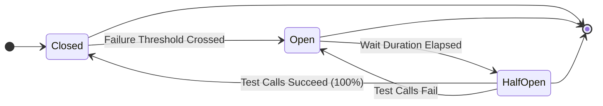

# **1. The Core Problem: Cascading Failures**

Imagine a microservices architecture:
*   **Order Service** needs information from **Product Service** to process an order.
*   Suddenly, the **Product Service** crashes or becomes extremely slow.

**What happens without a Circuit Breaker?**
1.  **Order Service** keeps sending requests to the unresponsive **Product Service**.
2.  Each request waits for a response until it hits a **timeout**. This **blocks the thread** in Order Service.
3.  As more orders come in, more threads get blocked waiting.
4.  Eventually, Order Service **runs out of available threads**, becomes unresponsive itself, and crashes.
5.  This failure can then propagate upstream to other services (e.g., API Gateway, User Service), causing a **cascading failure** across the entire system.

---

### **2. The Solution: Circuit Breaker Pattern**

The Circuit Breaker pattern is a **stateful** resilience mechanism that acts as a proxy between a service and its downstream dependency. Its primary goal is to **stop making calls that are likely to fail**, giving the failing service time to recover.

**Analogy:** It works exactly like an electrical circuit breaker in your home. If a circuit is overloaded (too many failures), it "trips" (opens) to prevent damage (further load and cascading failures). After some time, you can try to reset it (half-open) to see if the fault is fixed.

---

### **3. The State Machine: Heart of the Pattern**

A circuit breaker operates through three distinct states, transitioning between them based on the health of the downstream service.



#### **a) CLOSED State (Everything is OK)**
*   **Behavior:** All requests are **allowed to pass through** to the downstream service.
*   **Monitoring:** The circuit breaker continuously **monitors the results** (success vs. failure) of these calls.
*   **Transition:** If the number of failures **exceeds a defined threshold** within a specified window, the circuit breaker **"trips"** and transitions to the **OPEN** state.

#### **b) OPEN State (Stop All Requests)**
*   **Behavior:** **No requests** are sent to the downstream service. All calls **fail immediately** with a pre-defined fallback response. This is called **"fast failure"**.
*   **Benefits:**
    *   **Reduces Latency:** No waiting for timeouts.
    *   **Saves Resources:** No threads are blocked.
    *   **Allows Recovery:** Gives the struggling downstream service time to recover without being bombarded by new traffic.
*   **Transition:** After a **pre-configured "wait duration"** (e.g., 10 seconds), the circuit breaker automatically transitions to the **HALF-OPEN** state to test the waters.

#### **c) HALF-OPEN State (Testing the Waters)**
*   **Behavior:** A **limited number of "test" or "probe" requests** are allowed to pass to the downstream service.
*   **Purpose:** To check if the underlying problem has been resolved.
*   **Transition:**
    *   **If all test calls succeed:** The service is deemed healthy. The circuit breaker resets and moves back to the **CLOSED** state.
    *   **If any test call fails:** The service is still unhealthy. The circuit breaker immediately moves back to the **OPEN** state and the wait timer resets.

---

### **4. Key Configuration Parameters**

When setting up a circuit breaker (e.g., with Resilience4j), you configure it with these key parameters:

| Parameter | Description | Example Value |
| :--- | :--- | :--- |
| **`slidingWindowType`** | The type of window to track calls. `COUNT_BASED` (last N calls) or `TIME_BASED` (calls in last N seconds). | `COUNT_BASED` |
| **`slidingWindowSize`** | The size of the window used to calculate the error rate. | `10` |
| **`minimumNumberOfCalls`** | Minimum number of calls required before the circuit breaker can calculate the error rate. Prevents false positives with low traffic. | `5` |
| **`failureRateThreshold`** | The percentage of failed calls (within the window) at which the circuit should open. | `50` (%) |
| **`waitDurationInOpenState`** | How long the circuit breaker should stay open before switching to half-open. | `10s` |
| **`permittedNumberOfCallsInHalfOpenState`** | The number of test calls allowed in the half-open state. | `3` |
| **`recordExceptions`** | List of exceptions that should be recorded as failures. | `[TimeoutException]` |
| **`ignoreExceptions`** | List of exceptions that should be ignored (not counted as failures). | `[BadRequestException]` |

---

### **5. Implementation with Resilience4j (Java/Spring Boot)**

**Step 1: Add Dependency**
The Resilience4j circuit breaker is usually part of the core library.
```xml
<dependency>
    <groupId>io.github.resilience4j</groupId>
    <artifactId>resilience4j-spring-boot2</artifactId>
    <version>2.1.0</version> <!-- Check for latest version -->
</dependency>
```

**Step 2: Decorate the Service Method**
Apply the `@CircuitBreaker` annotation to the method that calls the downstream service.

```java
import io.github.resilience4j.circuitbreaker.annotation.CircuitBreaker;

@Service
public class OrderService {

    @Autowired
    private ProductServiceClient productServiceClient; // Feign Client

    // The name "productService" links to the config
    // "getProductFallback" is the method to run when the circuit is open or a call fails
    @CircuitBreaker(name = "productService", fallbackMethod = "getProductFallback")
    public Product getProductById(String id) {
        // This is the call to the downstream service
        return productServiceClient.getProductById(id);
    }

    // Fallback Method: Signature must match original method, plus a Throwable param.
    private Product getProductFallback(String id, Throwable t) {
        System.out.println("Circuit is open! Fallback engaged for product: " + id);
        // Return a default/stale response, don't call downstream
        return new Product(id, "Fallback Product", 0.0);
    }
}
```

**Step 3: Configure in `application.yml`**
```yaml
resilience4j:
  circuitbreaker:
    instances:
      productService: # Matches the name in the @CircuitBreaker annotation
        slidingWindowType: COUNT_BASED
        slidingWindowSize: 10
        minimumNumberOfCalls: 5
        failureRateThreshold: 50
        waitDurationInOpenState: 10s
        permittedNumberOfCallsInHalfOpenState: 3
        recordExceptions:
          - org.springframework.web.client.HttpServerErrorException
          - java.util.concurrent.TimeoutException
        ignoreExceptions:
          - org.springframework.web.client.HttpClientErrorException.NotFound
```

---

### **6. How the Automatic State Transition Works (Open -> Half-Open)**

This is a common and advanced interview question.

**Question:** "When the circuit is `OPEN`, no calls are made. So how does it automatically transition to `HALF_OPEN` after the wait duration?"

**Answer:** It uses a **`ScheduledExecutorService`**.

1.  **Upon Transition to OPEN:** The moment the circuit breaker trips to the `OPEN` state, it schedules a task.
2.  **The Scheduled Task:** The task's job is to change the circuit's state from `OPEN` to `HALF_OPEN`.
3.  **The Delay:** This task is scheduled to run after the configured `waitDurationInOpenState` (e.g., 10 seconds).
4.  **Execution:** After the 10-second delay, the executor service runs the task, which triggers the state transition to `HALF_OPEN`.

**Deep Dive (How `ScheduledExecutorService` works):**
*   It internally uses a **`DelayQueue`**.
*   Tasks (like our state transition task) are placed in this queue with a specific **delay time**.
*   A worker thread checks the queue for the task with the **shortest remaining delay**.
*   If the task isn't ready, the thread **waits (blocks)** for exactly that remaining time. The operating system wakes the thread up when the time is up.
*   The thread then executes the task, moving the circuit to `HALF_OPEN`.

---

### **Summary: Benefits of the Circuit Breaker**

*   **Prevents Cascading Failures:** Isolates failures to a single service.
*   **Graceful Degradation:** Provides fallback mechanisms, improving user experience.
*   **Reduces Latency:** Fails fast instead of making users wait for timeouts.
*   **Saves Resources:** Prevents threads from being held up on doomed requests.
*   **Promotes Self-Healing:** Automatically tests the downstream service for recovery.

By understanding this pattern and its implementation, you can build much more robust and resilient microservices architectures.